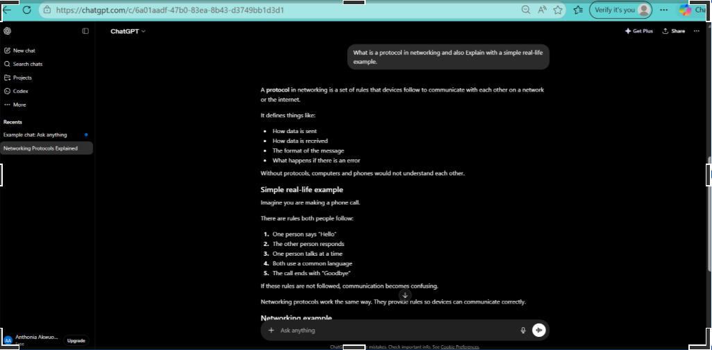
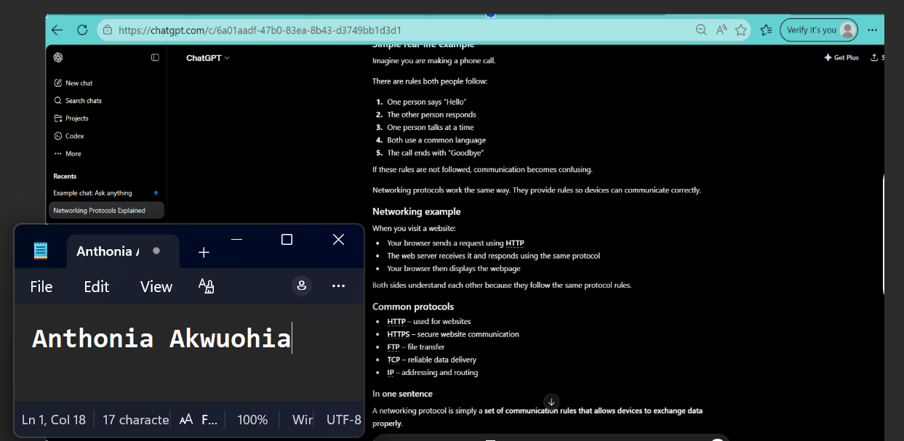
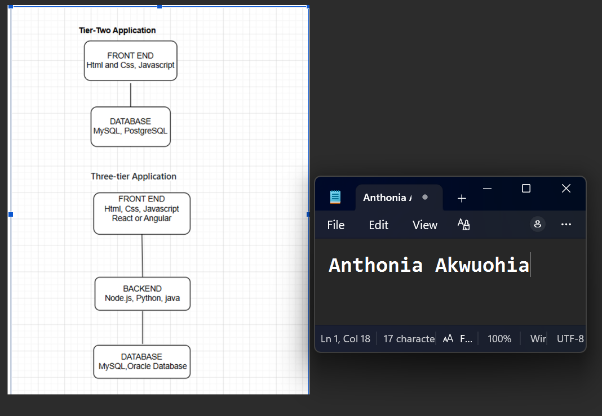
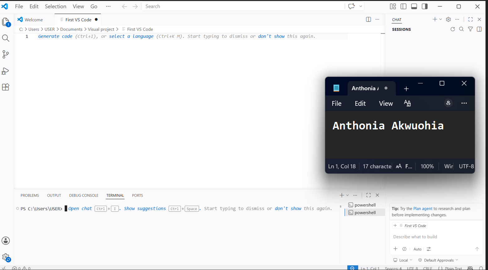
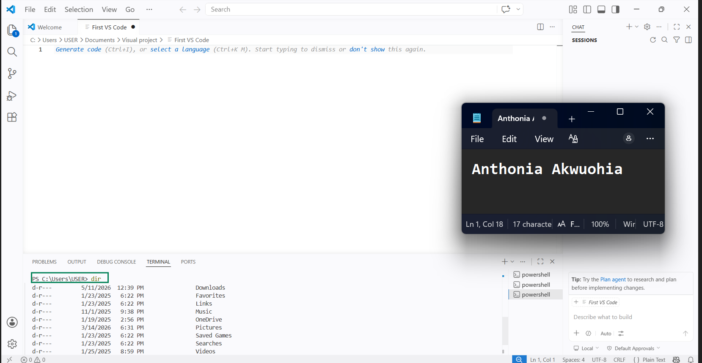

# Week 00 - Internet and Networking

Part of the DevOps Micro Internship (DMI) Cohort 3 with Agentic AI

---

# 🧑‍💻 Task 1: Using ChatGPT as Your Learning Assistant

## Scenario

You're new to DevOps and will frequently encounter technical questions. ChatGPT can be your learning companion.

## Your Task

Write a clear ChatGPT prompt to help you understand:

> "What is a protocol in networking? Explain with a simple real-life example."

Take a screenshot of your interaction showing:

* Your detailed prompt (with clear expectations)
* ChatGPT's simplified response with an example

## Screenshot

Save your screenshot in the `screenshots` folder and update the file name below.





Replace `task-1-chatgpt.png` with your actual screenshot file name.

---

## What I Learned (2–3 lines)

What I learnt from task 1 talking about protocol in networking, that a protocol in networking is a set of rules that devices follow to communicate with each other on a network or the internet. It defines things like, How data is sent, How data is received, The format of the message , What happens if there is an error. I also learnt that when  your browser sends a request using HTTP, the web server receives it and responds using the same protocol, Your browser then displays the webpage.

---

# 🌐 Task 2: Internet and Networking

## Scenario

Your friend is launching an online bookstore named **EpicReads**.

He asked you to explain how users globally can access his website hosted in Finland.

## Your Task

Write a short explanation (**100–150 words**) that includes:

* Packet Switching
* IP Address
* TCP/IP
* HTTP/HTTPS

💡 **Tip:** You may use ChatGPT (as demonstrated in Task 1) to refine your explanation.

## Answer

EpicReads’ website hosted in Finland can be accessed globally through the Internet using several networking technologies. When a user opens the website, the data is divided into small packets using packet switching, allowing efficient transmission across different network routes. Each device connected to the Internet has an IP address, which helps routers identify where the data should be sent. Communication between the user’s browser and the Finnish server happens through the TCP/IP protocol suite. TCP ensures that packets arrive correctly and in order, while IP handles addressing and routing. To load the bookstore webpage, the browser uses HTTP or the more secure HTTPS protocol, which encrypts user data and protects online transactions and login information.


---

# 🏗️ Task 3: Application Architecture & Stack

## Scenario

EpicReads bookstore has two application versions:

### Two-Tier Application

* Frontend
* Database

### Three-Tier Application

* Frontend
* Backend
* Database

## Your Task

* Draw simple diagrams (hand-drawn or tool-based such as draw.io)
* Label each layer clearly
* List at least two common technologies or tools used for each layer
* Submit a screenshot or photo clearly showing your own drawing

## Diagram Screenshot / Photo

Save your diagram image in the `screenshots` folder and update the file name below.




Replace `task-3-diagram.png` with your actual diagram file name.

---

## Technologies Used

### Frontend

* Html, Css
* Javascript, React

### Backend

* Node,js Python
* Java

### Database

* MySQL, PostgreSQL
* Oracle database


---

# 🌍 Task 4: Domain Name & DNS (Basic Concepts)

## Scenario

Your friend's bookstore **EpicReads** is currently accessible through:

```text
52.172.142.222:3000
```

He purchased the domain:

```text
epicreads.com
```

## Your Task

In **50–100 words**, explain in your own words:

1. What is DNS (Domain Name System)?
2. Which DNS record type should be used to connect the domain to the given IP, and why?

## Answer

 1) DNS (Domain Name System) is a system that translates human-readable domain names into IP addresses that computers use to communicate over the Internet, domain names like epicreads.com into IP addresses that computers use to locate servers on the Internet. Instead of remembering 52.172.142.222:3000, users can simply type the domain name in a browser.
 2) To connect the domain to the server, an A Record should be used because it maps a domain name directly to an IPv4 address. The A record would point epicreads.com to 52.172.142.222, allowing users worldwide to access the EpicReads website easily.


---

# 💻 Task 5: Visual Studio Code Setup (Hands-on)

## Your Task

Install Visual Studio Code (if not already installed).

Take a screenshot of your VS Code environment showing:

* Terminal open inside VS Code
* Running a basic command:

### Windows

```powershell
dir
```

### Linux / macOS

```bash
pwd
ls
```

* Your selected VS Code theme clearly visible

⚠️ **Important:** The screenshot must show your username or another identifiable detail to confirm it is your environment.

## Screenshot

Save your screenshot in the `screenshots` folder and update the file name below.





Replace `task-5-vscode.png` with your actual screenshot file name.

---

# 🔗 Task 6: Publish Your Assignment as a LinkedIn Post

## Objective

Publishing on LinkedIn helps you:

* Build your professional online presence
* Reinforce your learning
* Document your DevOps journey publicly

## Your Task

Summarize your answers from Tasks 1–5 into a LinkedIn post.

Clearly structure your post into the following sections:

* ChatGPT
* Internet & Networking
* App Architecture
* DNS
* VS Code Setup

Add the following credit note at the end of your post:

> **P.S. This post is part of the DevOps Micro Internship (DMI) with Agentic AI — Cohort 3 — by Pravin Mishra. My graded progress is public: https://dmi.pravinmishra.com/s/YOUR-GITHUB-USERNAME.html · Start your DevOps journey: https://dmi.pravinmishra.com/?utm_source=student&utm_medium=ps-linkedin&utm_campaign=cohort3**

---

## LinkedIn Post URL

Paste your LinkedIn post URL here:

https://www.linkedin.com/posts/anthonia-akwuohia-5b00681b0_pravin-mishra-the-cloudadvisory-linkedin-activity-7460407568872534017-m9bj?utm_source=share&utm_medium=member_desktop&rcm=ACoAADEhX1QBTHiW-kQPmKjn3MVixQzj4IzJO1Q
```

---

## LinkedIn Post Backup Copy

Paste the full text of your LinkedIn post here:

When I decided to dive into DevOps, I came across the DevOps Internship Cohort 3 (DMI) led by Pravin Mishra and jumped right in. Alongside this program, which helped me strengthen my skills in the IT ecosystem while collaborating with like-minded peers and experienced DevOps engineers.

ChatGPT
I explored how ChatGPT can support learning, problem-solving, and software development by explaining technical concepts in a simple, interactive way.

Internet & Networking
I deepened my understanding of how the internet works, starting from packet switching, which divides data into smaller packets, sends them separately, and reassembles them at the destination. I also learned about IP addresses, which ensure correct data delivery, and the TCP/IP protocol suite:
TCP guarantees packets arrive correctly and in order.
IP handles addressing and routing.
For example, when loading a bookstore webpage, the browser uses HTTP or the secure HTTPS protocol to encrypt user data and protect online transactions and logins.

App Architecture
Using EpicReads bookstore as a case study, I explored different application architectures:
Two-Tier Architecture: Frontend connects directly to the database—simple but rigid.
Three-Tier Architecture: Frontend → Backend → Database, showing how different components collaborate to build robust applications. 

DNS 
I learned how DNS translates domain names like epicreads.com into IP addresses (e.g., 52.172.142.222:3000) for easy access for users. I also explored DNS records, such as A Records, which map domains to IP addresses.

VS Code Setup
I configured Visual Studio Code to create a productive development environment:
Integrated terminal and basic commands (pwd, ls, dir)
GitHub integration
Custom themes
Extensions for advanced development

I’m excited to continue learning and building on this DevOps journey, exploring new technologies, and applying my knowledge in real-world scenarios.

P.S. This post is part of the FREE DevOps Micro Internship (DMI) Cohort 3 run by Pravin Mishra. You can be part of this learning community too. 
JOIN HERE (https://lnkd.in/e3_PbHNQ ) DMI Cohort 3: https://lnkd.in/eYPn3ZKD
Pravin Mishra Profile: https://lnkd.in/eBwM82rU

---

# Reflection – Week 0

### What did you find easy?

I found it easy to understand the basic networking concepts, such as protocols, TCP/IP, HTTP/HTTPS, and DNS, because the explanations and real-life examples made them easier to relate to. Setting up Visual Studio Code and using ChatGPT to simplify technical concepts also made learning more interactive and enjoyable.

---

### What was difficult?

The most challenging part was understanding how the different networking concepts work together, especially packet switching, IP addressing, and application architecture. Creating clear diagrams for the two-tier and three-tier architectures also required extra effort to ensure they were accurate and well organized.

---

### What will you improve next week?

Next week, I will spend more time practicing hands-on DevOps tasks and strengthening my understanding of networking concepts. I also plan to improve my documentation skills, ask more questions when I encounter challenges, and continue building consistency in my learning journey.

---

## 📌 About DMI & CloudAdvisory

DevOps Micro Internship (DMI) is a project-based DevOps program run by Pravin Mishra (The CloudAdvisory) focused on real-world execution, systems thinking, and career readiness.

It helps learners build strong DevOps foundations with hands-on experience.


## 📌 Resources

- 🌐 **DMI Official Website:** https://pravinmishra.com/dmi  
- 🎓 **DevOps for Beginners (Udemy):** https://www.udemy.com/course/devops-for-beginners-docker-k8s-cloud-cicd-4-projects/  
- 🎓 **Ultimate Agentic AI DevOps with Clude Code** https://www.udemy.com/course/ultimate-agentic-ai-devops-with-claude-code/?referralCode=448389767BC96284087B
- 🎓 **DevOps with Claude Code: Terraform, EKS, ArgoCD & Helm** https://www.udemy.com/course/devops-with-claude-code-terraform-eks-argocd-helm/?referralCode=1C5B734505D65A010FA3
- ▶️ **YouTube Playlist (DMI Cohort 3):** https://www.youtube.com/playlist?list=PLFeSNDtI4Cho  
- 🔗 **Pravin Mishra (LinkedIn):** https://www.linkedin.com/in/pravin-mishra-aws-trainer/  
- 🏢 **CloudAdvisory (LinkedIn):** https://www.linkedin.com/company/thecloudadvisory/

---

*This submission is part of DevOps Micro Internship (DMI) Cohort 3 — Agentic AI Track*