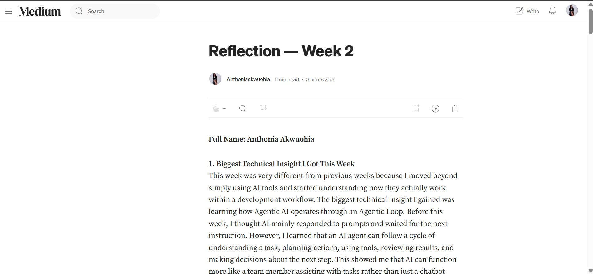
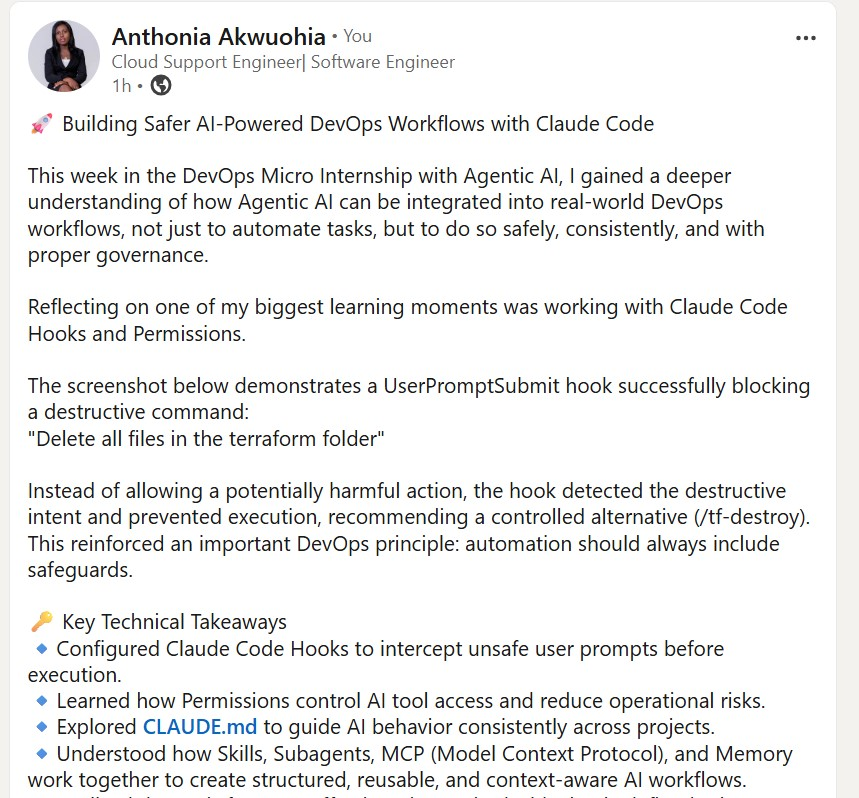
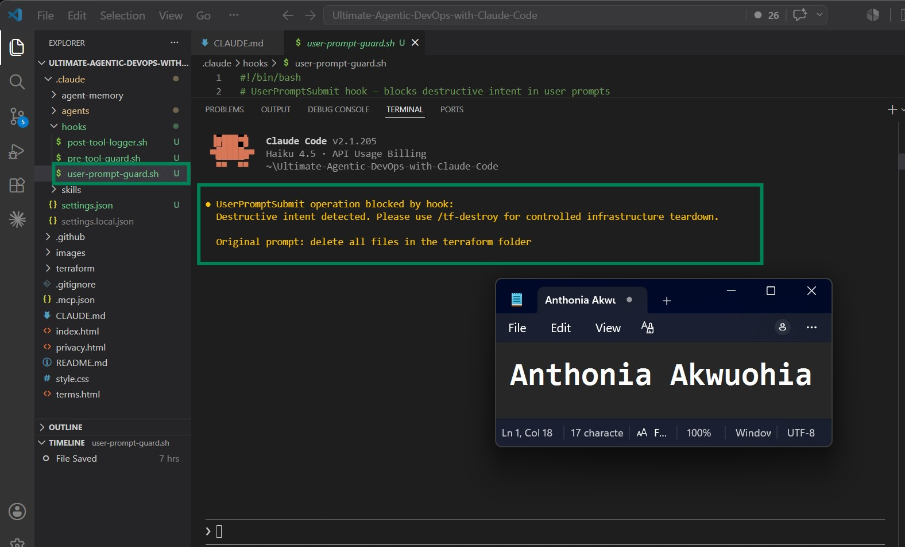

# Assignment 8 — Week 2 Reflection Blog

Part of the DevOps Micro Internship (DMI) Cohort 3 with Agentic AI

---

# Purpose

In this assignment, you will reflect on your Week 2 learning journey and write a short blog capturing your experience working with Agentic AI tools such as Claude Code, Skills, Subagents, MCP, Hooks, Permissions, and Memory.

You will also publish a LinkedIn post summarizing your learning and share both links for evaluation.

---

# Task 1 — Write Your Reflection Blog

## Goal

Write a reflection blog covering your Week 2 learning experience.

### Blog Requirements

Your blog must include:

* Title: **Reflection – Week 2**
* Minimum 300 words
* At least 2–3 topics from Week 2 (Claude Code, Skills, Subagents, MCP, Hooks, Permissions, Memory)
* Honest personal reflection (learning, challenges, mindset)
* One habit/system you plan to implement
* Your full name clearly visible

### Allowed Platforms

You can publish your blog on:

* Hashnode
* Medium
* Dev.to
* LinkedIn Article
* GitHub Markdown file
* Substack

---

### Evidence

#### Screenshot 1 — Blog published and visible



---

### Submission Field

Blog Link:

https://medium.com/@anthoniaakwuohia/reflection-week-2-086d9db66e10?sharedUserId=anthoniaakwuohia

---

# Task 2 — Create LinkedIn Post

## Goal

Share your Week 2 learning publicly on LinkedIn.

---

### LinkedIn Post Requirements

Your post must include:

* One screenshot from any Week 2 assignment
* Short reflection (what you learned or built)
* Required P.S. line exactly as given below

---

### Required P.S. Line (Must Include Exactly)

> **P.S. This post is part of the DevOps Micro Internship (DMI) with Agentic AI — Cohort 3 — by [Pravin Mishra](https://www.linkedin.com/in/pravin-mishra-aws-trainer/). My graded progress is public: https://dmi.pravinmishra.com/s/YOUR-GITHUB-USERNAME.html · Start your DevOps journey: https://dmi.pravinmishra.com/?utm_source=student&utm_medium=ps-linkedin&utm_campaign=cohort3**

---

### Suggested Hashtags

#DMIByPravinMishra #AgenticAI #ClaudeCode #DevOps #LearningInPublic

---

### Evidence

#### Screenshot 2 — LinkedIn post published





### Submission Field

LinkedIn Post Content (copy-paste here):

```
🚀 Building Safer AI-Powered DevOps Workflows with Claude Code

This week in the DevOps Micro Internship with Agentic AI, I gained a deeper understanding of how Agentic AI can be integrated into real-world DevOps workflows, not just to automate tasks, but to do so safely, consistently, and with proper governance.

Reflecting on one of my biggest learning moments was working with Claude Code Hooks and Permissions.

The screenshot below demonstrates a UserPromptSubmit hook successfully blocking a destructive command:
"Delete all files in the terraform folder"

Instead of allowing a potentially harmful action, the hook detected the destructive intent and prevented execution, recommending a controlled alternative (/tf-destroy). This reinforced an important DevOps principle: automation should always include safeguards.

🔑 Key Technical Takeaways
🔹Configured Claude Code Hooks to intercept unsafe user prompts before execution. 
🔹Learned how Permissions control AI tool access and reduce operational risks. 
🔹Explored CLAUDE.md to guide AI behavior consistently across projects. 
🔹Understood how Skills, Subagents, MCP (Model Context Protocol), and Memory work together to create structured, reusable, and context-aware AI workflows. 
🔹Realized that AI is far more effective when paired with clearly defined rules, reusable workflows, and human oversight. 

Beyond the technical concepts, I also learned an important lesson about myself: engineering isn't just about making automation work, it's about making it safe, reliable, and maintainable. Careful documentation, following instructions, and validating outputs are just as valuable as writing code.

Every week of this internship continues to strengthen my foundation in DevOps while expanding my understanding of how Agentic AI can improve modern engineering workflows.

Claude Code Hook blocking a destructive operation before execution, an excellent example of secure automation in practice. Another Week, Another DevOps Milestone.

P.S. This post is a part of DevOps Micro Internship with Agentic AI Cohort-3 by Pravin Mishra. You can start your DevOps journey by joining this Discord community (https://lnkd.in/e3_PbHNQ).
#DMIByPravinMishra #AgenticAI #ClaudeCode #DevOps #LearningInPublic #Automation #Terraform #CloudComputing #AIEngineering #OpenToWork


```

---

### LinkedIn Post Link:

https://www.linkedin.com/posts/anthonia-akwuohia-5b00681b0_dmibypravinmishra-agenticai-claudecode-share-7481086011326885888-81XH/?utm_source=share&utm_medium=member_desktop&rcm=ACoAADEhX1QBTHiW-kQPmKjn3MVixQzj4IzJO1Q

---

# Submission Instructions

* Blog must be publicly accessible
* LinkedIn post must be visible (public or unlisted where applicable)
* All required fields must be filled
* Screenshot proofs must be added to GitHub repository
* Do not include sensitive information in blog or post

---

# Completion Checklist

* [ ] Blog written with required structure
* [ ] Blog includes at least 2–3 Week 2 topics
* [ ] Blog is publicly accessible
* [ ] LinkedIn post created
* [ ] Required P.S. line included
* [ ] LinkedIn post content copied in submission field
* [ ] Blog link added
* [ ] LinkedIn post link added
* [ ] Screenshots added to GitHub repo

---

# About DMI & CloudAdvisory

DevOps Micro Internship (DMI) is a project-based DevOps program run by Pravin Mishra (The CloudAdvisory), focused on real-world execution, systems thinking, and agentic AI workflows.

It helps learners build strong DevOps foundations through hands-on experience.

---

# Resources

* 🌐 DMI Official Website: [https://pravinmishra.com/dmi](https://pravinmishra.com/dmi)
* 🎓 DevOps for Beginners (Udemy): [https://www.udemy.com/course/devops-for-beginners-docker-k8s-cloud-cicd-4-projects/](https://www.udemy.com/course/devops-for-beginners-docker-k8s-cloud-cicd-4-projects/)
* 🎓 Agentic AI DevOps with Claude Code: [https://www.udemy.com/course/ultimate-agentic-ai-devops-with-claude-code/](https://www.udemy.com/course/ultimate-agentic-ai-devops-with-claude-code/)
* 🎓 DevOps with Claude Code: Terraform, EKS, ArgoCD & Helm: [https://www.udemy.com/course/devops-with-claude-code-terraform-eks-argocd-helm/](https://www.udemy.com/course/devops-with-claude-code-terraform-eks-argocd-helm/)
* ▶️ YouTube Playlist: [https://www.youtube.com/playlist?list=PLFeSNDtI4Cho](https://www.youtube.com/playlist?list=PLFeSNDtI4Cho)
* 🔗 Pravin Mishra (LinkedIn): [https://www.linkedin.com/in/pravin-mishra-aws-trainer/](https://www.linkedin.com/in/pravin-mishra-aws-trainer/)
* 🏢 CloudAdvisory (LinkedIn): [https://www.linkedin.com/company/thecloudadvisory/](https://www.linkedin.com/company/thecloudadvisory/)

