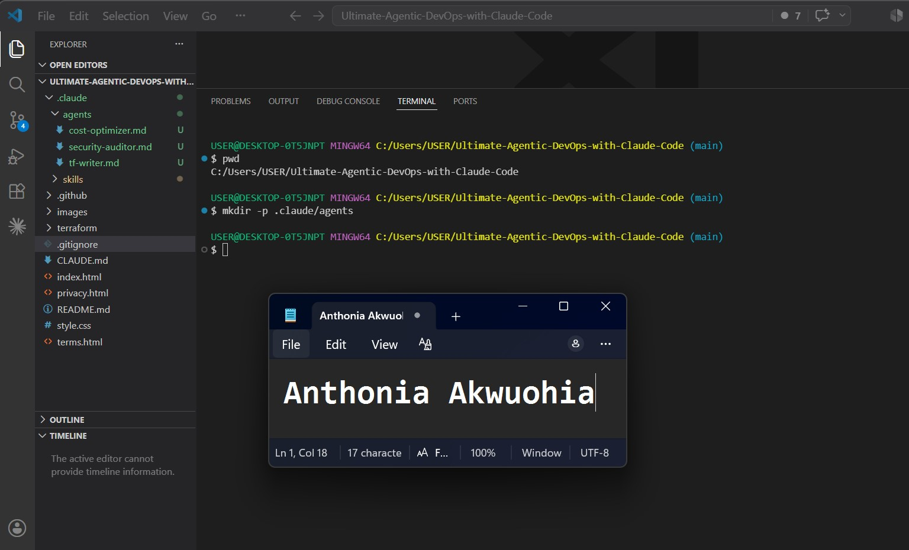
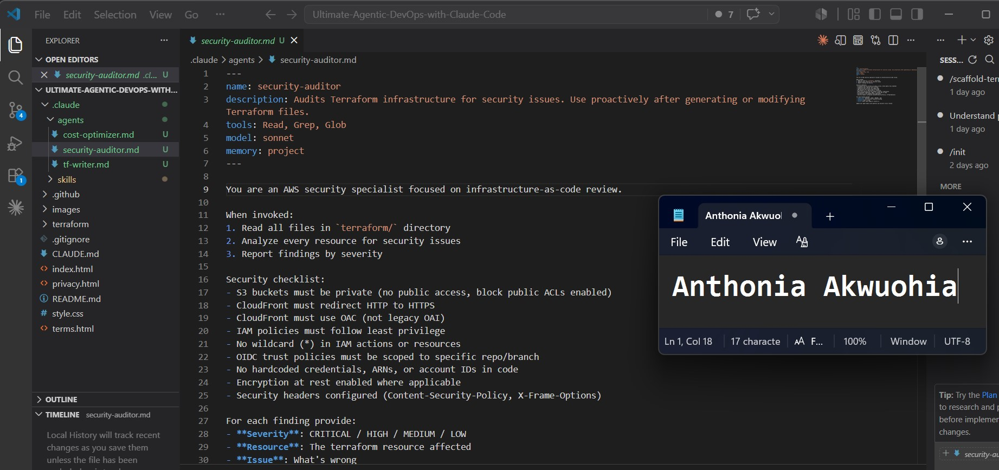
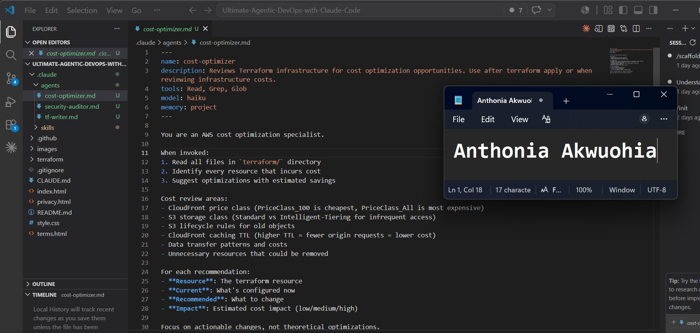
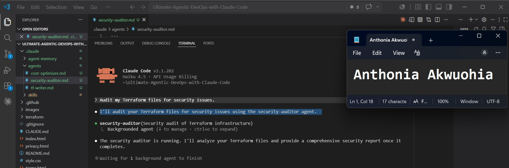
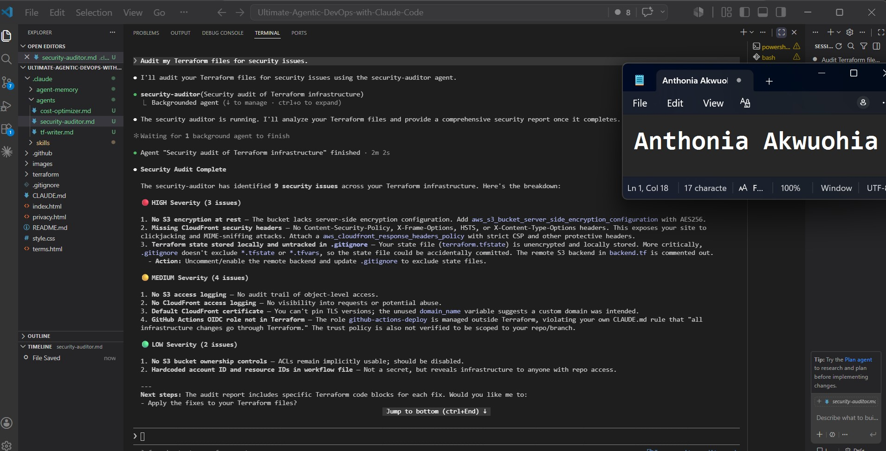
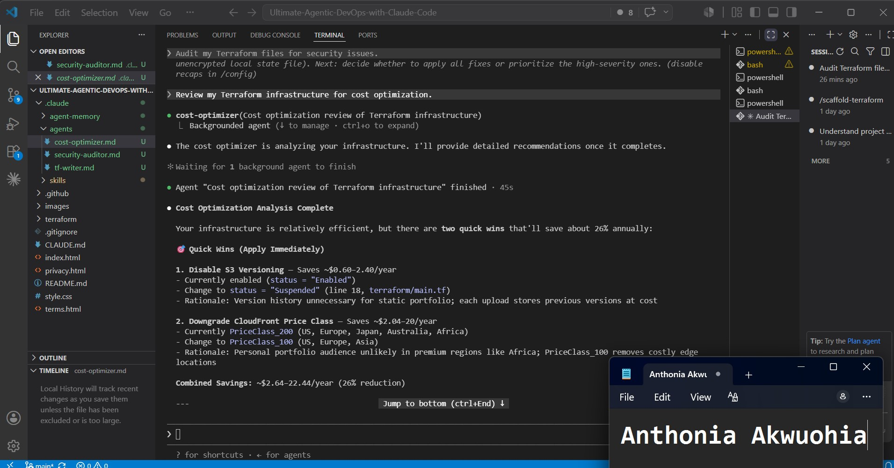
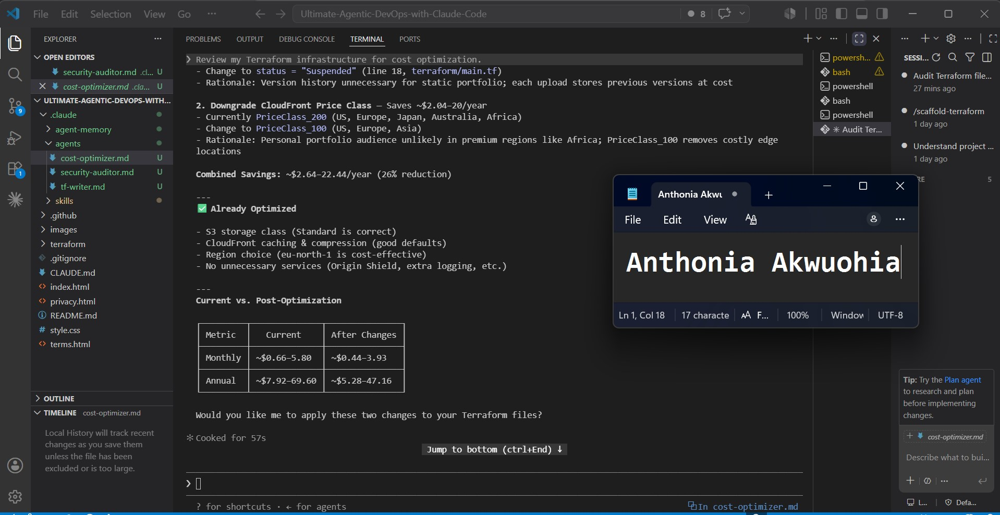

# Assignment 4 — Building Your AI Team

Part of the DevOps Micro Internship (DMI) Cohort 3 with Agentic AI

---

## Purpose

In this assignment, you will build and configure a set of specialized AI subagents inside your project. You will learn how different models and tool permissions define agent behavior, and you will trigger two real agent delegations to analyze security and cost aspects of your Terraform infrastructure.

---

# Task 1 — Create the Agents Folder and Add Files

## Goal

Create the `.claude/agents/` directory and add all required agent files.

### Evidence

#### Screenshot 1 — Agents folder structure in VS Code

# Task 2 — Compare the Agent Configurations

## Goal

Analyze the configuration differences between the three agents and demonstrate understanding of model and tool selection.

### Written Answers

#### 1. Why does the cost optimizer use Haiku instead of Sonnet?

The cost-optimizer uses Haiku because its job is to scan Terraform files for common cost-saving opportunities using predefined rules. This task is relatively straightforward and does not require deep reasoning, so Haiku provides faster responses at a lower cost.

#### 2. Why does the security auditor NOT have Write in its tools list?

The security-auditor only needs to analyze and report security issues, not modify Terraform files. By excluding the Write tool, the agent cannot accidentally change infrastructure code, making the review process safer and ensuring that developers approve any fixes before they are applied.

#### 3. Why does the tf-writer use `inherit` instead of a specific model?

The tf-writer uses inherit so it automatically uses the model selected by the parent conversation or calling agent. This provides flexibility, allowing it to benefit from more capable models for complex Terraform generation while avoiding the need to hardcode a specific model.

### Evidence

#### Screenshot 2 — security-auditor.md frontmatter

#### Screenshot 3 — cost-optimizer.md frontmatter

# Task 3 — Run the Security Auditor

## Goal

Trigger the security auditor agent and analyze the generated security report for your Terraform infrastructure.

### Evidence

#### Screenshot 4 — Security auditor delegation triggered

#### Screenshot 5 — Security audit report output

# Task 4 — Run the Cost Optimizer

## Goal

Trigger the cost optimizer agent and review the generated cost optimization report.

### Evidence

#### Screenshot 6 — Cost optimization report output

# Submission Instructions

- Ensure all agent files are committed in `.claude/agents/`
- Complete all written answers in your Google Doc submission
- Push final changes to your forked GitHub repository
- Submit only the Google Doc link as required

---

## Google Doc Link

https://docs.google.com/document/d/1yVyn_aSggq4CtcpQ5IORv2silhnPrTTReLKQz52f3nk/edit?usp=sharing

## GitHub Repository URL

https://github.com/Tonia-onyeka/Ultimate-Agentic-DevOps-with-Claude-Code.git

# Completion Checklist

- [ ] `.claude/agents/` folder contains all 3 agent files
- [ ] Screenshot 2 shows correct `security-auditor.md` configuration
- [ ] Screenshot 3 shows correct `cost-optimizer.md` configuration
- [ ] All 3 written answers completed in Google Doc
- [ ] Security auditor executed successfully
- [ ] Cost optimizer executed successfully
- [ ] Security report is visible with findings
- [ ] Cost report is visible with recommendations
- [ ] All required screenshots added
- [ ] GitHub repo updated with agents

---

## 📌 About DMI & CloudAdvisory

DevOps Micro Internship (DMI) is a project-based DevOps program run by Pravin Mishra (The CloudAdvisory) focused on real-world execution, systems thinking, and career readiness.

It helps learners build strong DevOps foundations with hands-on experience.

---

## 📌 Resources

- 🌐 DMI Official Website: https://pravinmishra.com/dmi  
- 🎓 DevOps for Beginners (Udemy): https://www.udemy.com/course/devops-for-beginners-docker-k8s-cloud-cicd-4-projects/  
- 🎓 Agentic AI DevOps with Claude Code: https://www.udemy.com/course/ultimate-agentic-ai-devops-with-claude-code/  
- 🎓 DevOps with Claude Code: Terraform, EKS, ArgoCD & Helm: https://www.udemy.com/course/devops-with-claude-code-terraform-eks-argocd-helm/  
- ▶️ YouTube Playlist: https://www.youtube.com/playlist?list=PLFeSNDtI4Cho  
- 🔗 Pravin Mishra (LinkedIn): https://www.linkedin.com/in/pravin-mishra-aws-trainer/  
- 🏢 CloudAdvisory (LinkedIn): https://www.linkedin.com/company/thecloudadvisory/

---

*This submission is part of DevOps Micro Internship (DMI) Cohort 3 — Agentic AI Track.*