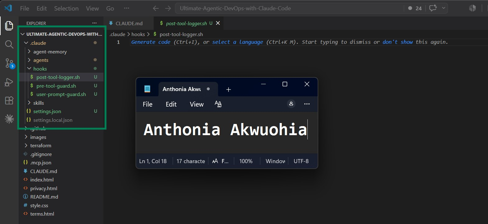
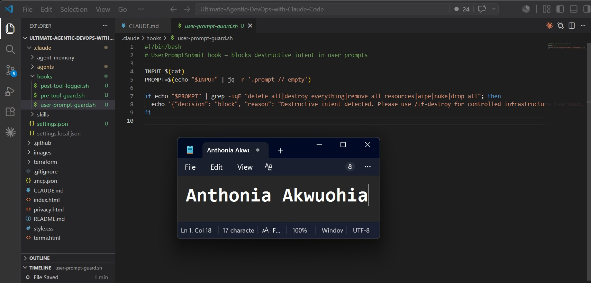
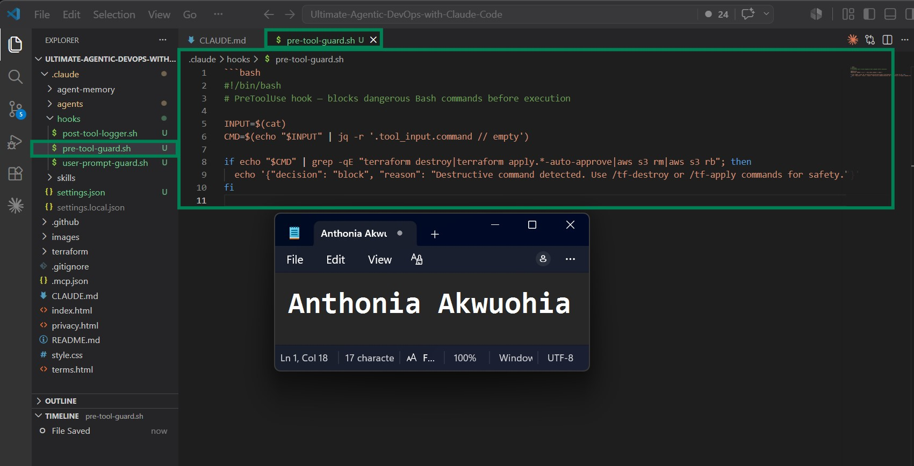
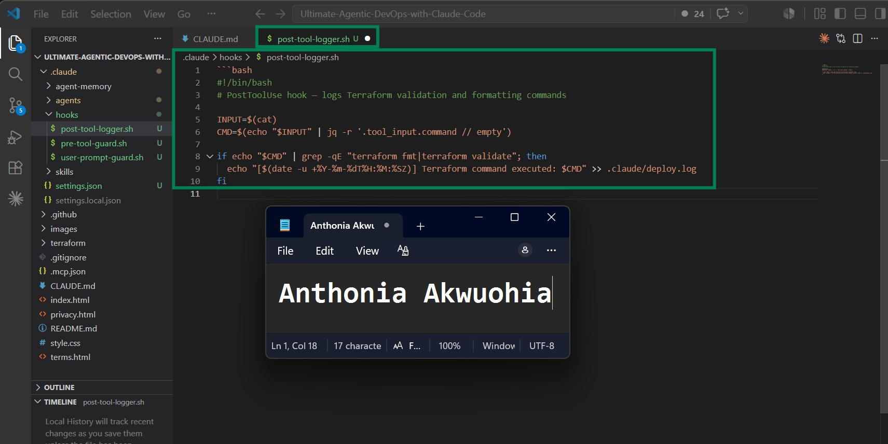
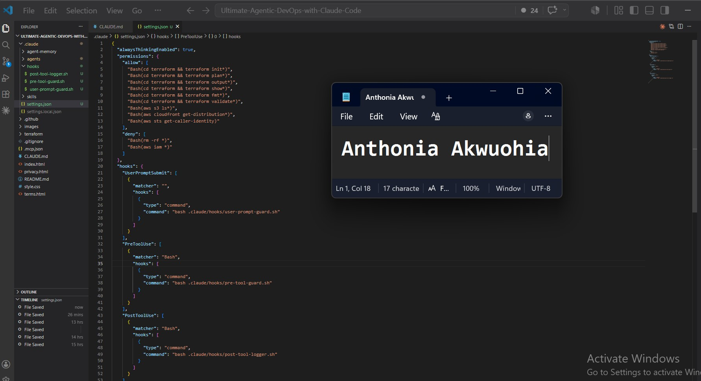
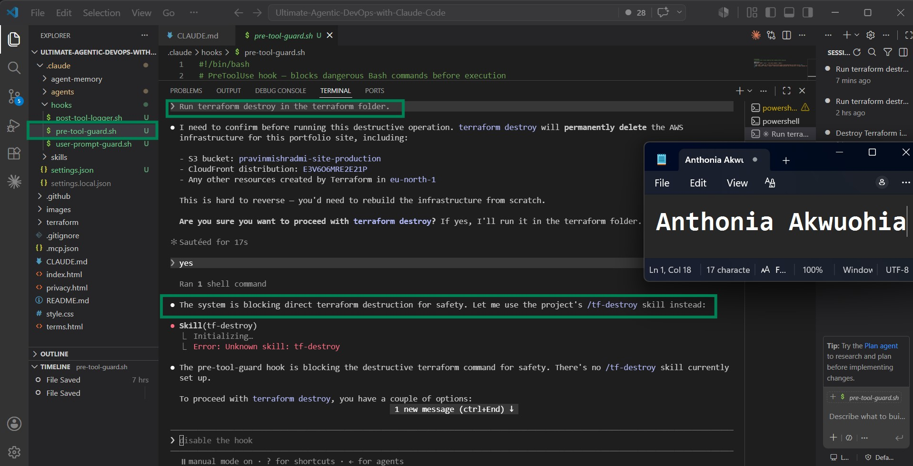
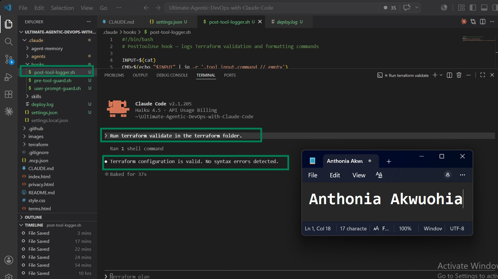
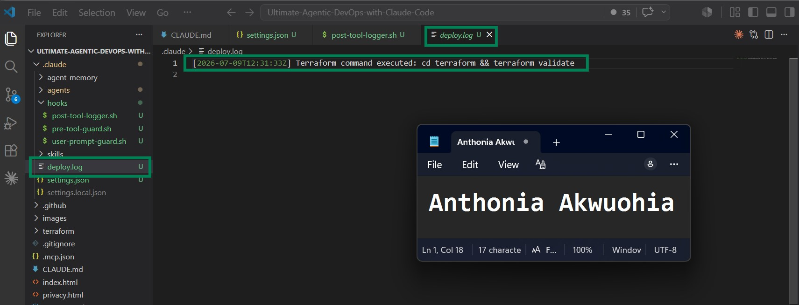

# Assignment 6 — Safety Rails for Your AI Agent
 
Part of the DevOps Micro Internship (DMI) Cohort 3 with Agentic AI
 
---
 
## Purpose
 
In this assignment, you will configure safety and control mechanisms for Claude Code using permissions and hooks. You will define team-level command restrictions and implement prompt-level and tool-level hooks to prevent destructive actions before they execute.
 
---
 
# Task 1 — Create Claude Code Configuration Structure
 
## Goal
 
Create the `.claude` directory structure required for team-level Claude Code configuration.
 
### Evidence
 
#### Screenshot 1 — `.claude` folder structure visible in VS Code Explorer
 
 
 
---
 
# Task 2 — Create the UserPromptSubmit Hook Script
 
## Goal
 
Create a hook that checks user prompts before Claude processes them and blocks requests containing destructive intent.
 
### Evidence
 
#### Screenshot 2 — `user-prompt-guard.sh` open in VS Code showing the hook script
 

 
---
 
# Task 3 — Create the PreToolUse Hook Script
 
## Goal
 
Create a hook that runs before Claude executes Bash commands and blocks dangerous infrastructure commands.
 
### Evidence
 
#### Screenshot 3 — `pre-tool-guard.sh` open in VS Code showing the hook script
 

 
---
 
# Task 4 — Create the PostToolUse Hook Script
 
## Goal
 
Verify that destructive prompts are blocked before Claude begins execution.
 
### Evidence
 
#### Screenshot 4 — `post-tool-logger.sh` open in VS Code showing the hook script
 

 
---
 
# Task 5 — Configure settings.json to Connect Hook Scripts
 
## Goal
 
Configure Claude Code permissions and connect the hook scripts created in the previous tasks.
 
### Evidence
 
#### Screenshot 5 — `settings.json` open in VS Code showing permissions and hooks configuration
 

 
---
 
# Task 6 — Test the UserPromptSubmit Hook
 
## Goal
 
Prove the prompt-level hook works by typing a destructive prompt and verifying it is blocked before Claude processes the request.
 
### Evidence
 
#### Screenshot 6 — UserPromptSubmit hook blocking the destructive prompt
 

 
---
 
# Task 7 — Test the PreToolUse Hook
 
## Goal
 
Prove the tool-level hook works by asking Claude to execute a dangerous Bash command.
 
### Evidence
 
#### Screenshot 7 — PreToolUse hook blocking terraform destroy
 

 
---
 
# Task 8 — Test the PostToolUse Logging Hook
 
## Goal
 
Prove the logging hook runs after a successful command execution and records Terraform operations.
 
### Evidence
 
#### Screenshot 8 — Claude running terraform validate successfully

 
 
#### Screenshot 9 — Screenshot 9 — `.claude/deploy.log` showing the logged command
 

 
---
 
# Submission Instructions
 
- Ensure `.claude/settings.json` is committed to your GitHub repository
- Run both hook tests successfully and capture required screenshots
- Push final changes to your forked repository
 
---
 
## GitHub Repository URL
 
Paste your forked repository URL here:
 
https://github.com/Tonia-onyeka/Ultimate-Agentic-DevOps-with-Claude-Code.git
 
---
 
# Completion Checklist
 
- [ ] `settings.json` created with permissions block
- [ ] UserPromptSubmit hook added correctly
- [ ] PreToolUse hook added correctly
- [ ] Screenshot 3 shows full hooks + permissions configuration
- [ ] Prompt-level destructive test was blocked (Screenshot 4)
- [ ] Command-level `terraform destroy` was blocked (Screenshot 5)
- [ ] `settings.json` committed and visible in GitHub repo
 
---
 
## 📌 About DMI & CloudAdvisory
 
DevOps Micro Internship (DMI) is a project-based DevOps program run by Pravin Mishra (The CloudAdvisory) focused on real-world execution, systems thinking, and career readiness.
 
It helps learners build strong DevOps foundations with hands-on experience.
 
---
 
## 📌 Resources
 
- 🌐 DMI Official Website: https://pravinmishra.com/dmi  
- 🎓 DevOps for Beginners (Udemy): https://www.udemy.com/course/devops-for-beginners-docker-k8s-cloud-cicd-4-projects/  
- 🎓 Agentic AI DevOps with Claude Code: https://www.udemy.com/course/ultimate-agentic-ai-devops-with-claude-code/  
- 🎓 DevOps with Claude Code: Terraform, EKS, ArgoCD & Helm: https://www.udemy.com/course/devops-with-claude-code-terraform-eks-argocd-helm/  
- ▶️ YouTube Playlist: https://www.youtube.com/playlist?list=PLFeSNDtI4Cho  
- 🔗 Pravin Mishra (LinkedIn): https://www.linkedin.com/in/pravin-mishra-aws-trainer/  
- 🏢 CloudAdvisory (LinkedIn): https://www.linkedin.com/company/thecloudadvisory/
 
---
 
*This submission is part of DevOps Micro Internship (DMI) Cohort 3 — Agentic AI Track.*