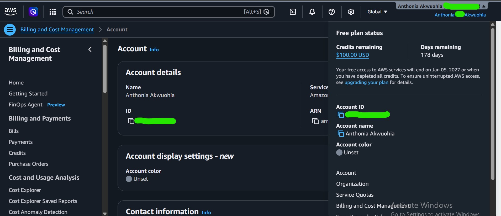

# Assignment 1 — AWS Free Tier Account Setup (EpicReads Cloud Onboarding)

Part of the DevOps Micro Internship (DMI) Cohort 3 with Agentic AI

---

## Purpose

In this assignment, you will create and verify an AWS Free Tier account as part of onboarding EpicReads — an online bookstore moving to the cloud. You will demonstrate an understanding of AWS fundamentals, Free Tier services, and account setup by answering conceptual questions and capturing proof of a working AWS Console login.

---

# Task 1 — Understanding AWS & Free Tier

## Goal

Demonstrate understanding of AWS basics and Free Tier usage by answering the following questions in your own words (3–4 lines each).

### Answers

#### Question 1 — What is an AWS account, and why do you need it at this stage?

An AWS account is a container that provides secure access to Amazon Web Services, allowing users to create, manage, and monitor cloud resources through the AWS Management Console and other tools. At this stage, I need an AWS account to gain hands-on experience with cloud services, complete the DevOps internship assignments, and deploy and manage infrastructure in a real AWS environment using the Free Tier.

---

#### Question 2 — What is AWS Free Tier, and how long does it last?

AWS Free Tier is a program offered by Amazon Web Services that allows new AWS users to use selected AWS services at no cost within specified usage limits. It is designed to help users learn, build, and test applications without incurring charges, provided they stay within the Free Tier limits. Most Free Tier offers for new customers last 12 months from the date the AWS account is created, while some services include always free or short-term trial offers.

---

#### Question 3 — Name three AWS Free Tier services and their free usage limits.

1) Amazon EC2 is AWS's virtual server (virtual machine) service.
Free Usage Limit: It has Up to 750 hours per month of an eligible t2.micro instance (or eligible micro instance, depending on the region) for the first 12 months after creating your AWS account.
2) Amazon S3 is AWS's object storage service. It allows you to store and retrieve files from the cloud. 
Free Usage Limit: it has Up to 5 GB of Standard Storage,  20,000 GET requests, and 2,000 PUT/COPY/POST/LIST requests per month for the first 12 months after creating your AWS account.
3) Amazon DynamoDB is a fully managed NoSQL database service used to store and query data at scale. Its AWS Free Tier provides 25 GB of storage and 25 provisioned read and write capacity units per month, making it suitable for learning and small applications without additional cost.

---

# Task 2 — Create AWS Free Tier Account

## Goal

Create a valid AWS Free Tier account and sign in to the AWS Management Console.

> No screenshots required for this task. Completion is verified through Task 3.

---

# Task 3 — Verify AWS Account

## Goal

Confirm that your AWS account setup is complete by navigating to the Account section and capturing proof.

### Evidence

#### Screenshot 1 — AWS Account page showing account name (email may be blurred)

---

# Submission Instructions

- Add all required screenshots in your GitHub repository submission
- Full name must be visible in required screenshots
- Do not expose sensitive information (keys, passwords, account IDs)

---

# Completion Checklist

- [ ] Task 1 answers written in own words
- [ ] AWS Free Tier account created successfully
- [ ] Signed in to AWS Management Console
- [ ] Screenshot of AWS Account page captured (full name visible, no sensitive data)
- [ ] All required screenshots added to repository

---

## 📌 About DMI & CloudAdvisory

DevOps Micro Internship (DMI) is a project-based DevOps program run by Pravin Mishra (The CloudAdvisory) focused on real-world execution, systems thinking, and career readiness.

It helps learners build strong DevOps foundations with hands-on experience.

---

## 📌 Resources

- 🌐 DMI Official Website: https://pravinmishra.com/dmi  
- 🎓 DevOps for Beginners (Udemy): https://www.udemy.com/course/devops-for-beginners-docker-k8s-cloud-cicd-4-projects/  
- 🎓 Agentic AI DevOps with Claude Code: https://www.udemy.com/course/ultimate-agentic-ai-devops-with-claude-code/  
- 🎓 DevOps with Claude Code: Terraform, EKS, ArgoCD & Helm: https://www.udemy.com/course/devops-with-claude-code-terraform-eks-argocd-helm/  
- ▶️ YouTube Playlist: https://www.youtube.com/playlist?list=PLFeSNDtI4Cho  
- 🔗 Pravin Mishra (LinkedIn): https://www.linkedin.com/in/pravin-mishra-aws-trainer/  
- 🏢 CloudAdvisory (LinkedIn): https://www.linkedin.com/company/thecloudadvisory/

---

*This submission is part of DevOps Micro Internship (DMI) Cohort 3 — Agentic AI Track.*