# Assignment 5 — Bash Script Automation Drill (OPS Checklist)

Part of the DevOps Micro Internship (DMI) Cohort 3 with Agentic AI

---

## Purpose

In this assignment, you will practice Bash scripting by building a series of small automation scripts covering environment setup, variables, arrays, loops, file conditionals, if-else logic, and functions. These scripts form the foundation of real-world Linux automation used in DevOps, cloud, and production support environments.

---

# Task 1 — Bash Environment & Workspace Setup

## Goal

Verify that Bash is available on your system and create a clean workspace for this assignment.

### Evidence

#### Screenshot 1 — Output of `echo $SHELL` and `bash --version`

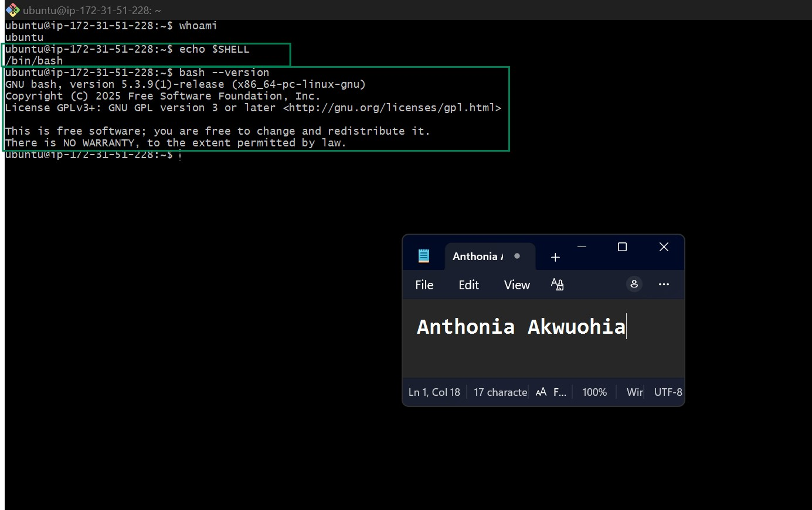

---

#### Screenshot 2 — Output of `pwd` and `ls -lah` showing the scripts directory

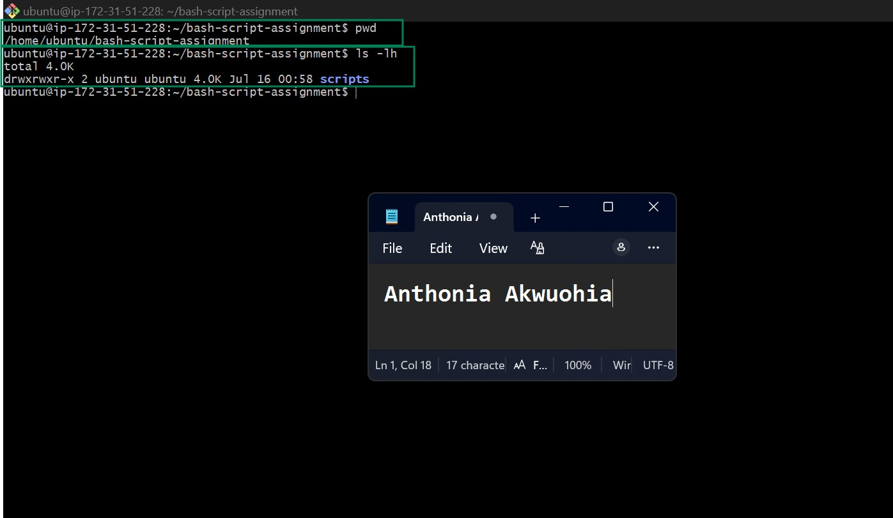

---

### Notes

Answer the following in your own words:

**1. What is Bash?**

Bash (Bourne Again Shell) is a command-line shell and scripting language used to interact with an operating system. It allows users to run commands, manage files, automate repetitive tasks, and write scripts to perform multiple operations efficiently.

---

**2. What is the difference between shell and Bash?**

A shell is a general program that provides a command-line interface for interacting with an operating system. Bash is a specific type of shell that offers additional features, improved scripting capabilities, command history, tab completion, and better usability compared to many older shells.

---

**3. Why is it important to confirm the Bash version before writing scripts?**

Confirming the Bash version is important because different versions support different commands and scripting features. Checking the version helps ensure that the script is compatible with the target environment and prevents errors caused by using features that may not be available in older versions.

---

# Task 2 — Your First Bash Script

## Goal

Create your first Bash script, make it executable, and run it from the terminal.

### Evidence

#### Screenshot 1 — Content of `first-script.sh`

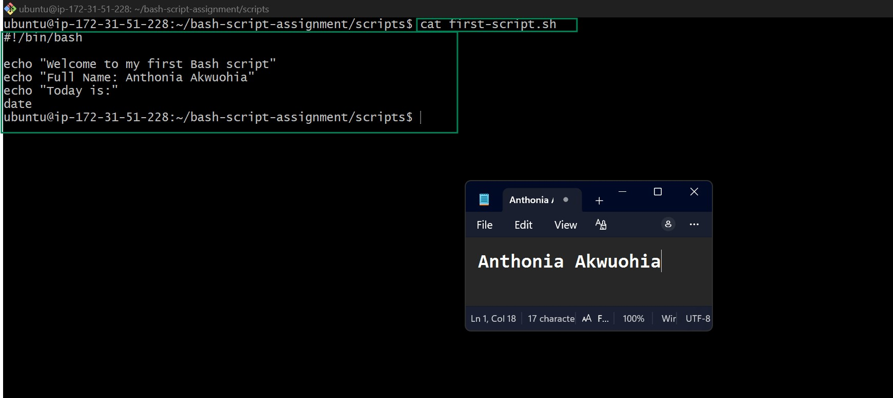

---

#### Screenshot 2 — Output of `./first-script.sh`

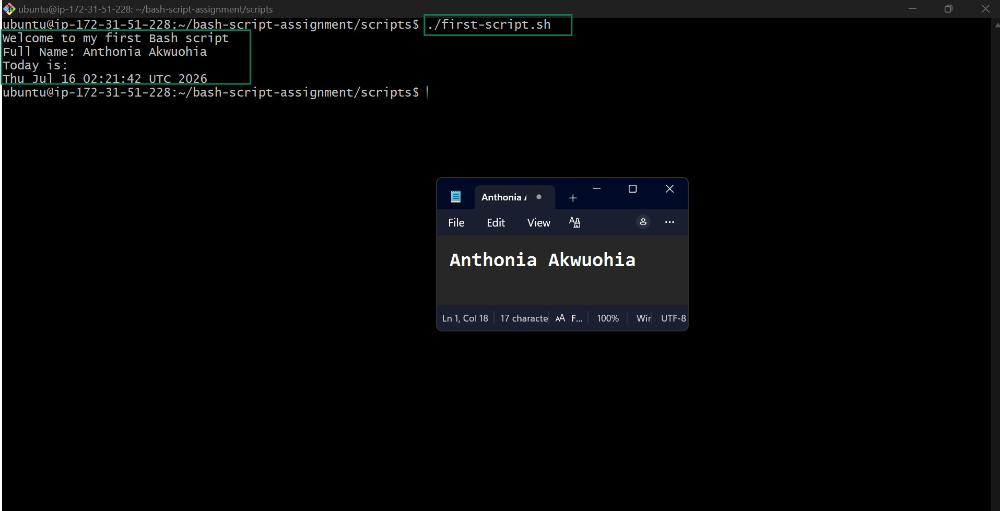

---

#### Screenshot 3 — Output of `ls -l first-script.sh` showing executable permission

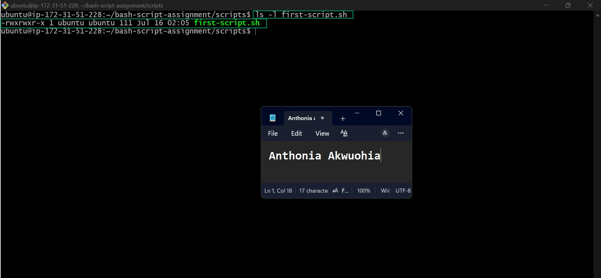

---

### Notes

Answer the following in your own words:

**1. What is the purpose of `#!/bin/bash`?**

#!/bin/bash is called a shebang. It tells the operating system to use the Bash shell to run the script, ensuring the commands are interpreted correctly and the script behaves as expected.

---

**2. Why do we use `chmod +x` before running a script?**

We use chmod +x to make a script executable. Without execute permission, the operating system will not allow the script to be run directly.

---

**3. What is the difference between running a script using `./script.sh` and `bash script.sh`?**

Running ./script.sh executes the script directly, so it must have execute permission (chmod +x) and a valid shebang (such as #!/bin/bash). Running bash script.sh starts the script with the Bash interpreter directly, so it can run even if the script is not marked as executable, as long as it is readable.

---

# Task 3 — Variables: User Information Script

## Goal

Use variables to store and display user-related information.

### Evidence

#### Screenshot 1 — Content of `user-info.sh`

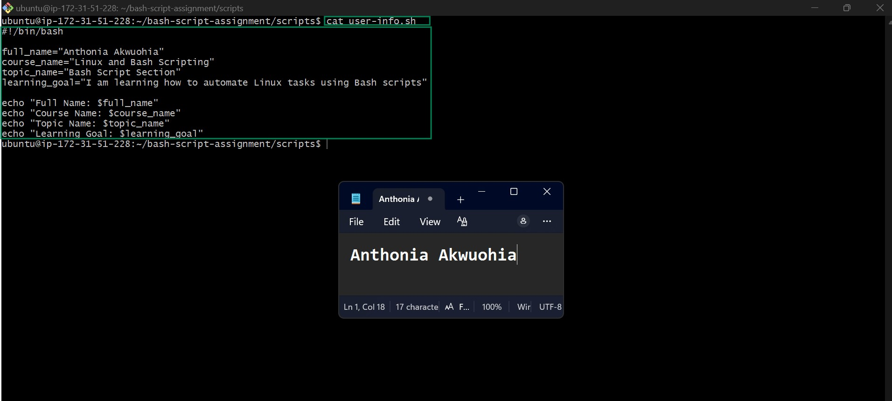

---

#### Screenshot 2 — Output of `./user-info.sh`

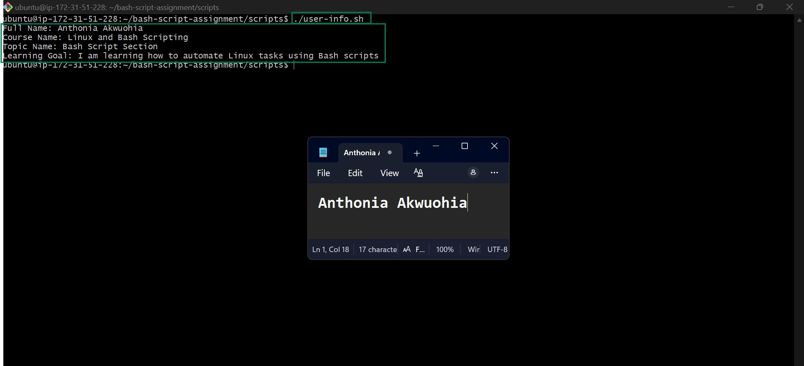

---

### Notes

Answer the following in your own words:

**1. What is a variable in Bash?**

A variable in Bash is a named container used to store information that a script can use later. Instead of writing the same value multiple times, you can save it in a variable and reference it whenever needed. Variables make scripts easier to read, maintain, and update because you only need to change the value in one place if necessary.

Variables can store different kinds of information, such as text, numbers, file paths, usernames, dates, or the output of commands. They help make scripts more dynamic by allowing them to work with different values during execution.
Example: 
</> Bash
username="Anthonia"
echo "Welcome, $username!"

This will display:

Welcome, Anthonia!

---

**2. Why should we avoid spaces around the `=` sign when creating variables?**

Bash requires variable assignments to have no spaces around the = sign. If spaces are added, Bash treats them as separate commands or arguments, which causes an error instead of creating the variable.

---

**3. How do you access the value stored inside a Bash variable?**

You access the value of a Bash variable by placing a dollar sign ($) before the variable name. For example, if the variable is name, you can access its value using $name.
Example: 
</> Bash
name="Anthonia"
echo "Hello, ${name}!"

Output:
Hello, Anthonia!

---

# Task 4 — Arrays & Loops: Tools Checklist Script

## Goal

Use arrays and loops to print a checklist of tools used in Bash scripting.

### Evidence

#### Screenshot 1 — Content of `tools-checklist.sh`

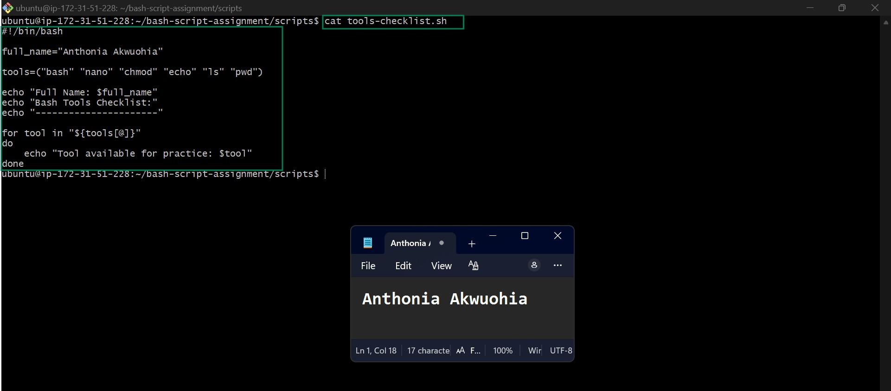

---

#### Screenshot 2 — Output of `./tools-checklist.sh`

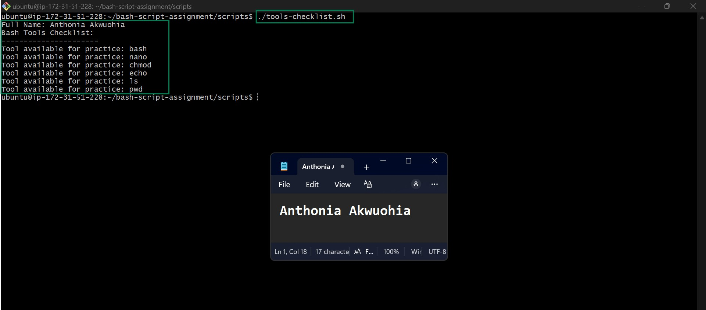

---

### Notes

Answer the following in your own words:

**1. What is an array in Bash?**

An array in Bash is a special type of variable that can store multiple values under a single variable name. Instead of creating separate variables for related pieces of information, an array allows you to organize all those values together in one place. Each value in the array is stored at a numbered position called an index, starting from 0.

Arrays are useful for storing collections of related data, such as a list of files, tools, server names, or usernames. By grouping related values together, arrays make scripts more organized, easier to read, and simpler to manage. They also make it easy to add, remove, or update items without rewriting large sections of the script.

---

**2. Why are arrays useful in scripts?**

Arrays are useful because they allow a script to handle multiple related values efficiently. Instead of writing the same command repeatedly for each value, you can store all the values in an array and process them together using loops or other Bash commands.

Using arrays makes scripts shorter, more organized, and easier to maintain. If you need to add or remove an item, you only have to update the array rather than changing the entire script. Arrays also reduce code duplication, improve readability, and make scripts more flexible when working with lists of data such as software packages, files, or servers.

---

**3. What does `"${tools[@]}"` mean?**

The expression "${tools[@]}" tells Bash to access every element stored in the tools array. The @ symbol means "all elements," while the double quotation marks ensure that each element is treated as a separate item, even if it contains spaces.

This expression is commonly used when looping through an array because it allows Bash to process each value one at a time. Using "${tools[@]}" is considered best practice because it preserves the contents of each array element correctly and prevents problems caused by spaces or special characters.

---

**4. What is the purpose of the `for` loop in this script?**

The purpose of the for loop is to repeat a set of commands for every item stored in the array. Instead of writing the same code multiple times for each value, the loop automatically goes through each element one by one and performs the specified action.

This makes the script more efficient, easier to read, and simpler to maintain. If new items are added to the array, the loop will automatically process them without requiring changes to the loop itself. Using a for loop helps automate repetitive tasks, reduces errors, and makes Bash scripts more scalable and easier to update.

---

# Task 5 — Loops: Number Counter Script

## Goal

Use loops to repeat a task multiple times.

### Evidence

#### Screenshot 1 — Content of `counter.sh`

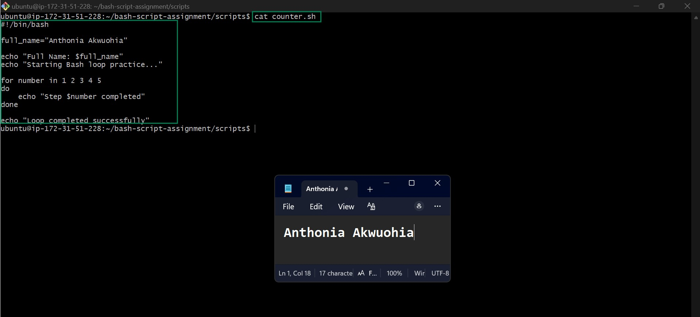

---

#### Screenshot 2 — Output of `./counter.sh`

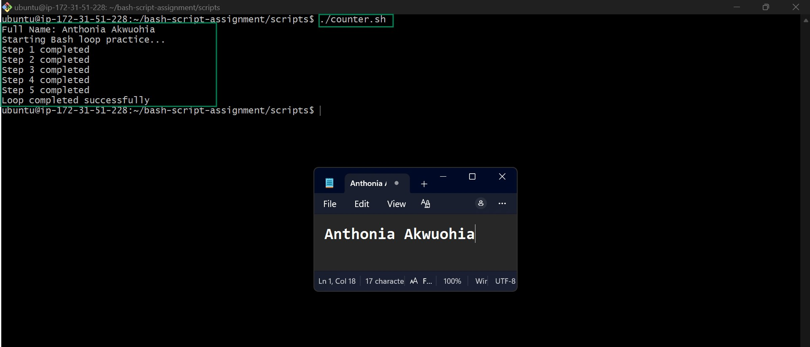

---

### Notes

Answer the following in your own words:

**1. What is a loop?**

A loop is a programming structure that allows a set of commands to be repeated automatically until a specific condition is met or until all items in a list have been processed. Instead of writing the same commands multiple times, a loop executes them repeatedly, making scripts shorter, more efficient, and easier to maintain.

In Bash scripting, loops are commonly used to automate repetitive tasks such as processing files, checking system information, installing software, or performing the same action on multiple items.

---

**2. Why do we use loops in Bash scripting?**

We use loops in Bash scripting to automate repetitive tasks and reduce the amount of code we need to write. Instead of repeating the same command many times, a loop allows the script to execute it automatically for each item or for a specified number of iterations.

Loops make scripts more efficient, easier to read, and simpler to maintain. They also reduce the risk of human error because the same operation is performed consistently each time. This is especially useful when working with lists of files, directories, users, servers, or software packages.

---

**3. How many times did the loop run in your script?**

The loop ran the same number of times as the number of items it was instructed to process. For example, if the script looped through an array containing three items (Git, Docker, and Terraform), then the loop executed three times, once for each item in the array.

If your script used a numeric loop, the number of iterations depended on the range you specified. The loop continues until it has completed every iteration defined in the script.

---

**4. What would you change if you wanted the loop to run 10 times?**

To make the loop run 10 times, I would modify the loop's range or condition so that it performs ten iterations instead of the current number. For example, if using a numeric for loop, I would change the range to count from 1 to 10.

Example
</> Bash
for i in {1..10}
do
    echo "Iteration $i"
done

This loop will execute exactly 10 times, printing the iteration number during each cycle. By changing the loop's range or condition, I can easily control how many times the commands inside the loop are repeated.

---

# Task 6 — Files & Conditionals: File Validation Script

## Goal

Use file checks and conditionals to verify whether files and directories exist.

### Evidence

#### Screenshot 1 — Output of `ls -lah ../test-folder`

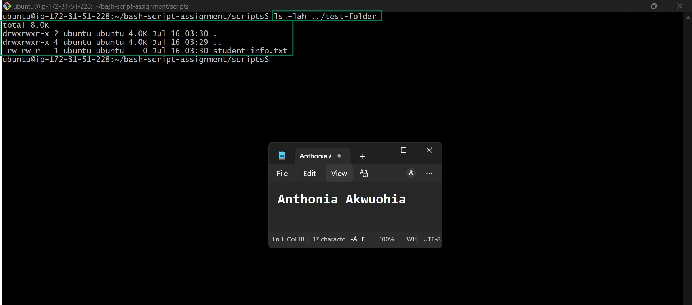

---

#### Screenshot 2 — Content of `file-check.sh`

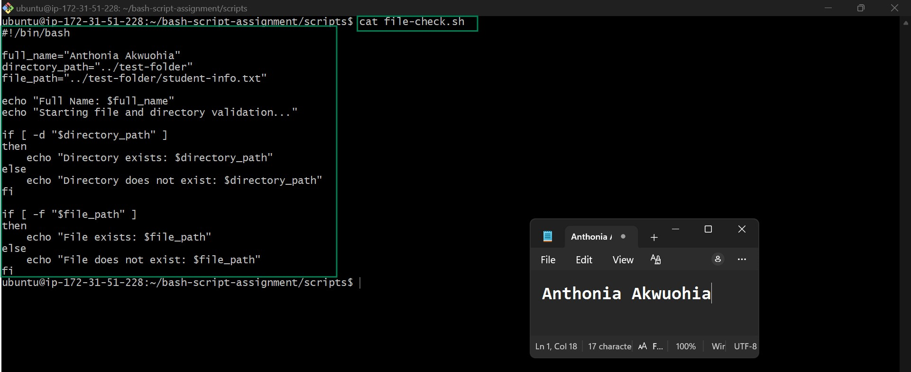

---

#### Screenshot 3 — Output of `./file-check.sh`

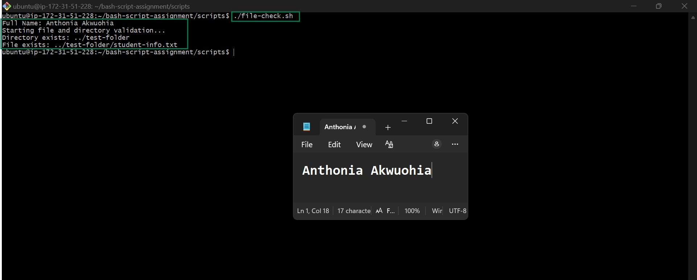

---

### Notes

Answer the following in your own words:

**1. What does `-d` check in Bash?**

The -d operator checks whether a specified path exists and is a directory. It returns true if the directory exists and false if it does not. This helps scripts verify that a directory is available before performing operations on it.

---

**2. What does `-f` check in Bash?**

The -f operator checks whether a specified path exists and is a regular file. It is commonly used to confirm that a file is available before reading, editing, or executing it, helping to prevent errors.

---

**3. Why should file and directory paths be stored in variables?**

Storing file and directory paths in variables makes scripts easier to read, update, and maintain. If the path changes, you only need to update the variable instead of editing multiple lines throughout the script.

---

**4. What happens if the file does not exist?**

If the file does not exist, Bash cannot perform operations on it and usually displays an error such as "No such file or directory." Using -f to check for the file first helps the script handle the situation safely and avoid unexpected failures.

---

# Task 7 — Conditionals: Pass or Retry Script

## Goal

Use if-else conditionals to make decisions based on a variable value.

### Evidence

#### Screenshot 1 — Content of `score-check.sh` with `score=85`

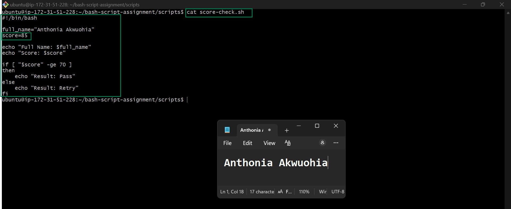

---

#### Screenshot 2 — Output showing `Result: Pass`

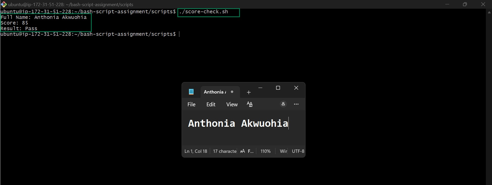

---

#### Screenshot 3 — Content of `score-check.sh` with `score=55`

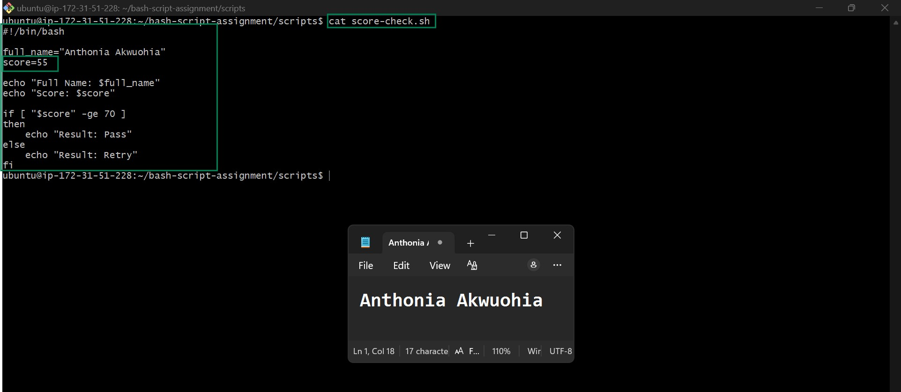

---

#### Screenshot 4 — Output showing `Result: Retry`

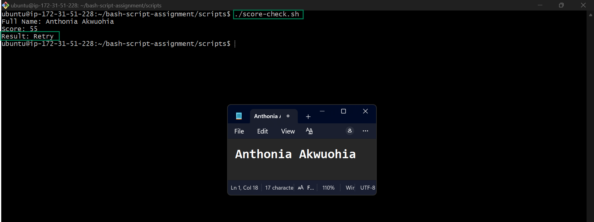

---

### Notes

Answer the following in your own words:

**1. What is the purpose of if-else in Bash?**

The if-else statement is used to make decisions in a Bash script. It checks whether a condition is true or false and runs different commands based on the result.

---

**2. What does `-ge` mean?**

The -ge operator means "greater than or equal to." It is used to compare two numbers and returns true if the first number is greater than or equal to the second.

---

**3. Why should conditions be tested with different values?**

Testing conditions with different values ensures that the script works correctly in different situations. It helps identify errors and confirms that both the true and false outcomes behave as expected.

---

**4. How can conditionals help in automation scripts?**

Conditionals make automation scripts more intelligent by allowing them to make decisions based on specific conditions. This enables scripts to handle different situations automatically, reduce errors, and improve efficiency.

---

# Task 8 — Functions: Final Bash Automation Script

## Goal

Create a final Bash script using functions to organize reusable code.

### Evidence

#### Screenshot 1 — Content of `final-automation.sh`

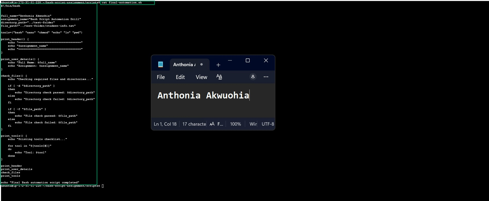

---

#### Screenshot 2 — Output of `./final-automation.sh`

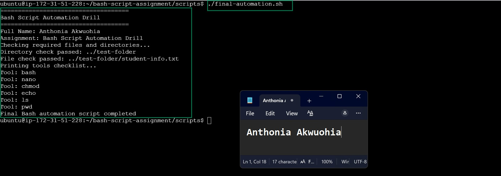

---

#### Screenshot 3 — Output of `ls -lah` showing all created scripts

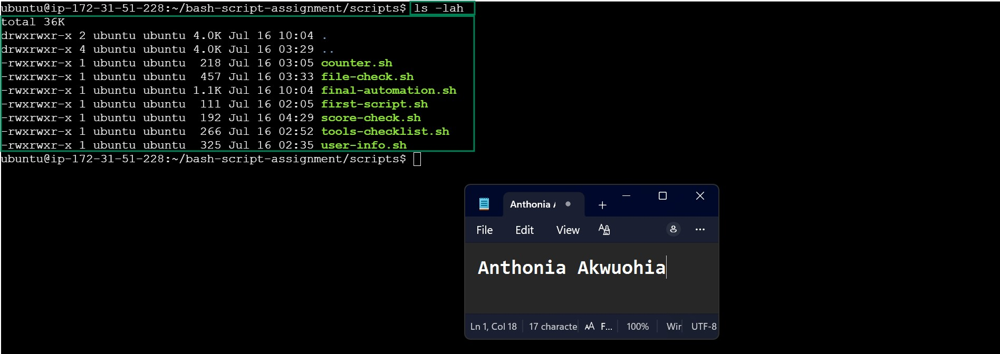

---

### Notes

Answer the following in your own words:

**1. What is a function in Bash?**

A function in Bash is a named block of code that performs a specific task. Instead of writing the same commands multiple times throughout a script, you can place them inside a function and call that function whenever you need it. This helps organize the script into smaller, meaningful sections that are easier to understand and maintain.

Functions are especially useful in larger scripts because they separate different tasks into reusable components. For example, you might create one function to display system information, another to validate files, and another to install software. Each function has a specific responsibility, making the script cleaner and more structured.

---

**2. Why are functions useful in scripts?**

Functions are useful because they make Bash scripts more organized, reusable, and easier to maintain. Instead of repeating the same block of code several times, you can write it once inside a function and call it whenever it is needed.

Functions improve the readability of a script by breaking complex tasks into smaller, manageable sections. They also reduce the chances of errors because changes only need to be made in one place. This saves time and makes troubleshooting much easier.

---

**3. Which functions did you create in this script?**

In this script, I created four functions: print_header(), print_user_details(), check_files(), and print_tools(). The print_header() function displays the assignment title, print_user_details() prints the user's name and assignment name, check_files() verifies whether the required directory and file exist, and print_tools() uses a for loop to display each tool stored in the tools array. Each function performs a specific task, making the script more organized, reusable, and easier to maintain.

---

**4. How does this final script combine variables, arrays, loops, conditionals, files, and functions?**

The final script combines several Bash concepts to automate different tasks efficiently. It uses variables to store the user's full name, assignment name, and file paths. An array stores the list of Bash tools, while a for loop iterates through the array to display each tool. Conditionals (if statements) use the -d and -f operators to check whether the required directory and file exist before displaying the appropriate message. Finally, the script organizes all these tasks into functions, making the code modular, easier to read, reusable, and simple to maintain.

---

# LinkedIn Post (Required)

## Evidence

#### LinkedIn Post URL

Paste your LinkedIn post URL here:

https://www.linkedin.com/posts/anthonia-akwuohia-5b00681b0_devops-bash-linux-activity-7483709579747348480-RSsz?utm_source=share&utm_medium=member_desktop&rcm=ACoAADEhX1QBTHiW-kQPmKjn3MVixQzj4IzJO1Q

---

#### Screenshot — Published LinkedIn post

---

# Submission Instructions

- Add all required screenshots in your submission
- Full name must be visible in required screenshots
- All script files must be created and run successfully
- Required notes must be answered clearly for every task
- Do not expose sensitive information (keys, passwords, credentials)

---

# Completion Checklist

- [ ] Task 1: Environment setup verified, workspace created (Screenshots 1–2, Notes answered)
- [ ] Task 2: First script created, executed, permissions verified (Screenshots 1–3, Notes answered)
- [ ] Task 3: Variables script created and run (Screenshots 1–2, Notes answered)
- [ ] Task 4: Arrays and loops script created and run (Screenshots 1–2, Notes answered)
- [ ] Task 5: Counter loop script created and run (Screenshots 1–2, Notes answered)
- [ ] Task 6: File validation script created and run (Screenshots 1–3, Notes answered)
- [ ] Task 7: Pass/Retry conditional script tested with both values (Screenshots 1–4, Notes answered)
- [ ] Task 8: Final automation script created and run (Screenshots 1–3, Notes answered)
- [ ] All scripts run without errors
- [ ] Full Name visible in all required screenshots
- [ ] LinkedIn post published and URL submitted
- [ ] No sensitive data exposed

---

## 📌 About DMI & CloudAdvisory

DevOps Micro Internship (DMI) is a project-based DevOps program run by Pravin Mishra (The CloudAdvisory) focused on real-world execution, systems thinking, and career readiness.

It helps learners build strong DevOps foundations with hands-on experience.

---

## 📌 Resources

- 🌐 DMI Official Website: https://pravinmishra.com/dmi  
- 🎓 DevOps for Beginners (Udemy): https://www.udemy.com/course/devops-for-beginners-docker-k8s-cloud-cicd-4-projects/  
- 🎓 Agentic AI DevOps with Claude Code: https://www.udemy.com/course/ultimate-agentic-ai-devops-with-claude-code/  
- 🎓 DevOps with Claude Code: Terraform, EKS, ArgoCD & Helm: https://www.udemy.com/course/devops-with-claude-code-terraform-eks-argocd-helm/  
- ▶️ YouTube Playlist: https://www.youtube.com/playlist?list=PLFeSNDtI4Cho  
- 🔗 Pravin Mishra (LinkedIn): https://www.linkedin.com/in/pravin-mishra-aws-trainer/  
- 🏢 CloudAdvisory (LinkedIn): https://www.linkedin.com/company/thecloudadvisory/

---

*This submission is part of DevOps Micro Internship (DMI) Cohort 3 — Agentic AI Track.*