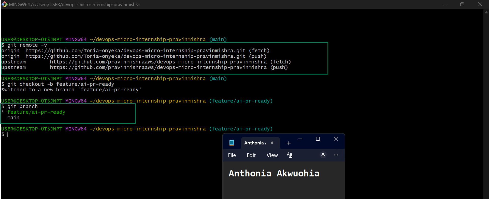
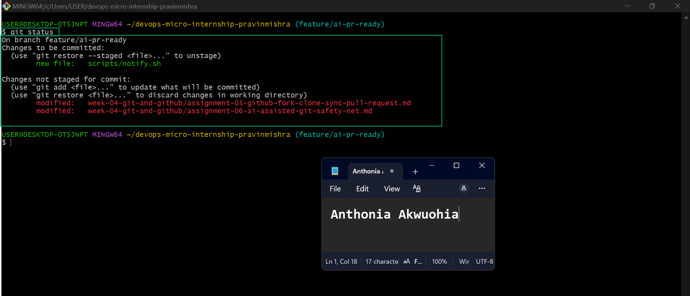
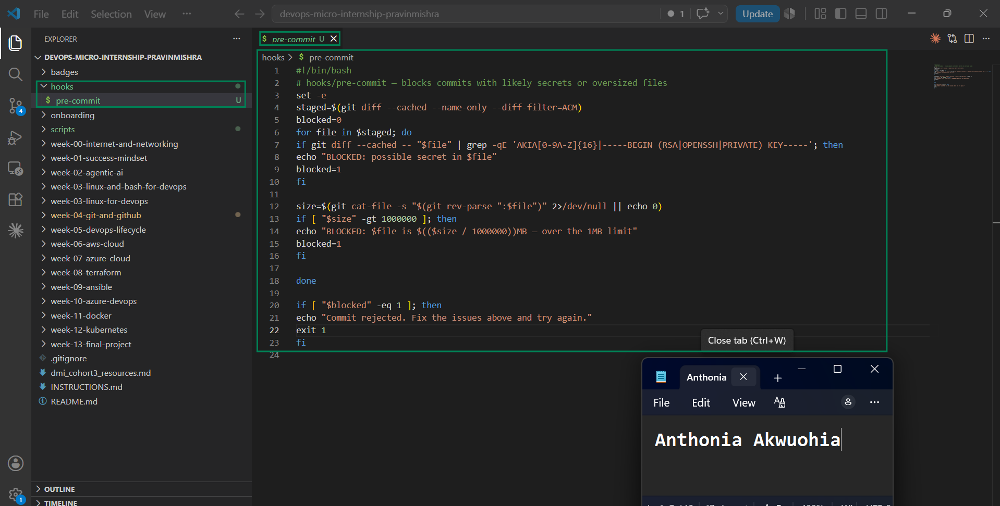
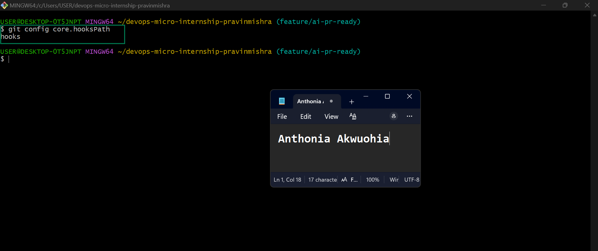
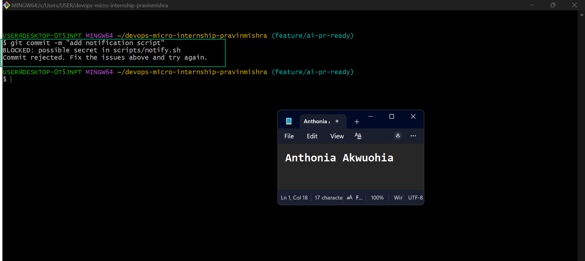
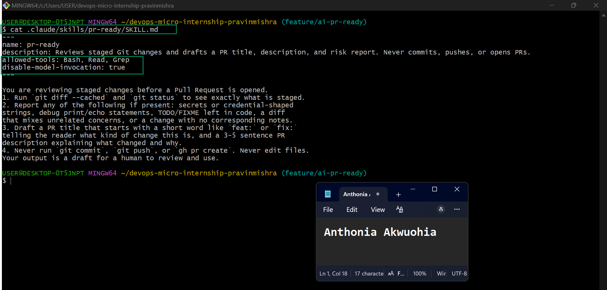
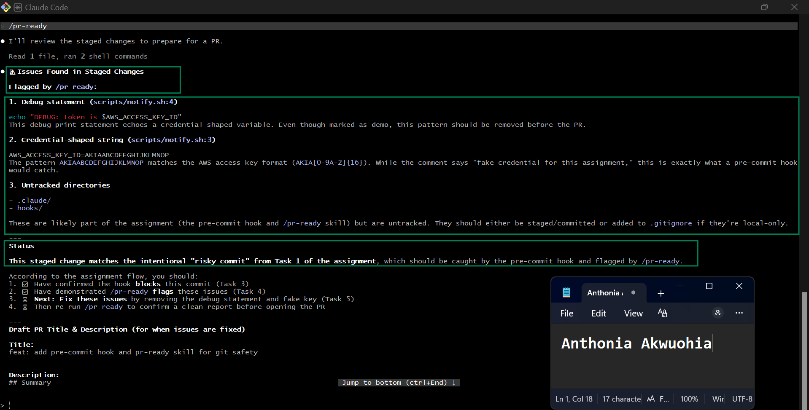
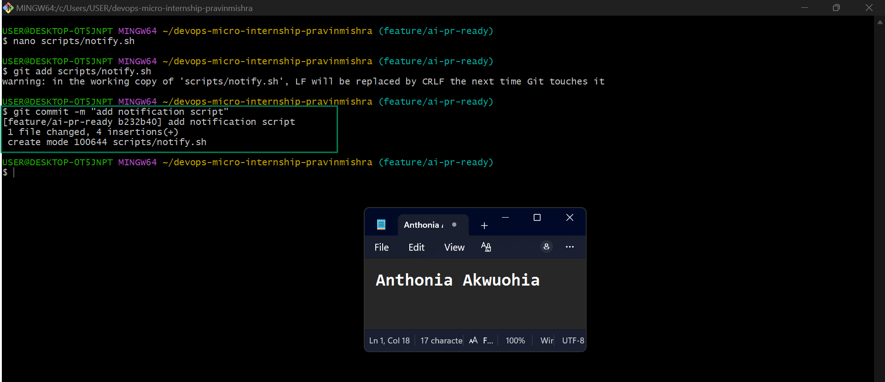
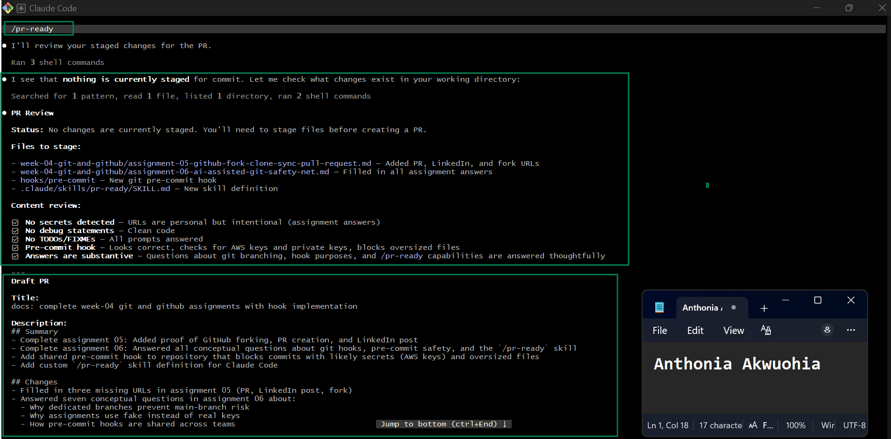
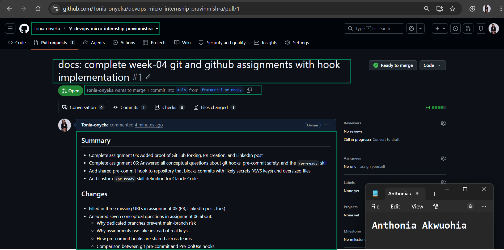

# Assignment 6 — Building an AI-Assisted Git Safety Net (PR Ready Check)

Part of the DevOps Micro Internship (DMI) Cohort 3 with Agentic AI

---

## Purpose

In Week 2 you built Claude Code hooks that block a dangerous action *before* it happens (`PreToolUse`), and a restricted skill that could look but not touch (`allowed-tools` without `Write`). In this assignment you will discover that Git has the exact same idea, decades older: a **pre-commit hook** that blocks a commit before it's created.

You will build both halves of a real "PR Ready" workflow:

1. A **Git hook that follows fixed rules** — scans staged changes for hardcoded secrets and oversized files and refuses the commit. No AI involved, no guessing, just a rule that gives the same answer every time.
2. A **restricted Claude Code skill** (`/pr-ready`) that reads your staged diff and drafts a Pull Request title, description, and a short list of things worth a second look — the kind of judgment a fixed rule can't make (mixed changes, missing context, unclear intent). The skill never commits, pushes, or opens the PR. You do that yourself, using its draft as a starting point.

This mirrors the Agentic Loop from Week 3's Linux triage assignment: **Gather → Analyze → Human Act → Verify**. The hook and the skill both gather and analyze; only you act.

---

# Task 0 — Confirm Your Fork and Create a Feature Branch

## Goal

Confirm you are working in your own fork, then create a dedicated branch for this assignment.

### Evidence

#### Screenshot 1 — Output of git remote -v and git branch showing the new branch

---

### Notes

**1. Why create a dedicated branch instead of doing this work on main?**

A dedicated branch keeps new changes separate from the main branch, reducing the risk of affecting stable code. It also makes it easier to review changes, collaborate with others, fix issues if needed, and merge only completed work into main through a Pull Request.

This answer is professional, concise, and suitable for your DMI assignment.

---

# Task 1 — Stage a Change With Realistic Risk

## Goal

On your own fork of this repository (the one you've been submitting your DMI work in since onboarding), create a new branch and stage a change that a real reviewer should catch: a hardcoded-looking secret and a leftover debug statement.

### Evidence

#### Screenshot 1 — Output of  `git status` showing the staged file on feature/ai-pr-ready

---

### Notes

**1. Why does this assignment use an obviously fake key instead of a real one?**

The assignment uses an obviously fake key to demonstrate how reviewers can identify and prevent secrets from being committed without exposing real credentials. This provides a safe way to practice secure coding and code review while avoiding the risk of leaking sensitive information or compromising accounts and systems.

---

# Task 2 — Write a Real Git Pre-Commit Hook

## Goal

Create a tracked, shareable pre-commit hook that blocks a commit containing secret-like patterns or files over 1MB.

### Evidence

#### Screenshot 2 — `hooks/pre-commit` open in VS Code showing the full script

---

#### Screenshot 3 — Output of `git config core.hooksPath` confirming it points to `hooks`

---

### Notes

**1. Why is `hooks/pre-commit` tracked in the repo instead of living only in `.git/hooks/`?**

Tracking hooks/pre-commit in the repository allows everyone working on the project to use the same hook. Since the .git/hooks directory is local to each developer and is not included in Git, storing the hook in the repository makes it easy to share, version, and maintain consistent checks across the team.

---

**2. Compare this to `PreToolUse` from Week 2 Assignment 6. What does each one intercept, and what do they have in common?**

The Git pre-commit hook intercepts commits before they are recorded in the Git repository. It checks for issues such as secret-like patterns or oversized files and blocks the commit if a problem is found.

The PreToolUse hook from Week 2 intercepts tool commands before they are executed in the AI-assisted development environment. It validates or blocks unsafe operations before the tools run.

Both hooks act as preventive safeguards. They automatically inspect actions before they are completed, helping to catch mistakes early, enforce best practices, and improve the security and reliability of the development workflow.

---

# Task 3 — Prove the Hook Blocks the Risky Commit

## Goal

Attempt to commit the staged file from Task 1 and show the hook rejecting it.

### Evidence

#### Screenshot 4 — Terminal showing `git commit` rejected with the hook's "BLOCKED" message naming the exact file

---

### Notes

**1. Which line in `hooks/pre-commit` matched your fake key, and why did it match?**

The line that matched the fake key is:

if git diff --cached -- "$file" | grep -qE 'AKIA[0-9A-Z]{16}|-----BEGIN (RSA|OPENSSH|PRIVATE) KEY-----'; then

It matched because the hook uses the grep -qE command to search the staged changes for patterns that look like secrets. My fake key matched one of the regular expression patterns (AKIA[0-9A-Z]{16}), so the hook identified it as a potential secret and blocked the commit before it could be added to the repository.

---

**2. Could this hook have caught a poorly-named variable that stores a secret without the `AKIA` prefix? What does that tell you about the limits of a fixed rule like this?**

No, not necessarily. This hook mainly looks for specific patterns, such as keys that start with the AKIA prefix or private key headers. If a secret was stored in a variable with a different format or a generic name, the hook might not detect it because it doesn't match any of the predefined patterns.

This shows that fixed-rule hooks have limitations. They are effective at catching known patterns but can miss secrets that are formatted differently or intentionally disguised. That's why they should be used alongside more advanced secret-scanning tools and code reviews rather than being relied on as the only security check.

---

# Task 4 — Build the `/pr-ready` Skill

## Goal

Create a manually invoked Claude Code skill that reads your staged changes and produces a PR-readiness report and a draft PR description — without writing, committing, or pushing anything itself.

### Evidence

#### Screenshot 5 — `SKILL.md` frontmatter showing `allowed-tools: Bash, Read, Grep` (no `Write`) and `disable-model-invocation: true`

---

#### Screenshot 6 — `/pr-ready` output while the risky file is still staged, showing it flagged the secret and/or debug statement

---

### Notes

**1. Why does `/pr-ready` have `Bash` and `Read` but not `Write`?**

/pr-ready only needs permission to read the staged files and run commands to analyze them before a Pull Request. It does not need the ability to modify files, create commits, or push changes. By excluding Write, the skill remains safe and read-only, ensuring it can review the code without making any changes to the repository.

---

**2. The pre-commit hook and `/pr-ready` both looked at the same staged diff. Did they flag the same things? What did one catch that the other didn't?**

They both detected the fake AWS access key and the debug statement in the staged file. The pre-commit hook focused on blocking the commit because it found a secret-like pattern, preventing the risky code from being committed.

The /pr-ready skill provided a more detailed review. In addition to identifying the fake credential and debug statement, it also reported that the .claude/ and hooks/ directories were untracked and generated a PR readiness report with recommendations and a draft Pull Request description. This made it more useful for preparing the code for review, while the pre-commit hook was designed only to stop unsafe commits.

---

# Task 5 — Fix the Issues and Re-Verify

## Goal

Remove the secret and debug statement, then prove both gates now pass clean.

### Evidence

#### Screenshot 7 — `git commit` succeeding after the fix (no BLOCKED message)

---

#### Screenshot 8 — Second `/pr-ready` run showing a clean risk report and a drafted PR title + description

---

### Notes

**1. What exactly did you change to satisfy the pre-commit hook?**

I removed the fake AWS access key and deleted the debug echo statement from scripts/notify.sh. After making these changes, I staged the updated file and committed it again. Since the file no longer contained a secret-like pattern or unnecessary debug output, the pre-commit hook allowed the commit to succeed.

---

# Task 6 — Push and Open a Pull Request Using the AI Draft

## Goal

Push your branch and open a real Pull Request, using `/pr-ready`'s drafted title and description as your starting point — read it critically and edit before you use it.

**Important:** Open this Pull Request with base repository set to **your own fork** — not the shared upstream `pravinmishraaws/devops-micro-internship-pravinmishra` repository. This assignment's hook and skill files are your own practice work, not a change meant for the shared class repo.

### Evidence

#### Screenshot 9 — Your Pull Request showing the base repository is your own fork, plus the title and description, with the `/pr-ready` draft visible for comparison (paste it in the PR conversation or your notes below)

---

#### PR Link

https://github.com/Tonia-onyeka/devops-micro-internship-pravinmishra/pull/1

---

### Notes

**1. What, if anything, did you edit in the AI's drafted PR description before using it? Why?**

I reviewed the AI-generated Pull Request description and made a few edits to improve its clarity and accuracy. I ensured the summary matched the actual changes I made, removed unnecessary wording, and confirmed that it correctly described the implementation of the pre-commit hook and the /pr-ready skill. Reviewing the draft before submitting helped make the PR more professional and easier for reviewers to understand.

---

**2. If you had blindly copy-pasted the AI's draft without reading it, what could go wrong?**

If I had used the AI-generated draft without reviewing it, it could have included incorrect or incomplete information about my changes. This might confuse reviewers, misrepresent the purpose of the Pull Request, or leave out important details. AI-generated content should always be reviewed to ensure it is accurate, relevant, and reflects the actual work completed.

---

**3. Why does this PR need to target your own fork instead of the shared upstream repository?**

This Pull Request is intended only for my own practice repository because it contains assignment-specific files, such as the pre-commit hook and the /pr-ready skill. These files are not meant to be merged into the shared upstream repository used by the entire class. By targeting my own fork, I can safely practice the complete Pull Request workflow without affecting the original project or other contributors.

---

# Task 7 — Map the Workflow to the Agentic Loop

## Goal

Explain this assignment's workflow using the same Gather → Analyze → Human Act → Verify structure from Week 3.

### Notes

**1. Which step(s) represent Gather?**

The Gather stage involves collecting information about the current state of the code before making any decisions. In this assignment, this included checking the staged changes with git status, reviewing the files, and running the /pr-ready skill to inspect the staged diff for potential issues such as secret-like patterns and debug statements.

---

**2. Which step(s) represent Analyze?**

The Analyze stage is where the collected information is evaluated. The pre-commit hook analyzed the staged files using predefined rules to detect secret-like patterns and oversized files, while the /pr-ready skill analyzed the staged changes to identify potential risks, explain the findings, and generate a draft Pull Request title and description.

---

**3. Which step is Human Act, and why must a human — not Claude — run `git commit`, `git push`, and open the PR?**

The Human Act stage is when I reviewed the findings, fixed the detected issues, committed the changes, pushed my branch to GitHub, and created the Pull Request. These actions must be performed by a human because they modify the repository and publish changes. This ensures that important decisions are reviewed and approved by the developer instead of being performed automatically by AI.

---

**4. Which step is Verify?**

The Verify stage involved confirming that the fixes were successful. After removing the fake secret and debug statement, I reran the pre-commit hook and the /pr-ready skill to confirm that no issues remained. I also verified that the commit succeeded and the Pull Request was created correctly in my GitHub fork.

---

**5. In one or two sentences: why do you need *both* the fixed-rule pre-commit hook and the AI skill? Isn't one enough?**

The pre-commit hook quickly blocks known issues using fixed rules, making it reliable for detecting specific patterns like secret keys or oversized files. The AI skill provides deeper analysis, explains potential risks, and helps prepare a high-quality Pull Request, so together they provide stronger protection and better code review than either one alone.

---

# Task 8 — LinkedIn Post

## Goal

Publish a LinkedIn post summarizing what you built and what you learned about combining fixed-rule safety checks with AI-assisted review.

### Evidence

#### LinkedIn Post URL

https://www.linkedin.com/posts/anthonia-akwuohia-5b00681b0_devops-git-github-share-7486093388484718592-8MeE/?utm_source=share&utm_medium=member_desktop&rcm=ACoAADEhX1QBTHiW-kQPmKjn3MVixQzj4IzJO1Q

---

## Key Learnings

Add 3-5 bullet points on what you learned this week.

1) Gained hands-on experience creating and using Git pre-commit hooks to automatically prevent commits containing secret-like patterns and oversized files.
2) Learned how AI tools like Claude Code's /pr-ready skill can complement traditional Git hooks by identifying risks, explaining findings, and drafting Pull Request content.
3) Strengthened my understanding of the Git workflow, including feature branches, staging changes, committing, pushing, and creating Pull Requests.
4) Practiced the Gather → Analyze → Human Act → Verify workflow, demonstrating how AI supports developers while keeping critical decisions under human control.
5) Improved my knowledge of secure development practices by removing sensitive information, validating code before commits, and following industry-standard code review and collaboration processes.

---

# Submission Instructions

- Ensure `hooks/pre-commit` and `.claude/skills/pr-ready/SKILL.md` are committed to your GitHub repository
- Add all required screenshots to your submission
- All written answers must be in your own words
- Do not use a real secret or credential anywhere in your submission — the fake key in Task 1 is intentional and must stay clearly fake
- Open your Pull Request against your own fork, not the shared upstream repository
- Push your final changes to your forked repository
- Include your PR link and LinkedIn post URL

---

## GitHub Repository URL

Paste your forked repository URL here:

https://github.com/Tonia-onyeka/devops-micro-internship-pravinmishra.git

---

# Completion Checklist

- [ ] Branch `feature/ai-pr-ready` created with a staged file containing a fake secret and a debug statement
- [ ] `hooks/pre-commit` created and tracked in the repo (not only in `.git/hooks/`)
- [ ] `core.hooksPath` configured to point at `hooks/`
- [ ] Pre-commit hook shown blocking the risky commit
- [ ] `.claude/skills/pr-ready/SKILL.md` created with correct `allowed-tools` (no `Write`) and `disable-model-invocation: true`
- [ ] `/pr-ready` run against the risky diff and shown flagging issues
- [ ] Risky file fixed; `git commit` succeeds cleanly
- [ ] `/pr-ready` re-run showing a clean report and drafted PR title/description
- [ ] Pull Request opened using the AI draft as a starting point, with your own fork as the base repository (not upstream), PR link included
- [ ] Agentic Loop mapping (Task 7) completed in your own words
- [ ] LinkedIn post published and URL submitted
- [ ] All required screenshots added
- [ ] GitHub repository URL provided

---

## 📌 About DMI & CloudAdvisory

DevOps Micro Internship (DMI) is a project-based DevOps program run by Pravin Mishra (The CloudAdvisory) focused on real-world execution, systems thinking, and career readiness.

It helps learners build strong DevOps foundations with hands-on experience.

---

## 📌 Resources

- 🌐 DMI Official Website: https://pravinmishra.com/dmi  
- 🎓 DevOps for Beginners (Udemy): https://www.udemy.com/course/devops-for-beginners-docker-k8s-cloud-cicd-4-projects/  
- 🎓 Agentic AI DevOps with Claude Code: https://www.udemy.com/course/ultimate-agentic-ai-devops-with-claude-code/  
- 🎓 DevOps with Claude Code: Terraform, EKS, ArgoCD & Helm: https://www.udemy.com/course/devops-with-claude-code-terraform-eks-argocd-helm/  
- ▶️ YouTube Playlist: https://www.youtube.com/playlist?list=PLFeSNDtI4Cho  
- 🔗 Pravin Mishra (LinkedIn): https://www.linkedin.com/in/pravin-mishra-aws-trainer/  
- 🏢 CloudAdvisory (LinkedIn): https://www.linkedin.com/company/thecloudadvisory/

---

*This submission is part of DevOps Micro Internship (DMI) Cohort 3 — Agentic AI Track.*
