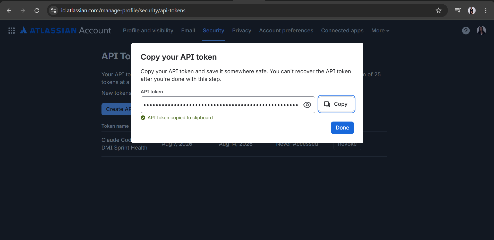
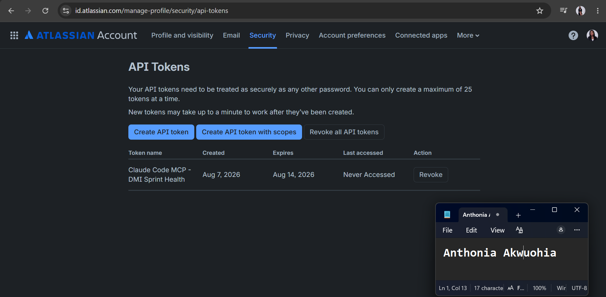
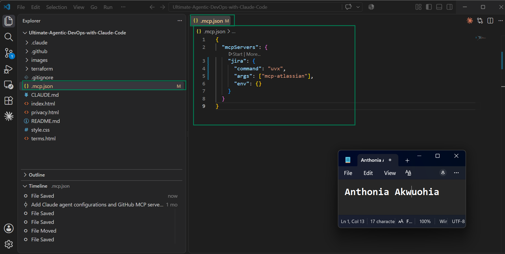
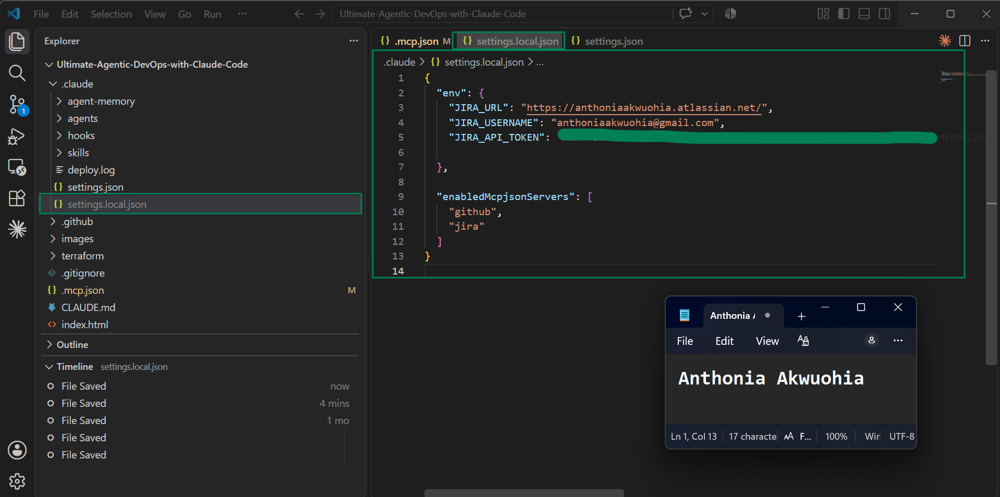
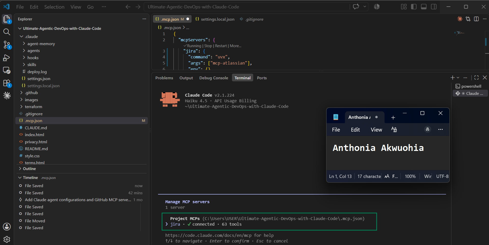
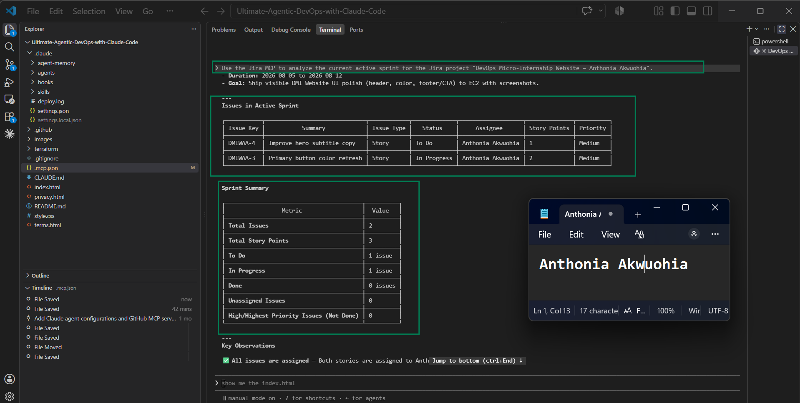
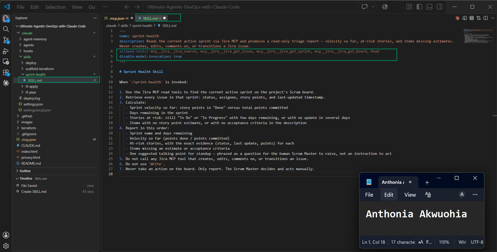
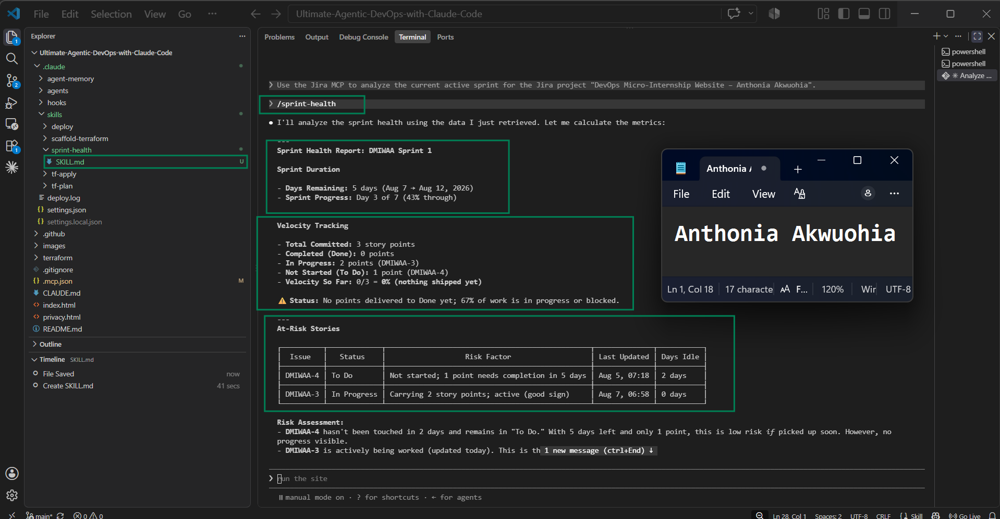
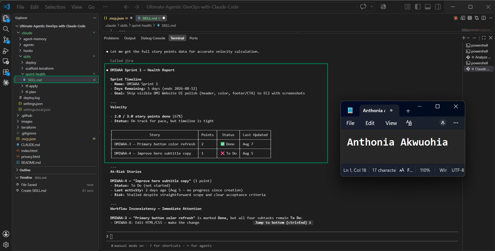

# Assignment 5 — AI-Assisted Sprint Health Report via Jira MCP

Part of the DevOps Micro Internship (DMI) Cohort 3 with Agentic AI

---

## Purpose

In this assignment, you will connect Claude Code to your Jira board through an MCP server, the same way you connected it to GitHub in Week 2, and build a read-only `/sprint-health` skill. The skill reads your current sprint through Jira's API and reports sprint velocity, stories at risk of missing the sprint, and items missing an estimate — but it must never create, edit, comment on, or transition a single ticket itself. You will prove that boundary holds by making a real change on the board yourself and confirming the skill only ever reports, never acts.

---

# Task 1 — Create a Jira API Token

## Goal

Generate an API token from your Atlassian account that the MCP server will use to authenticate with your Jira site. Do not screenshot the token value itself.

### Evidence

#### Screenshot 1 — Jira API token creation confirmation page showing the token name, with the token value not visible

### Notes You Must Write (Very Important):

Why does the MCP server need your site URL and account email in addition to the token?

The MCP server needs the Jira site URL to know which Atlassian/Jira workspace it should connect to. It needs the account email to identify the specific Atlassian user account that owns or is using the API token. The API token acts as the password for authentication, while the email identifies the user and the site URL identifies the Jira environment. All three pieces of information are required for the MCP server to securely authenticate and access the correct Jira project and resources.

---

# Task 2 — Create .mcp.json at the Project Root

## Goal

Create or update `.mcp.json` at your project root with a Jira MCP server block, following the same shape as the GitHub MCP server you configured in Week 2.

### Evidence

#### Screenshot 2 — `.mcp.json` open in VS Code showing the Jira server configuration

### Notes You Must Write (Very Important):

Compare this jira block to the github block from Week 2 Assignment 5. The GitHub server ran via npx (a Node.js package); this one runs via uvx (a Python package) — what stays exactly the same shape despite that difference, and why doesn't Claude Code care which language a given MCP server is written in?

The Jira block and the GitHub block keep the same overall MCP configuration structure. Both use a server name, a command to start the server, and arguments inside the .mcp.json file. The only difference is the runtime used to launch the server: the GitHub server uses npx because it is a Node.js package, while the Jira server uses uvx because it is a Python package.

Claude Code does not care whether an MCP server is written in JavaScript, Python, Go, or any other language because it communicates with the server through the MCP (Model Context Protocol). As long as the server follows the MCP protocol and exposes the expected tools and responses, Claude Code can interact with it in the same way regardless of the programming language used to implement the server.

---

# Task 3 — Add Your Credentials to settings.local.json

## Goal

Add your Jira site URL, account email, and API token to `.claude/settings.local.json`, and confirm that file is listed in `.gitignore` so it is never committed.

### Evidence

#### Screenshot 3 — `settings.local.json` open in VS Code showing the `env` section, with the actual token value blurred or covered

### Notes You Must Write (Very Important):

Why must JIRA_API_TOKEN live in settings.local.json and never in .mcp.json?

JIRA_API_TOKEN is a secret credential that grants access to my Jira account, so it must be stored in settings.local.json, which is intended for local, machine-specific secrets and environment variables. The .mcp.json file is part of the project configuration and may be shared with other team members or committed to version control. Storing the token there would create a security risk because the credential could be exposed publicly or to unauthorized users. Keeping the token in settings.local.json and ensuring that file is included in .gitignore helps protect sensitive authentication information and follows secure DevOps secret-management practices.

---

# Task 4 — Verify the Connection with /mcp

## Goal

Restart Claude Code and confirm the Jira MCP server shows as connected.

### Evidence

#### Screenshot 4 — `/mcp` output showing `jira: connected`

---

# Task 5 — Run a Live Query to Prove Real Board Data

## Goal

Ask Claude to list the issues in your current active sprint through the Jira MCP connection, and confirm the result matches what you see on your live board in the browser.

### Evidence

#### Screenshot 5 — Claude's response showing the live sprint issue list retrieved via Jira MCP

### Notes You Must Write (Very Important):

How did you confirm this was real board data and not something Claude guessed?

I confirmed it was real board data by comparing the issue list returned through the Jira MCP query with the issues visible on my live Jira Sprint board in the browser. The issue keys, summaries, statuses, and sprint membership matched exactly between Claude's response and the Jira board. Because the data was retrieved through the authenticated Jira MCP connection and reflected the current state of my active sprint, I could verify that it came from the live Jira project rather than being generated or guessed by Claude.

---

# Task 6 — Build the /sprint-health Skill

## Goal

Create a `/sprint-health` skill restricted to read-only Jira tools plus `Read`, with no issue-mutating tools and no `Write`. Run it and confirm it produces a report covering sprint velocity, at-risk stories, and items missing an estimate.

### Evidence

#### Screenshot 6 — `SKILL.md` frontmatter showing `allowed-tools` limited to read-only Jira tools plus `Read`, with `disable-model-invocation: true`

#### Screenshot 7 — `/sprint-health` output showing the full triage report against your real sprint

### Notes You Must Write (Very Important):

1. Which Jira MCP tools does this skill's allowed-tools list include, and which mutating tools (create issue, update issue, transition issue, add comment) does it deliberately exclude?

The /sprint-health skill includes only read-only Jira MCP tools and the Read tool. The allowed tools are used to view sprint, issue, and board information without making any changes. It deliberately excludes all mutating tools such as create issue, update issue, transition issue, and add comment. This ensures the skill can analyze sprint health and generate reports safely without modifying Jira data.

2. Why does a Scrum Master need this restriction more than almost any other role in this course?

A Scrum Master is responsible for monitoring and facilitating the Scrum process, not for changing product scope or updating issues without team agreement. This restriction prevents accidental modifications to the backlog, sprint status, or team work items while performing sprint analysis. By keeping the skill read-only, the Scrum Master can safely inspect velocity, identify at-risk stories, and detect missing estimates while preserving transparency, accountability, and the integrity of the team's Jira board.

---

# Task 7 — Prove the Skill Never Mutates the Board

## Goal

Manually update one ticket on your board in the browser (for example, move a story to "Done" or add a missing estimate), then run `/sprint-health` again and confirm the new report reflects your change — proving the skill only ever reads live state and never wrote to the board itself.

### Evidence

#### Screenshot 8 — Second `/sprint-health` run showing the report now reflects your manual board change

### Notes You Must Write (Very Important):

Map this assignment to Gather → Analyze → Human Act → Verify from Week 3 Assignment 6. Which step did you perform manually in the browser, and why must that step stay human?

1) Gather: The /sprint-health skill collected the current live Jira sprint data through the read-only Jira MCP connection.

2) Analyze: The skill analyzed the sprint information and identified items such as velocity, at-risk stories, and missing estimates.

3) Human Act: I manually updated the Jira ticket in the browser by changing its status or adding the missing estimate. This step must remain human because it changes the official project state and requires judgment, ownership, and team accountability.

4) Verify: I ran /sprint-health again and confirmed that the updated report reflected the manual change, proving that the skill only reads the live board state and does not write or modify Jira data itself.

---

# Submission Instructions

Complete all tasks in sequence.

Your submission must include:
- All 8 required screenshots
- All the required notes

---

# Completion Checklist

- [ ] Task 1: Jira API token created, value never screenshotted (Screenshot 1)
- [ ] Task 2: `.mcp.json` has the Jira server block (Screenshot 2)
- [ ] Task 3: Credentials stored in `settings.local.json`, token blurred, file gitignored (Screenshot 3)
- [ ] Task 4: `/mcp` shows the Jira server connected (Screenshot 4)
- [ ] Task 5: Live query returned real sprint data, verified against the browser (Screenshot 5)
- [ ] Task 6: `/sprint-health` skill created with correct read-only `allowed-tools`, and produced a full report (Screenshots 6–7)
- [ ] Task 7: A manual board change was reflected in a second `/sprint-health` run (Screenshot 8)
- [ ] Skill never created, edited, transitioned, or commented on any issue
- [ ] Reflection answered (Notes)
- [ ] No API token value exposed

---

## 📌 About DMI & CloudAdvisory

DevOps Micro Internship (DMI) is a project-based DevOps program run by Pravin Mishra (The CloudAdvisory) focused on real-world execution, systems thinking, and career readiness.

It helps learners build strong DevOps foundations with hands-on experience.

---

## 📌 Resources

- 🌐 DMI Official Website: https://dmi.pravinmishra.com?utm_source=github&utm_medium=readme  
- 🎓 University: https://university.pravinmishra.com?utm_source=github&utm_medium=readme  
- 💬 Discord Community: https://discord.pravinmishra.com?utm_source=github&utm_medium=readme  
- 📝 Blog: https://dmi.pravinmishra.com/blog?utm_source=github&utm_medium=readme  
- ▶️ YouTube Playlist: https://www.youtube.com/playlist?list=PLFeSNDtI4Cho  
- 🔗 Pravin Mishra (LinkedIn): https://www.linkedin.com/in/pravin-mishra-aws-trainer/  
- 🏢 CloudAdvisory (LinkedIn): https://www.linkedin.com/company/thecloudadvisory/

---

*This submission is part of DevOps Micro Internship (DMI) Cohort 3 — Agentic AI Track.*
