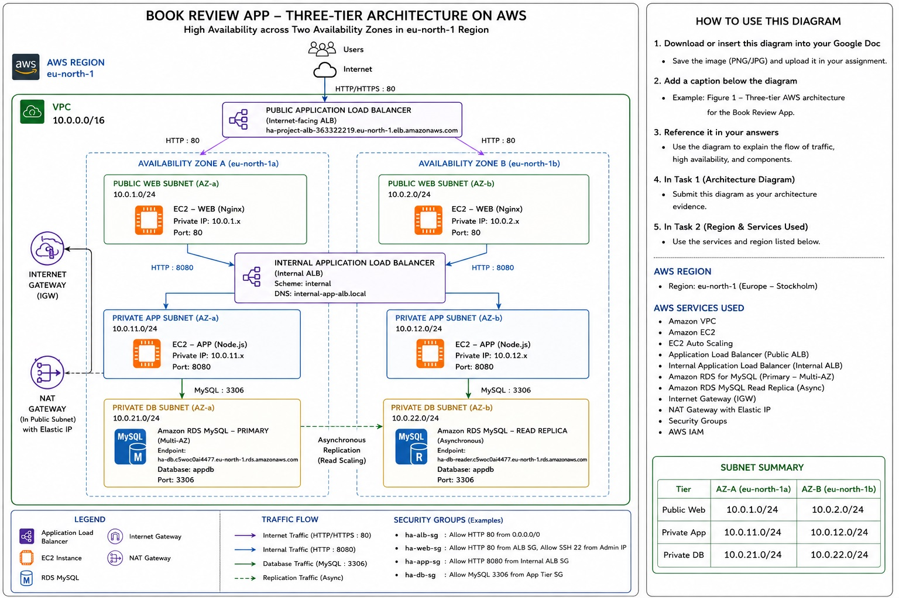
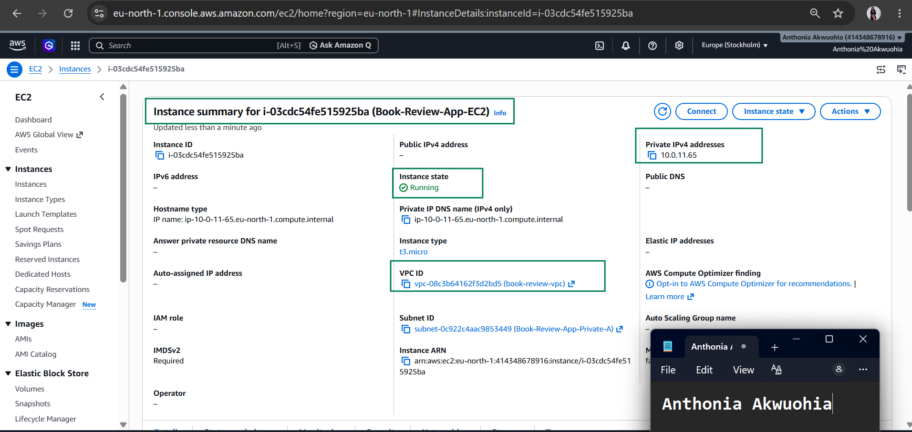
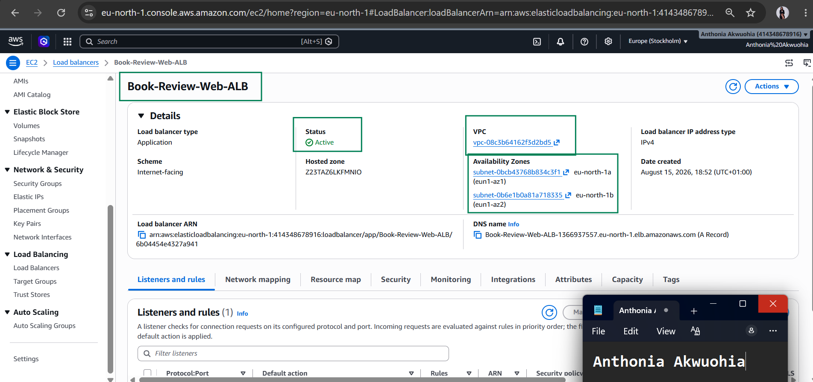
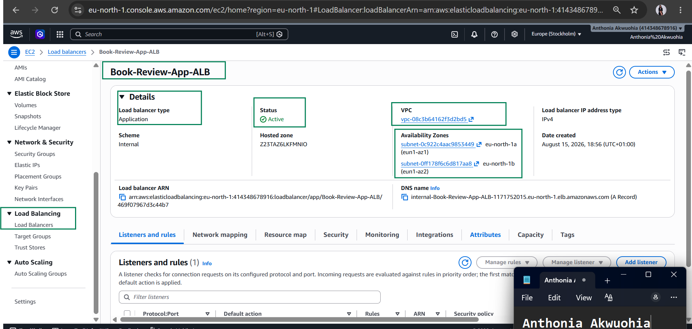
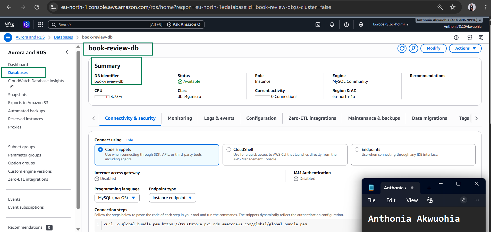
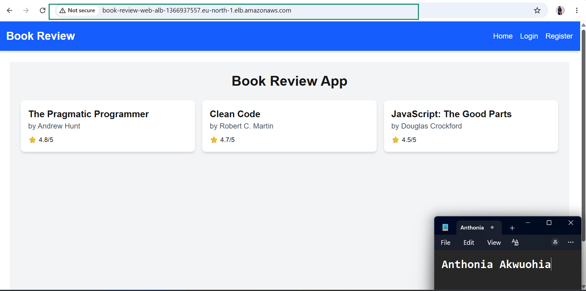
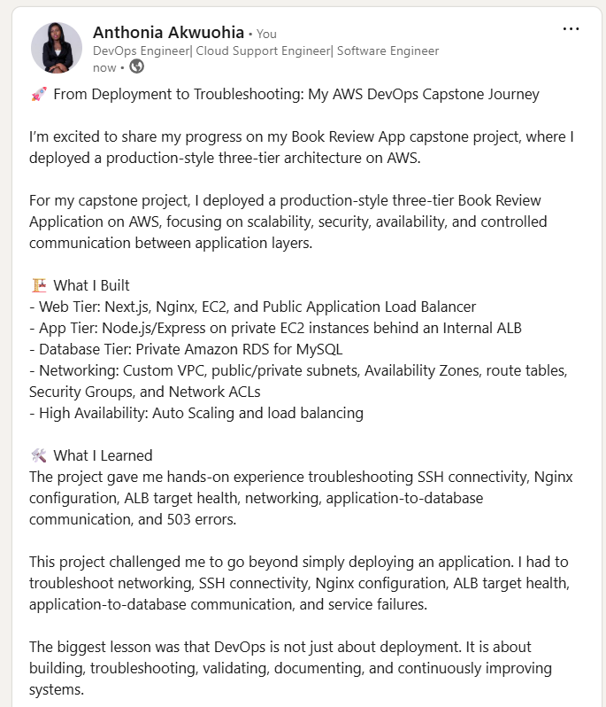

# Assignment 6 — Capstone Assignment — Deploy Book Review App (Three-Tier Architecture) on AWS

Part of the DevOps Micro Internship (DMI) Cohort 3 with Agentic AI

---

## Purpose

This is the most important assignment of the course. You will deploy the Book Review App in a fully production-style three-tier architecture on AWS: a Next.js Web Tier behind Nginx and a public ALB, a private Node.js/Express App Tier behind an internal ALB, and a private Multi-AZ MySQL RDS database with a read replica. You are expected to design, deploy, isolate, debug, and document the result independently.

---

# Task 1 — Architecture Diagram

## Goal

Create an architecture diagram showing the custom VPC (10.0.0.0/16), the six subnets across two Availability Zones (two public Web Tier, two private App Tier, two private Database Tier), the public ALB, Web Tier EC2/Nginx, internal ALB, private App Tier EC2, private Multi-AZ RDS with its read replica, and the permitted traffic flow.

### Evidence

#### Diagram image or link

---

# Task 2 — AWS Region & Services Used

## Goal

Record the AWS Region used and list every AWS service used across networking, compute, load balancing, security, and the database.

### Notes

**Region:**

Deployment Region: eu-north-1 (Stockholm) 

---

**Services:**

Networking & Content Delivery:
1) Amazon VPC (Virtual Private Cloud): Network boundary configured with he custom VPC uses:

VPC CIDR: 10.0.0.0/16
The VPC is divided into six subnets across two Availability Zones

2) Subnets: 6 total subnets across 2 Availability Zones (2 Public Web, 2 Private App, 2 Private DB).

3) Internet Gateway (IGW): Provides public internet ingress/egress for public subnets.
The Internet Gateway connects the VPC to the Internet.
The public route table contains a route similar to:

0.0.0.0/0 → Internet Gateway

This allows resources in appropriately configured public subnets to communicate with the Internet.

In this architecture, the public Web Tier and public ALB use the public networking path.

4) NAT Gateway: Enables secure outbound internet access for private App EC2 instances.
Purpose: Allows resources in private subnets to make outbound Internet connections without making those resources publicly accessible.

5) Route Tables: Public, App Private, and DB Private route tables to manage network path flow.

Compute:

Amazon EC2
Purpose: Provides the virtual servers that run the application components.

Amazon EC2 instances are used for the application workloads.

In this architecture:

Web Tier EC2 instances run Nginx.
App Tier EC2 instances run the application runtime, such as Node.js.
EC2 instances are distributed across two Availability Zones.
The Web Tier instances receive traffic from the public ALB.
App Tier instances receive traffic through the internal ALB.

Using EC2 allows the application to run on configurable virtual servers while providing control over the operating system, software, networking, and security configuration.

Load Balancing:
Purpose: Receives traffic from users and distributes it across the Web Tier EC2 instances.

The public Application Load Balancer is internet-facing and is deployed across the two public subnets.

Public ALB: Sits in the public subnets (Book-Review-Public-A & B) listening on port 80. It serves as the single internet entry point, routing client HTTP web requests across the frontend Nginx Web instances. 
Internal ALB: Sits in private subnets between the Web and App tiers. It accepts proxy requests from Nginx and balances backend API traffic across the Node.js App instances on port 8080, keeping the backend hidden from the public internet.  

Security & Access Control:
AWS Security Groups (SG): Act as stateful virtual firewalls enforcing strict tier-to-tier access:

Public ALB SG: Allows inbound HTTP (80) from the internet (0.0.0.0/0).
Web Tier SG: Allows inbound HTTP (80) only from the Public ALB SG.
App Tier SG: Allows inbound custom TCP (8080) only from the Internal ALB SG.
RDS DB SG: Allows inbound MySQL (3306) only from the App Tier SG.

Database (Amazon RDS for MySQL):

Purpose: Provides the managed relational database for the Book Review App.
Amazon RDS is used to host the application's MySQL database.

The database is placed in the private Database Tier rather than being directly exposed to the Internet.

The database uses:

Database, Port: 3306

The App Tier communicates with RDS through MySQL port 3306.
Multi-AZ Primary Database: Deployed in private DB subnets across two AZs. It provides synchronous failover protection for the main book_review_db database.

RDS DB Subnet Group: Groups Book-Review-DB-Private-A and B into an isolated network boundary with no internet gateways or external routes, ensuring data is accessible only by the application tier inside the VPC.
---

# Task 3 — Public Entry Point

## Goal

Confirm the Book Review App loads through the public ALB DNS name.

### Evidence

#### Public ALB DNS

Paste your public ALB DNS name here:

http://book-review-web-alb-1366937557.eu-north-1.elb.amazonaws.com/

---

# Task 4 — Evidence Screenshots

## Goal

Capture visual proof of every tier and load balancer.

### Evidence

#### Web EC2

![Screenshot](screenshots//Assignment6.Task4.web.png

---

#### App EC2

---

#### Public ALB

---

#### Internal ALB

---

#### RDS + Replica

---

#### App UI proof

---

# Task 5 — Summary

## Goal

Summarize what worked in the final deployment, the issues encountered and how each was fixed, and the tools or sources used to research and debug.

### Notes

**What worked:**

The Book Review App was deployed using a three-tier AWS architecture. The Web Tier was placed in public subnets and configured with Next.js and Nginx behind a public Application Load Balancer. The App Tier was isolated in private subnets and accessed through an internal Application Load Balancer. Amazon RDS for MySQL was used as the private database layer. The deployment was tested by checking EC2 instances, load balancer target health, Nginx configuration, application connectivity, and database communication.

---

**Issues + fixes:**

Several issues were encountered during the deployment and troubleshooting process. SSH connectivity to the Web EC2 initially timed out, so the Security Group, subnet route table, Internet Gateway, Network ACL, public IP address, and EC2 status checks were reviewed. The network configuration was confirmed to allow the required traffic.

Nginx configuration also required troubleshooting. The Web Tier Nginx configuration was updated to serve the Next.js frontend on port 3000 and forward /api/ requests to the internal Application Load Balancer. The default Nginx site was disabled, the Book Review configuration was enabled, and nginx -t was used to validate the configuration before restarting the service.

Database connectivity and application configuration were also reviewed. The backend environment variables were checked to ensure that the application used the correct RDS endpoint, database name, database user, and credentials. The internal ALB was used to keep App Tier communication private.

During testing, a 503 Service Temporarily Unavailable response was encountered through the public ALB. The issue was investigated by checking ALB target health, Nginx status, Nginx configuration, port 80/3000 listeners, and the Next.js application. These troubleshooting steps helped identify where communication between the different tiers needed to be corrected.

---

**Tools/sources used:**

The deployment and troubleshooting were performed using the AWS Management Console, EC2, VPC, Application Load Balancers, Auto Scaling Groups, Amazon RDS, Security Groups, Network ACLs, Internet Gateway, Ubuntu Linux, Nginx, Node.js, Next.js, MySQL, Git/GitHub, SSH, PM2, and standard Linux networking and service-management commands. AWS documentation and technical references were also used to understand AWS networking, load balancing, security, and database configuration.
---

# LinkedIn Post (Required)

## Goal

Publish a LinkedIn post sharing the capstone deployment, including the public ALB DNS (or a redacted screenshot), three to five lines on what you built and why it is production-style, and one proof screenshot.

## Evidence

#### LinkedIn Post URL

Paste your LinkedIn post URL here:

https://www.linkedin.com/posts/anthonia-akwuohia-5b00681b0_devops-aws-cloudcomputing-activity-7495160397298081793-hUOs?utm_source=share&utm_medium=member_desktop&rcm=ACoAADEhX1QBTHiW-kQPmKjn3MVixQzj4IzJO1Q

---

#### Screenshot of LinkedIn post

---

# Submission Instructions

- Add all required screenshots and links in your submission
- Do not expose passwords, RDS credentials, connection strings, private keys, or account IDs

---

# Completion Checklist

- [ ] Task 1: Architecture diagram completed
- [ ] Task 2: AWS Region and services documented
- [ ] Task 3: Public ALB DNS confirmed working
- [ ] Task 4: All six evidence screenshots captured (Web Tier, App Tier, both ALBs, RDS + replica, app UI)
- [ ] Task 5: Deployment summary completed (what worked, issues/fixes, tools/sources)
- [ ] LinkedIn post published and URL submitted
- [ ] App Tier and Database Tier confirmed not publicly accessible
- [ ] No sensitive data exposed

---

## 📌 About DMI & CloudAdvisory

DevOps Micro Internship (DMI) is a project-based DevOps program run by Pravin Mishra (The CloudAdvisory) focused on real-world execution, systems thinking, and career readiness.

It helps learners build strong DevOps foundations with hands-on experience.

---

## 📌 Resources

- 🌐 DMI Official Website: https://dmi.pravinmishra.com?utm_source=github&utm_medium=readme  
- 🎓 University: https://university.pravinmishra.com?utm_source=github&utm_medium=readme  
- 💬 Discord Community: https://discord.pravinmishra.com?utm_source=github&utm_medium=readme  
- 📝 Blog: https://dmi.pravinmishra.com/blog?utm_source=github&utm_medium=readme  
- ▶️ YouTube Playlist: https://www.youtube.com/playlist?list=PLFeSNDtI4Cho  
- 🔗 Pravin Mishra (LinkedIn): https://www.linkedin.com/in/pravin-mishra-aws-trainer/  
- 🏢 CloudAdvisory (LinkedIn): https://www.linkedin.com/company/thecloudadvisory/

---

*This submission is part of DevOps Micro Internship (DMI) Cohort 3 — Agentic AI Track.*