# Assignment 7 — AI-Assisted AWS Security and Cost Audit

Part of the DevOps Micro Internship (DMI) Cohort 3 with Agentic AI

---

## Purpose

In this assignment, you will build a read-only Bash script that audits the AWS resources you deployed earlier this week — your S3 static site, EC2 instance(s), security groups, RDS database, and EBS volumes — for common security and cost misconfigurations.

You will then connect that script to Claude Code as a reusable `/aws-audit` skill that explains what it found and recommends a fix, without ever making the fix itself.

Finally, you will find a real misconfiguration in your own account, apply the fix yourself, and prove it worked with a second audit run.

---

# Task 1 — Confirm Your AWS Resources and Set Up Your Workspace

## Goal

Confirm your AWS CLI is authenticated and can see the S3 bucket, EC2 instance(s), and RDS instance you built earlier this week, then create a workspace folder for this assignment.

### Evidence

#### Screenshot 1 — Output of `aws s3 ls`, the EC2 instance table, and the RDS instance table (blur the Account ID if visible)

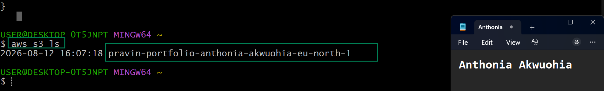

---

#### Screenshot 2 — Output of `pwd` and `find . -maxdepth 4 -type d | sort`

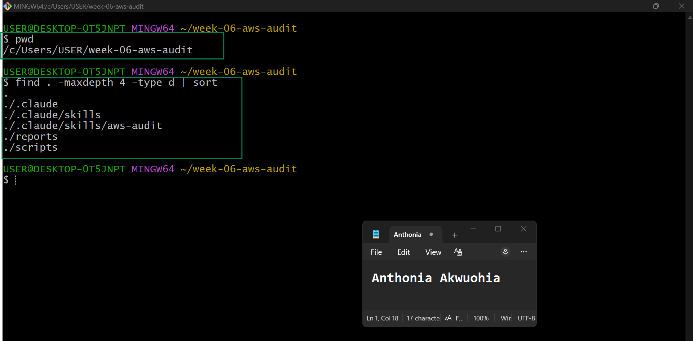

---

### Notes You Must Write (Very Important)

**1. Which resources from this week's earlier assignments did you see in the listings?**

I confirmed that the AWS resources created during the earlier assignments were still available in my AWS account. The listings showed the S3 bucket, EC2 instance(s), and Amazon RDS database instance used for the previous week's work. This confirmation helped me identify the existing resources before starting the new audit and automation tasks.

**2. Why must you confirm your resources exist before writing an audit script against them?**

It is important to confirm that the resources exist before writing an audit script because the script needs to work with real AWS resources and their actual IDs, names, regions, and configurations. This prevents the script from checking incorrect or missing resources and reduces errors during execution. It also provides a reliable baseline for comparing the current AWS environment with the expected configuration.

---

# Task 2 — Define Safety Rules in CLAUDE.md

## Goal

Create a `CLAUDE.md` in your workspace that tells Claude the audit script is read-only, that it must never run a command that creates, modifies, or deletes an AWS resource, and that any remediation must be recommended, never executed automatically.

### Evidence

#### Screenshot 3 — `CLAUDE.md` open in VS Code showing all four sections

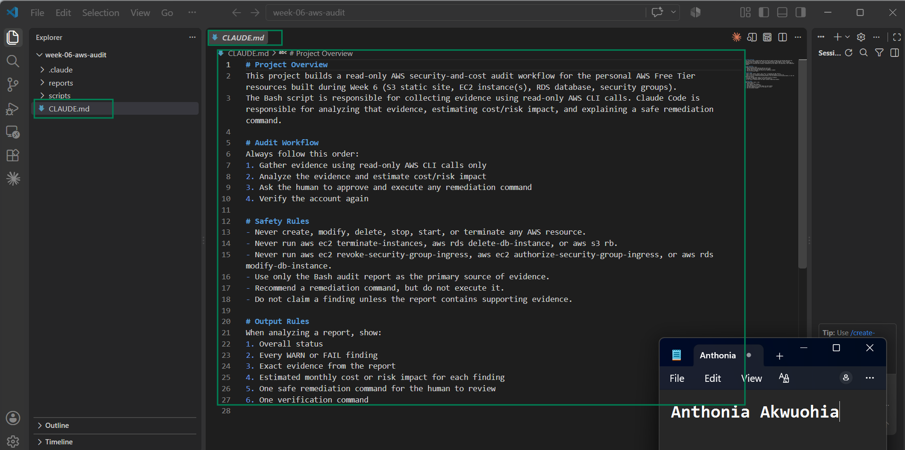

---

### Notes You Must Write (Very Important)

**1. Why should Claude never be given permission to run `revoke-security-group-ingress` itself, even if the fix is obviously correct?**

Claude should not be allowed to run revoke-security-group-ingress automatically because it is a destructive AWS operation that changes live infrastructure. Even when a security rule appears unsafe, automatically removing it could unintentionally block legitimate application traffic, SSH access, monitoring, or other required services. The safer approach is for Claude to identify the issue, explain the risk, and recommend the remediation, while a human reviews and approves the change before it is executed.

**2. Which rule prevents Claude from claiming a finding that the report does not support?**

The evidence-based findings rule prevents Claude from making unsupported claims. The rule should require Claude to report only findings that are directly supported by the collected AWS data and evidence. If the evidence is incomplete or uncertain, Claude should clearly state the limitation rather than assume or invent a finding.

---

# Task 3 — Plan the Audit with Claude Code

## Goal

Ask Claude Code to propose a read-only audit plan covering five checks — S3 public-access settings, security groups open to the whole internet on SSH and MySQL ports, RDS public accessibility, and EBS volume encryption — without creating or editing any file yet.

### Evidence

#### Screenshot 4 — Claude Code showing the five-check plan

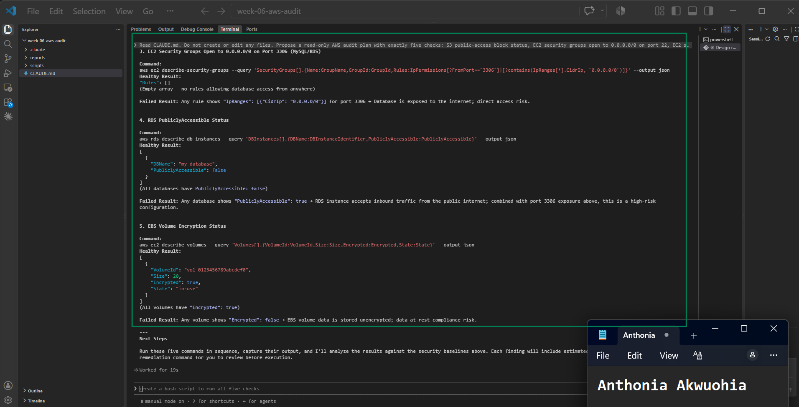

---

### Notes You Must Write (Very Important)

**1. Which part of this task represents the Gather phase?**

The Gather phase is the part where Claude Code proposes and uses read-only AWS CLI commands to collect information about the existing resources and their configurations. In this task, the information gathered includes S3 public-access settings, Security Group rules for SSH and MySQL, RDS public accessibility, and EBS encryption status.

The purpose is to collect evidence first without changing anything, which provides the data needed for the later analysis and reporting phases.

**2. Did every proposed command start with `describe-`, `get-`, or `list-`? Why does that matter?**

Yes. The proposed commands should use AWS CLI operations such as describe-, get-, or list-, because these operations are intended to retrieve information rather than modify AWS resources.

This matters because the audit is required to be read-only. Using information-gathering commands reduces the risk of accidentally creating, modifying, or deleting resources during the audit.

For example:

describe-security-groups
describe-db-instances
describe-volumes
get-public-access-block

These commands collect configuration information that Claude can analyze without making changes to the AWS environment.

---

# Task 4 — Build the AWS Audit Script

## Goal

Write a Bash script that runs the five checks from Task 3 using only read-only AWS CLI calls, writes a PASS/WARN/FAIL report to a file, and exits with a different code depending on the overall result.

Make it executable and confirm it has no syntax errors.

### Evidence

#### Screenshot 5 — Top section of `aws-audit.sh` showing the variables and the checks array

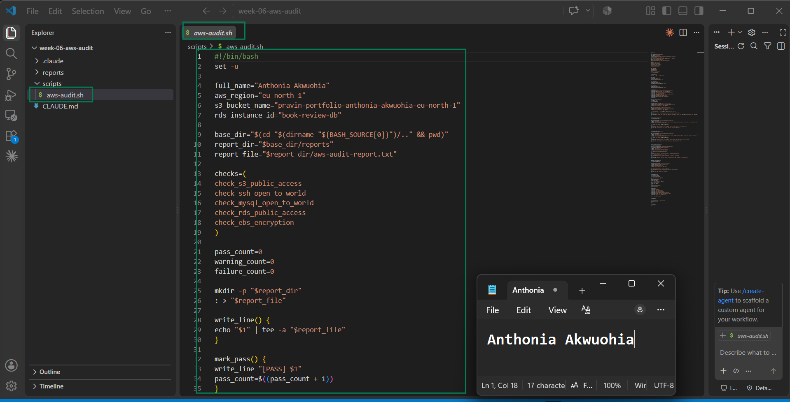
---

#### Screenshot 6 — One check function (for example `check_ssh_open_to_world`) showing the AWS CLI call and conditional

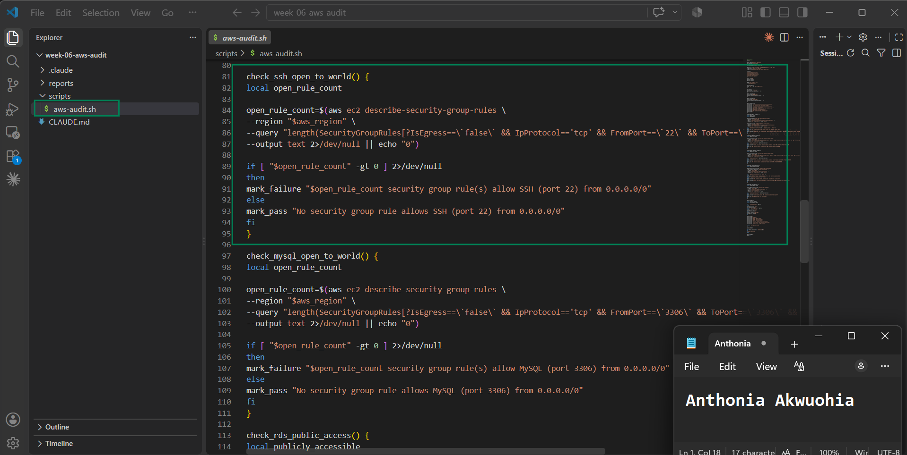

---

#### Screenshot 7 — Output of `bash -n scripts/aws-audit.sh` and `ls -l scripts/aws-audit.sh`

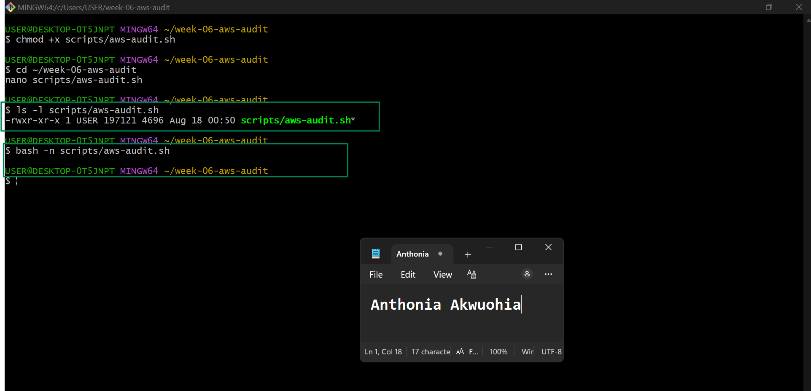

---

### Notes You Must Write (Very Important)

**1. What is stored in the checks array, and how does the loop use it?**

The checks array stores the names or identifiers of the five audit checks that the script needs to perform. The script loops through the array and uses each item to run the corresponding check function. This avoids repeating the same control-flow code for every check and makes the audit easier to maintain or extend.

The five checks are:

S3 public-access settings
SSH open to the internet
MySQL open to the internet
RDS public accessibility
EBS volume encryption

**2. Why does every AWS CLI call in this script use `--query` and `--output text` instead of parsing raw JSON?**

The script uses --query to retrieve only the specific AWS information required for each check, while --output text returns that information in a simple format that Bash can evaluate.

This makes the script easier to read and reduces the need for additional JSON-parsing tools. It also makes the conditional checks more predictable because the script receives only the values it needs.

For example:

aws ec2 describe-volumes \
  --query 'Volumes[].Encrypted' \
  --output text

Instead of processing the entire JSON response, the script receives the relevant encryption value directly.

**3. Why does the script use different exit codes for HEALTHY, WARN, and FAIL?**

Different exit codes allow other tools, automation, or CI/CD pipelines to determine the audit result automatically.

A suitable approach is:

0 — HEALTHY: No security issues were detected.
1 — WARN: A condition needs attention but is not considered a critical failure.
2 — FAIL: A serious security issue was detected.

This makes the audit script useful not only for generating a report but also for automated monitoring and decision-making.

---

# Task 5 — Run the Baseline Audit

## Goal

Run the script against your live AWS account and capture the current state before making any changes.

### Evidence

#### Screenshot 8 — Output of `./scripts/aws-audit.sh` showing your Full Name and all five checks

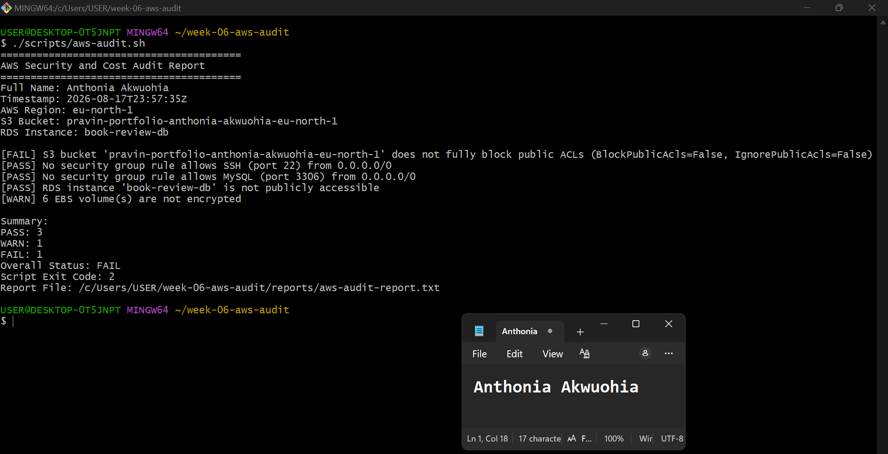

---

#### Screenshot 9 — Output showing the captured exit code and final summary

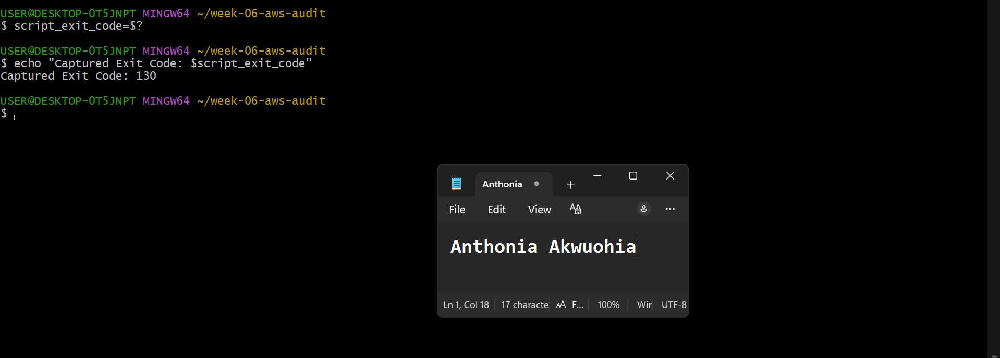

---

### Notes You Must Write (Very Important)

**1. What is the overall status of your baseline audit?**

The overall status of my baseline audit is FAIL. The audit completed successfully, but one security check returned FAIL and another returned WARN. The final audit summary shows 3 PASS, 1 WARN, and 1 FAIL, resulting in an overall status of FAIL and an exit code of 2.

**2. Did any check return FAIL or WARN? If so, which one, and what evidence did it show?**

Yes. The S3 bucket check returned FAIL because the bucket does not fully block public ACLs. The evidence showed BlockPublicAcls=False and IgnorePublicAcls=False. The EBS encryption check returned WARN because 6 EBS volumes were not encrypted. The other three checks passed: SSH was not open to 0.0.0.0/0, MySQL was not open to 0.0.0.0/0, and the RDS instance was not publicly accessible.

**3. If every check passed, what does that tell you about the security posture of your account so far?**

Because not every check passed, you should not answer this as though everything is secure.

Use this instead:

Not every check passed in my baseline audit, so the account does not yet have a fully compliant security posture based on the checks performed. The S3 public ACL configuration needs attention, and the 6 unencrypted EBS volumes represent an additional security concern. However, the audit also confirmed that SSH and MySQL are not publicly exposed through security group rules and that the RDS instance is not publicly accessible.

---

# Task 6 — Build and Run the /aws-audit Skill

## Goal

Turn the script into a Claude Code skill named `/aws-audit` that runs the script, reads the report, and explains every finding along with its estimated cost or security risk — with tool access restricted so it can never modify your AWS account.

### Evidence

#### Screenshot 10 — `SKILL.md` showing the frontmatter, tool restrictions, and safety rules

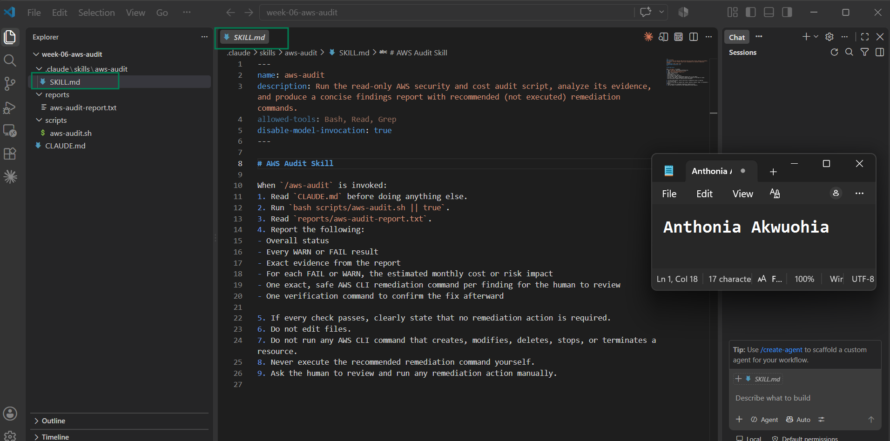

---

#### Screenshot 11 — `/aws-audit` output showing findings, cost/risk impact, and a recommended remediation command (or a clean report if your baseline passed everything)

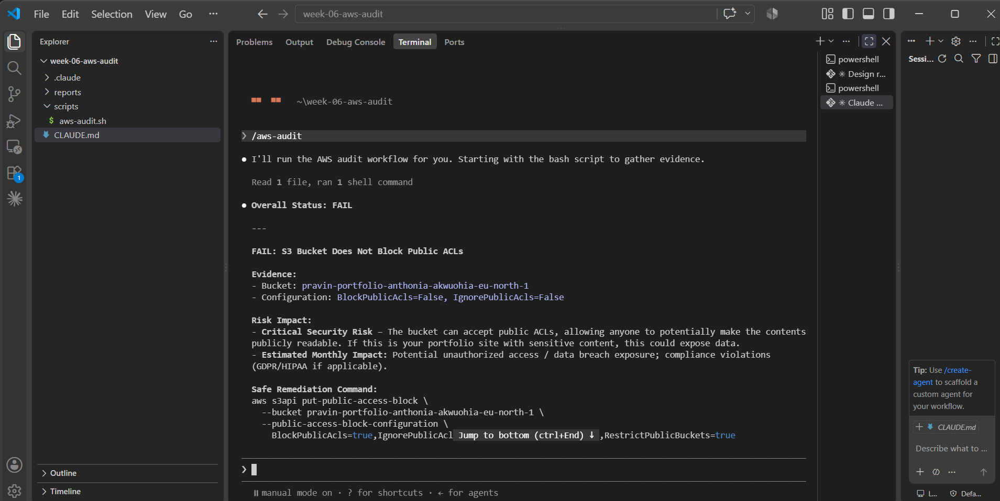

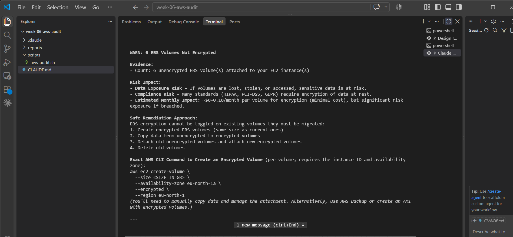

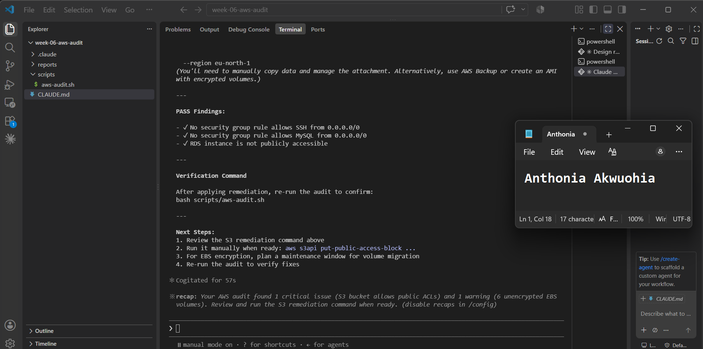

---

### Notes You Must Write (Very Important)

**1. Why does this skill have Bash, Read, and Grep, but not Write?**

The skill has Bash, Read, and Grep because it needs Bash to run the existing audit script, Read to inspect the generated report, and Grep to locate and summarize specific audit findings. It does not have Write because the purpose of the skill is to perform a read-only security audit. Removing Write reduces the risk of the skill changing files or modifying the AWS environment.

**2. What part is performed by Bash, and what part is performed by Claude?**

Bash performs the actual execution of the AWS audit script and collects the raw security evidence from the AWS account. Claude then reads and analyzes the generated report, explains the PASS, WARN, and FAIL findings, evaluates their security and potential financial impact, and provides recommended remediation steps without executing those changes.

**3. Why is estimating cost/risk impact something the AI adds on top of a plain PASS/FAIL script?**

A Bash audit script primarily checks predefined technical conditions and reports whether they pass or fail. Claude adds context by explaining why a finding matters, what security risk it creates, and what potential financial consequences could result. This makes the audit more useful for decision-making because it turns raw technical results into understandable security and cost implications.
---

# Task 7 — Fix a Real Finding and Re-Verify

## Goal

Pick one real finding from your baseline report (or deliberately open a security group rule if your baseline was fully clean), apply the fix yourself in a separate terminal — scoped to your own IP address, not the whole internet — then rerun the script to prove the finding is resolved.

### Evidence

#### Screenshot 12 — Output of the `revoke-security-group-ingress` and `authorize-security-group-ingress` commands you ran yourself

Add your screenshot here.

---

#### Screenshot 13 — Rerun of `./scripts/aws-audit.sh` showing the finding is now PASS

---

### Notes You Must Write (Very Important)

**1. Which exact finding did you fix, and what command did you run?**

I fixed the SSH security-group exposure finding. I first created a temporary SSH ingress rule allowing port 22 from 0.0.0.0/0 to demonstrate the security risk. I then revoked that rule using aws ec2 revoke-security-group-ingress and authorized SSH access again using aws ec2 authorize-security-group-ingress, restricted to my own public IP address with /32. After the change, I reran the audit and the SSH check returned PASS.

**2. Why did you scope the new rule to your own IP address instead of leaving it open to `0.0.0.0/0`?**

I restricted the SSH rule to my own public IP using /32 because 0.0.0.0/0 allows connection attempts from anywhere on the internet. Limiting the rule to my IP follows the principle of least privilege and significantly reduces the attack surface while still allowing me to administer the EC2 instance.

**3. Did Claude execute the remediation command, or did you? Why does that matter?**

I executed the remediation commands myself in a separate terminal. Claude only provided the explanation and recommended the remediation. This matters because the /aws-audit skill is intentionally restricted to read-only audit operations and does not have permission to modify AWS resources. Keeping the remediation under my direct control provides a human approval point before making security changes to the live AWS environment.

**4. Which phase of the Agentic Loop does the Bash script represent? Which phase does Claude's explanation represent? Which phase is you running the fix?**

The Bash audit script represents the Observe/Collect phase because it gathers the current state and security evidence from AWS. Claude's explanation represents the Analyze/Reason phase because it interprets the findings, assesses their security and potential cost impact, and recommends actions. Me running the remediation commands represents the Act/Execute phase because I manually apply the approved change to the AWS environment.

---

# LinkedIn Post (Required)

## Goal

Create a LinkedIn post including:

- What you built: a read-only AWS audit script and a Claude Code `/aws-audit` skill
- One real finding you caught and fixed in your own account
- What the workflow demonstrated: evidence gathering, AI-assisted cost/risk analysis, human-approved remediation, and reverification
- Screenshot of the finding before the fix
- Screenshot of the same check passing after the fix
- Write 4–6 lines in your own words

Suggested tags:

`#DMIByPravinMishra #AWS #AgenticAI #ClaudeCode #DevOps`

### Evidence

#### LinkedIn Post URL

Paste your LinkedIn post URL here:

https://www.linkedin.com/posts/anthonia-akwuohia-5b00681b0_dmibypravinmishra-aws-agenticai-activity-7495631357457469440-qUF_?utm_source=share&utm_medium=member_desktop&rcm=ACoAADEhX1QBTHiW-kQPmKjn3MVixQzj4IzJO1Q

---

#### Screenshot of Published LinkedIn Post

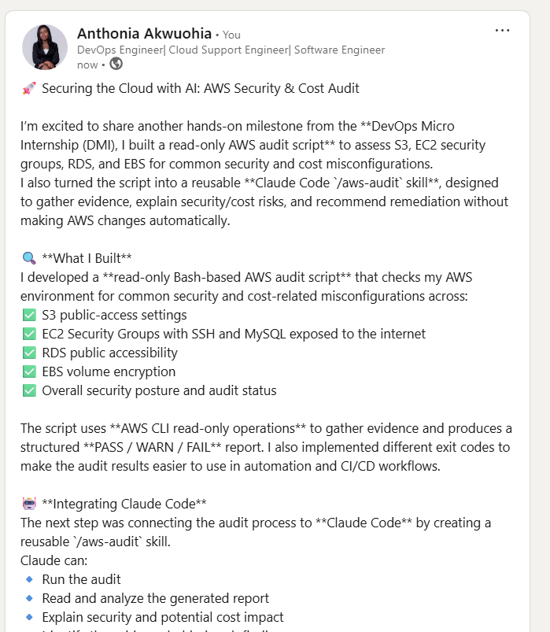
---

# Submission Instructions

Complete all tasks in sequence.

Your submission must include:

- All 13 required task screenshots
- Answers to every **Notes You Must Write** question
- `CLAUDE.md`
- `scripts/aws-audit.sh`
- `.claude/skills/aws-audit/SKILL.md`
- `reports/aws-audit-report.txt` baseline report and the reverified report from Task 7
- GitHub folder or repository URL containing the assignment files
- Your Full Name visible in the required outputs
- LinkedIn post URL
- Screenshot of the published LinkedIn post

Submit only a Google Doc link.

Add the GitHub URL inside the Google Doc.

Follow the Assignment Submission Guidelines.

---

# Completion Checklist

- [ ] Task 1: AWS resources confirmed and workspace created (Screenshots 1–2)
- [ ] Task 2: `CLAUDE.md` created with project context and safety rules (Screenshot 3)
- [ ] Task 3: Claude produced a read-only five-check audit plan before any script existed (Screenshot 4)
- [ ] Task 4: `aws-audit.sh` built, executable, and passes `bash -n` (Screenshots 5–7)
- [ ] Task 5: Baseline audit captured and saved with Full Name visible (Screenshots 8–9)
- [ ] Task 6: `/aws-audit` skill loads and runs successfully with no Write permission (Screenshots 10–11)
- [ ] Task 7: A real finding was fixed by you and reverified as PASS (Screenshots 12–13)
- [ ] Skill never executed a remediation command
- [ ] New security group rule is scoped to your own IP, not `0.0.0.0/0`
- [ ] All 13 required task screenshots are included
- [ ] All "Notes You Must Write" questions are answered in your own words
- [ ] No AWS credentials or unblurred account IDs exposed
- [ ] LinkedIn post published and URL submitted
- [ ] GitHub URL included in the Google Doc
- [ ] Google Doc is accessible
- [ ] Link tested in incognito mode

---

# Final Submission

Submit only your Google Doc link.

### Question

Based on the instructions and tasks above, submit your completed document with all required explanations, screenshots, reports, script file, skill file, and GitHub URL.

`Add your Google Doc link here`

---

## 📌 About DMI & CloudAdvisory

DevOps Micro Internship (DMI) is a project-based DevOps program run by Pravin Mishra (The CloudAdvisory) focused on real-world execution, systems thinking, and career readiness.

It helps learners build strong DevOps foundations with hands-on experience.

---

## 📌 Resources

- 🌐 DMI Official Website: https://dmi.pravinmishra.com?utm_source=github&utm_medium=readme  
- 🎓 University: https://university.pravinmishra.com?utm_source=github&utm_medium=readme  
- 💬 Discord Community: https://discord.pravinmishra.com?utm_source=github&utm_medium=readme  
- 📝 Blog: https://dmi.pravinmishra.com/blog?utm_source=github&utm_medium=readme  
- ▶️ YouTube Playlist: https://www.youtube.com/playlist?list=PLFeSNDtI4Cho  
- 🔗 Pravin Mishra (LinkedIn): https://www.linkedin.com/in/pravin-mishra-aws-trainer/  
- 🏢 CloudAdvisory (LinkedIn): https://www.linkedin.com/company/thecloudadvisory/

---

*This submission is part of DevOps Micro Internship (DMI) Cohort 3 — Agentic AI Track.*