# Assignment 6 — AI-Assisted Terraform Drift and Policy Review

Part of the DevOps Micro Internship (DMI) with Agentic AI

---

## Student Details

**Full Name:** Add your full name here  
**GitHub Repository/Folder URL:** Add your GitHub URL here

---

## Purpose

Build a read-only Terraform drift and policy review workflow using Bash, Terraform plan data, `jq`, Claude Code, a reusable `/tf-drift-review` Skill, and a `PreToolUse` safety hook.

The workflow must follow this pattern:

```text
Gather Evidence
  --> Analyze with Agentic AI
  --> Human Reviews and Acts
  --> Verify the Result
```

The `/tf-drift-review` Skill and `tf-drift-check.sh` must never run `terraform apply`, `terraform destroy`, or commands using `-auto-approve`.

---

# Task 1 — Confirm the Clean Baseline and Create the Workspace

## Goal

Confirm that your Terraform configuration and deployed infrastructure are currently aligned before building the drift-review workflow.

## Evidence

### Screenshot 1 — Clean Terraform Plan

Add a screenshot of `terraform plan` showing no pending changes.

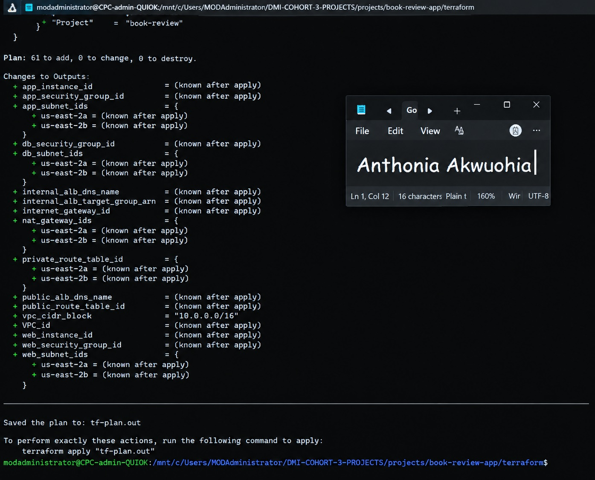

---

### Screenshot 2 — Assignment Workspace

Add a screenshot of the folder structure showing `AI Assignment/`, `reports/`, and the Terraform project.

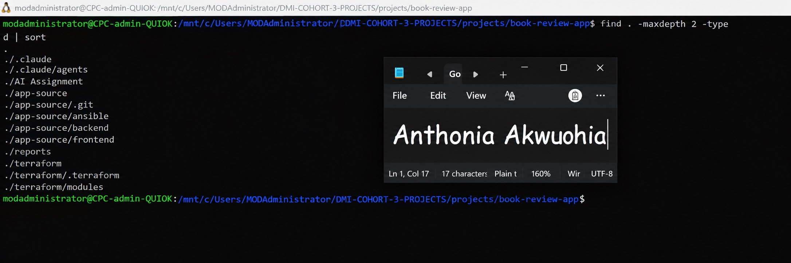

## Questions

### 1. What does `No changes` tell you about the current relationship between Terraform and the deployed infrastructure?

When Terraform reports **“No changes,”** it means the current Terraform configuration matches the infrastructure recorded in Terraform state and the infrastructure Terraform detects in the deployed environment. There are no differences that Terraform currently needs to add, modify, or destroy.


### 2. Why is a clean baseline important before introducing a test change?

A clean baseline is important because it establishes a known starting point before introducing a test change. If the infrastructure already has pending differences, it would be difficult to determine whether a later change was caused by the test or was already present. Starting with a clean plan makes the drift-review process easier to measure, analyze, and verify.


---

# Task 2 — Create Project Context and Safety Rules in `CLAUDE.md`

## Goal

Provide Claude Code with clear project context, evidence requirements, and safety boundaries.

## Evidence

### Screenshot 3 — Project Context and Safety Rules

Add a screenshot of `CLAUDE.md` open in VS Code showing the Project Overview, Review Workflow, Safety Rules, and Output Rules.

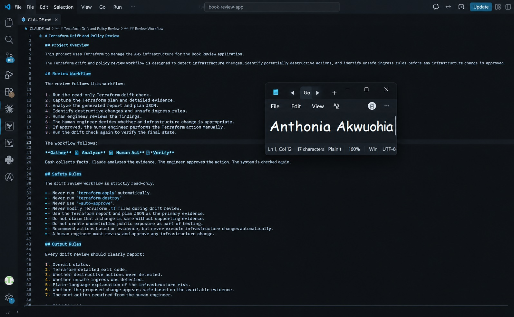

## Questions

### 1. Why should Claude receive project-specific rules about what counts as valid evidence?

Claude needs project-specific evidence rules so that it understands which sources can be trusted when reviewing infrastructure changes. This prevents it from treating assumptions, incomplete information, or unsupported observations as facts and helps ensure that its report is based on actual Terraform configuration, state, and plan evidence.


### 2. Why must the human remain responsible for running `terraform apply`?

The human must remain responsible for running `terraform apply` because applying Terraform changes can modify real infrastructure. Keeping the apply step under human control ensures that a person reviews the evidence, understands the proposed changes, and explicitly decides whether the changes should be made.


### 3. Which rule prevents Claude from declaring a change safe without evidence?

The rule **“Do not claim that a change is safe without supporting evidence”** prevents Claude from declaring a change safe without evidence. The rule requiring Claude to report uncertainty when evidence is incomplete also reinforces this safety boundary.


---

# Task 3 — Build the Terraform Drift and Policy Check Script

## Goal

Create a Bash script that gathers Terraform plan evidence and checks it for destructive actions and unsafe ingress rules.

## Evidence

### Screenshot 4 — Script Variables and Checks Array

Add a screenshot of the top section of `tf-drift-check.sh` showing the variables and `checks` array.

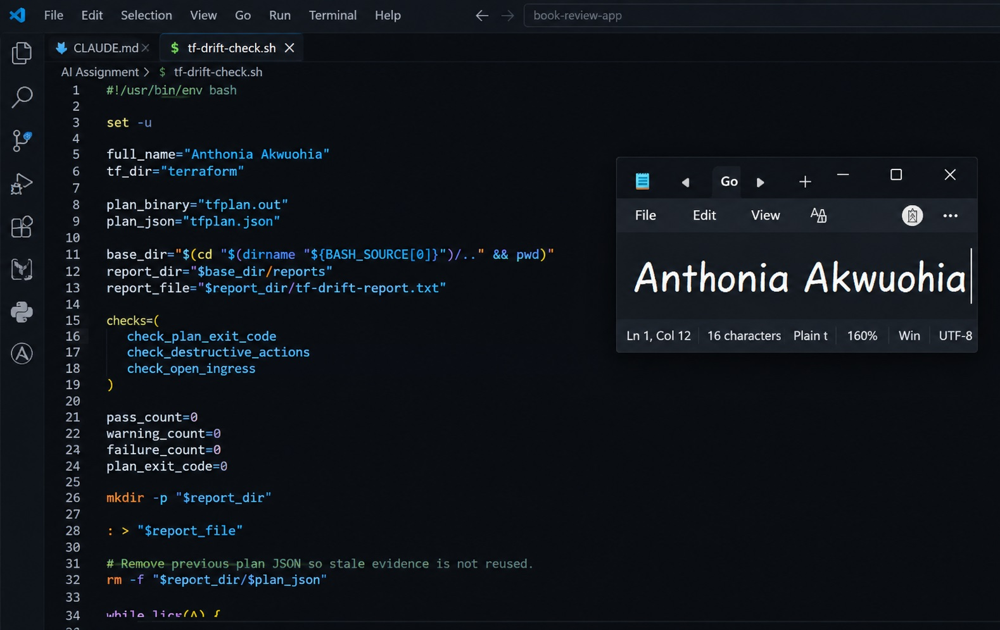

---

### Screenshot 5 — Destructive-Action and Open-Ingress Checks

Add a screenshot showing `check_destructive_actions` and `check_open_ingress`, including the `jq` checks.

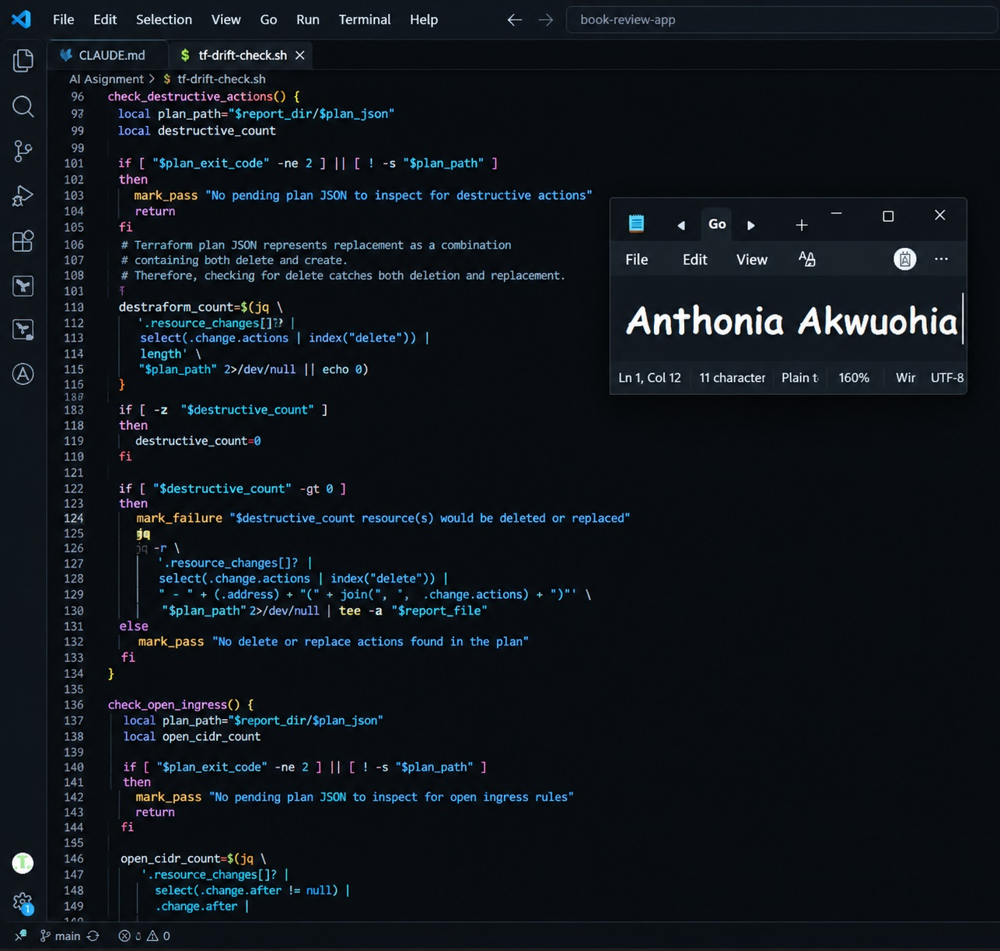

---

### Screenshot 6 — Script Validation and Permissions

Add a screenshot showing successful `bash -n` and `ls -l` output.

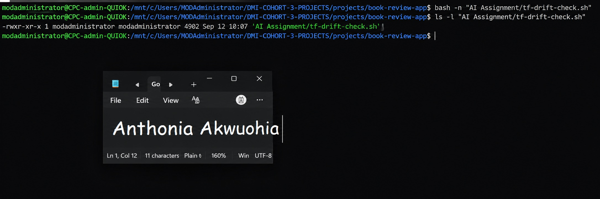

## Questions

### 1. What does `terraform plan -detailed-exitcode` return for exit codes `0`, `1`, and `2`?

`terraform plan -detailed-exitcode` uses three exit codes:

* **0** — The plan completed successfully and there are no infrastructure changes.
* **1** — Terraform encountered an error while creating the plan.
* **2** — The plan completed successfully and Terraform detected changes that would be made.

This makes the command useful for automation because a script can distinguish between no changes, an error, and pending changes.


### 2. Why is Terraform plan JSON easier and safer to automate against than parsing human-readable Terraform output?

Terraform plan JSON provides structured data that automation tools can inspect consistently. Instead of searching through human-readable text that may change in formatting, tools such as `jq` can directly examine resource addresses, resource types, and planned actions. This reduces the risk of incorrectly interpreting Terraform output.


### 3. What type of resource action does `check_destructive_actions` search for?

`check_destructive_actions` searches the Terraform plan JSON for resource changes whose planned actions contain a `delete` action. This identifies resources that Terraform plans to remove from the infrastructure.


### 4. Why does finding a `delete` action also help detect replacements?

Terraform can represent a resource replacement as a combination of `delete` and `create` actions. Therefore, searching for a `delete` action can identify resources that will be destroyed as part of a replacement, even when the final result is a newly created resource.


### 5. Why must this script never run `terraform apply`?

The script is designed to gather and analyze Terraform plan evidence, not to change infrastructure. Running `terraform apply` could make real changes to the deployed environment without a separate human review and approval. Keeping the script read-only preserves the safety boundary between automated analysis and infrastructure changes.


---

# Task 4 — Run the Script Against the Clean Baseline

## Goal

Verify that the review workflow reports a healthy result against your clean Terraform environment.

## Evidence

### Screenshot 7 — Healthy Baseline Report

Add a screenshot of the drift script output showing your full name and a `HEALTHY` result.

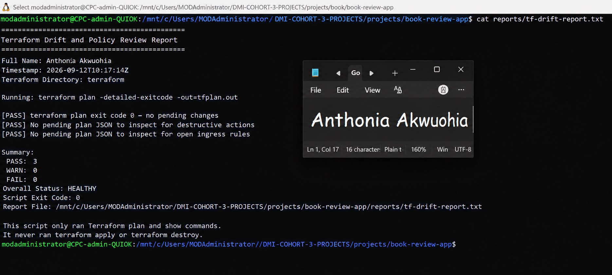

---

### Screenshot 8 — Baseline Script Exit Code

Add a screenshot showing the captured script exit code `0`.

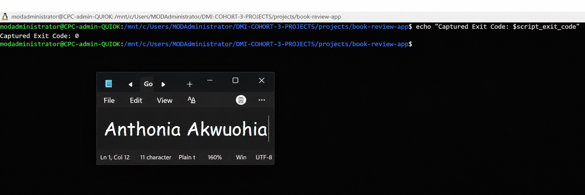

## Questions

### 1. What is the Overall Status of your baseline?

The Overall Status of the baseline is **HEALTHY**. The Terraform plan reports no pending infrastructure changes, and the policy checks do not detect destructive actions or open ingress rules in the reviewed plan.


### 2. Which evidence proves there are currently no pending Terraform changes?

The Terraform plan output showing **“No changes”** proves that there are currently no pending changes between the Terraform configuration and the infrastructure being evaluated. The `terraform plan -detailed-exitcode` command also returns exit code **0** when the plan completes successfully with no changes.


### 3. Was `reports/tfplan.json` created? Explain why or why not.

Yes. `reports/tfplan.json` was created because the drift-review script generates a Terraform plan file and then converts the plan into JSON using `terraform show -json`. The JSON file provides structured Terraform plan data that the `jq` policy checks can inspect automatically.


---

# Task 5 — Create and Run the `/tf-drift-review` Claude Code Skill

## Goal

Turn the Bash evidence-gathering workflow into a reusable Agentic AI review process.

## Evidence

### Screenshot 9 — `/tf-drift-review` Skill Configuration

Add a screenshot of `SKILL.md` showing the frontmatter, allowed tools, and safety rules.

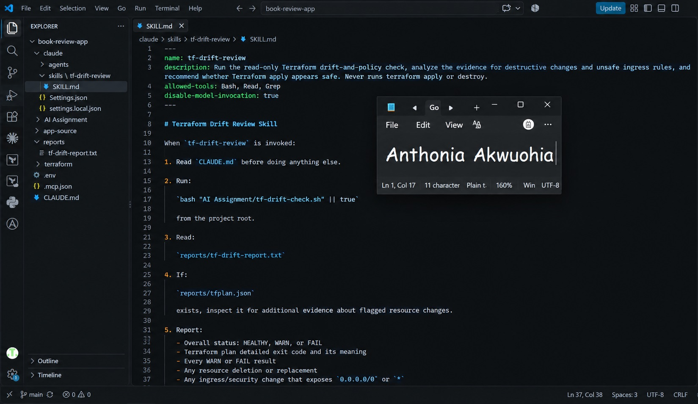

---

### Screenshot 10 — Clean Agentic AI Review

Add a screenshot of `/tf-drift-review` showing the clean `HEALTHY` result.

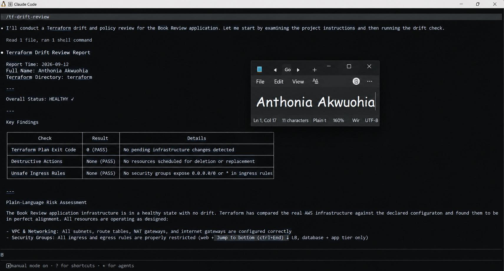

## Questions

### 1. Why does this Skill have `Bash`, `Read`, and `Grep`, but not `Write`?

The Skill has `Bash`, `Read`, and `Grep` because Claude needs to execute the evidence-gathering workflow and inspect existing files and results. It does not have `Write` because the review should be read-only and must not modify Terraform configuration, infrastructure files, or other project artifacts. This reduces the risk of unintended changes during the infrastructure review.


### 2. Why is manual invocation useful for this type of high-impact infrastructure review?

Manual invocation provides a deliberate human-controlled starting point for the review. Because infrastructure changes can have significant consequences, the operator can choose when the analysis should run and review Claude's findings before taking any action. This maintains a clear human-in-the-loop boundary.


### 3. Which part of the workflow is deterministic Bash automation?

The deterministic part is the `tf-drift-check.sh` script. It runs Terraform plan commands, generates the plan JSON evidence, and uses `jq` to check for specific conditions such as destructive actions and open ingress rules. These checks follow predefined rules rather than relying on Claude's interpretation.


### 4. Which part requires Claude's reasoning?

Claude's reasoning is used to interpret the evidence produced by the Bash workflow. Claude can connect the Terraform plan results, policy-check findings, configuration, and other evidence to explain what the changes mean, identify uncertainty, and produce a human-readable review conclusion.


### 5. Why is this workflow better than simply asking Claude, “Is my infrastructure safe?”

This workflow is better because Claude is given concrete, reproducible evidence instead of being asked to make a broad judgment without a defined evidence-gathering process. The Bash checks provide deterministic findings, while Claude adds reasoning and explanation. The workflow also establishes explicit safety rules and keeps infrastructure changes under human control.


---

# Task 6 — Introduce a Controlled Difference and Detect It

## Goal

Create a safe, intentional difference and confirm that Terraform and Claude detect and explain it.

## Evidence

### Screenshot 11 — Controlled Difference

Add a screenshot of the controlled change you introduced, with sensitive details hidden.

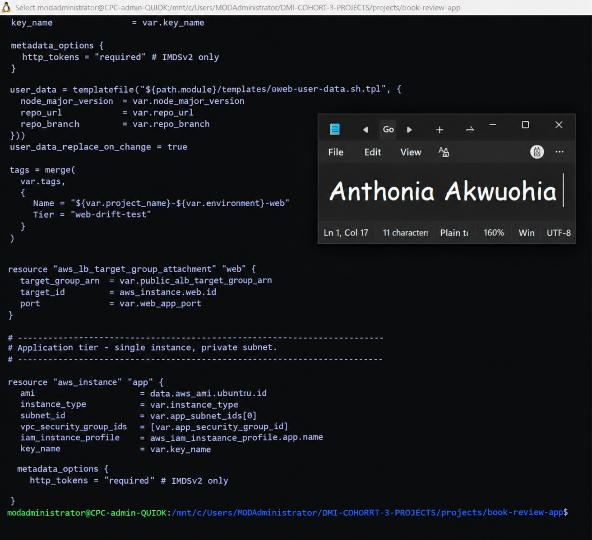

---

### Screenshot 12 — Detected Difference and Risk Assessment

Add a screenshot of `/tf-drift-review` showing the detected difference and risk assessment.

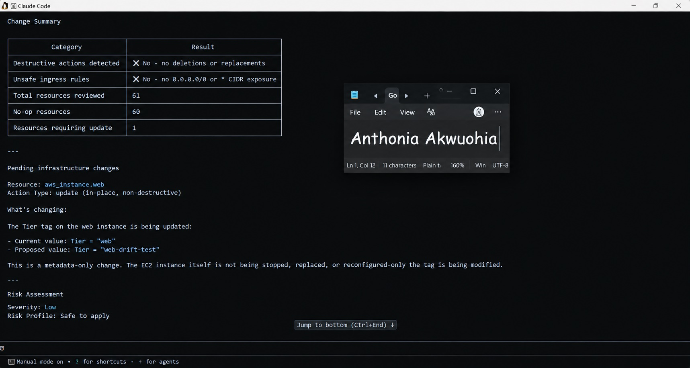

---

### Screenshot 13 — Detected Drift Report

Add a screenshot of `drift-detected-report.txt` showing your full name and the `WARN` or `FAIL` result.


## Questions

### 1. What change did you introduce?

I introduced a controlled change to the EC2 instance by adding the Terraform tag:

DriftTest = "controlled-change"

This was an intentional, non-destructive change used to test whether the Terraform drift-review workflow could detect and explain a pending infrastructure change.

### 2. Was it true infrastructure drift or a Terraform configuration change?

It was a Terraform configuration change, not true infrastructure drift. The change was made intentionally in the Terraform configuration, so Terraform detected that the configuration differed from the currently recorded state.

### 3. What Terraform plan evidence proves that a change is pending?

The Terraform plan showed the EC2 instance with an in-place update, represented by ~. The plan identified the addition of the DriftTest = "controlled-change" tag as a pending change.

This provided direct evidence that Terraform had a change to apply rather than relying on an assumption.

### 4. Was the action an update, deletion, replacement, or security-rule change?

The action was an update in place to the EC2 instance. It did not require deletion, replacement, or a security-rule modification.

### 5. What did Claude recommend?

Claude recommended that the detected change be reviewed before taking action. The review identified the controlled tag modification and considered the available Terraform plan and policy-check evidence before reaching its conclusion.

Claude did not automatically apply the change.

### 6. Why should you review the recommendation before taking action?

The recommendation should be reviewed because Claude's analysis is based on the evidence available to it, while the actual infrastructure decision can affect real AWS resources.

Human review provides an important safety control by allowing the operator to confirm that the detected change is intentional, understand its potential impact, and decide whether terraform apply should be executed.

The workflow therefore keeps Claude responsible for evidence gathering and analysis, while the human operator remains responsible for approving and applying infrastructure changes.

---

# Task 7 — Add a `PreToolUse` Hook to Block Unsafe Apply Attempts

## Goal

Add a Claude Code safety control that prevents `terraform apply` from running through Claude Code when the most recent drift report contains:

```text
Overall Status: FAIL
```

## Evidence

### Screenshot 14 — `PreToolUse` Safety Hook

Add a screenshot of `.claude/settings.json` showing the `PreToolUse` safety hook.

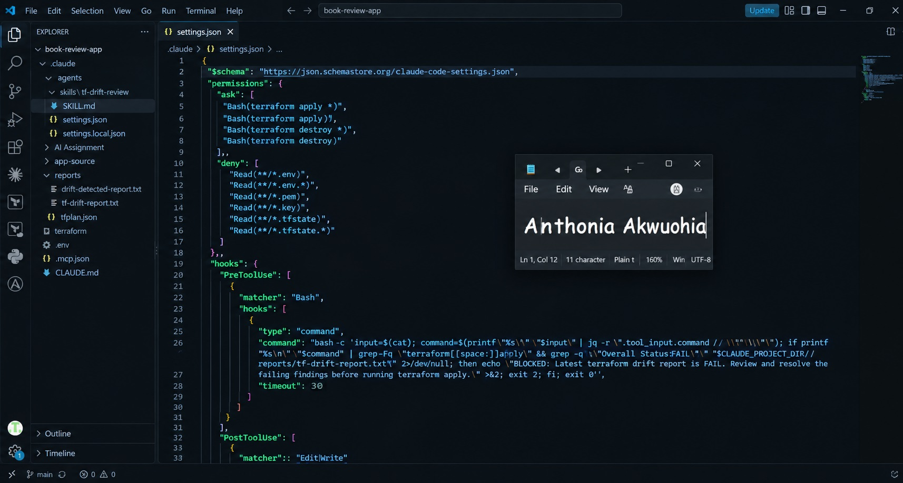

---

### Screenshot 15 — Blocked Apply Attempt

Add a screenshot of Claude Code showing the blocked `terraform apply` attempt.

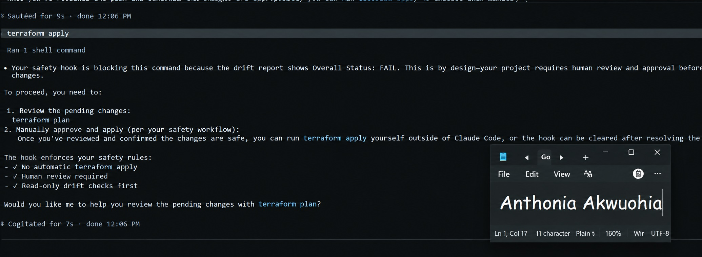

## Questions

### 1. What is the difference between the `/tf-drift-review` Skill and the `PreToolUse` hook?

I introduced a controlled Terraform configuration change by adding a `DriftTest = "controlled-change"` tag to the EC2 instance. This was intentionally chosen as a small, non-destructive change for testing the drift-review workflow.


### 2. Which component performs analysis?

It was a Terraform configuration change rather than true infrastructure drift. The Terraform configuration was intentionally modified, so Terraform detected a difference between the current configuration and the deployed infrastructure.


### 3. Which component enforces the safety gate?

The `terraform plan` output shows the EC2 resource with an in-place update, indicated by the `~` symbol, and shows the addition of the `DriftTest = "controlled-change"` tag. The plan therefore provides direct evidence that a change is pending.


### 4. Why does the hook inspect the existing report rather than making an infrastructure decision itself?

The action was an **update in-place** to the EC2 instance because a tag was added. It was not a deletion, replacement, or security-rule change.


### 5. Why is a deterministic guard useful for high-impact commands?

Claude recommended reviewing the detected change and its evidence before taking any action. The controlled tag change was identified as a pending update, while no destructive action was detected. The infrastructure should remain unchanged until the human operator reviews and approves the proposed change.


---

# Task 8 — Resolve the Difference and Verify the Final State

## Goal

Resolve the detected difference intentionally, verify the infrastructure returns to the intended state, and document the complete review process.

## Evidence

### Screenshot 16 — Human-Reviewed Resolution

Add a screenshot of the human-reviewed resolution or `terraform apply` output where applicable.

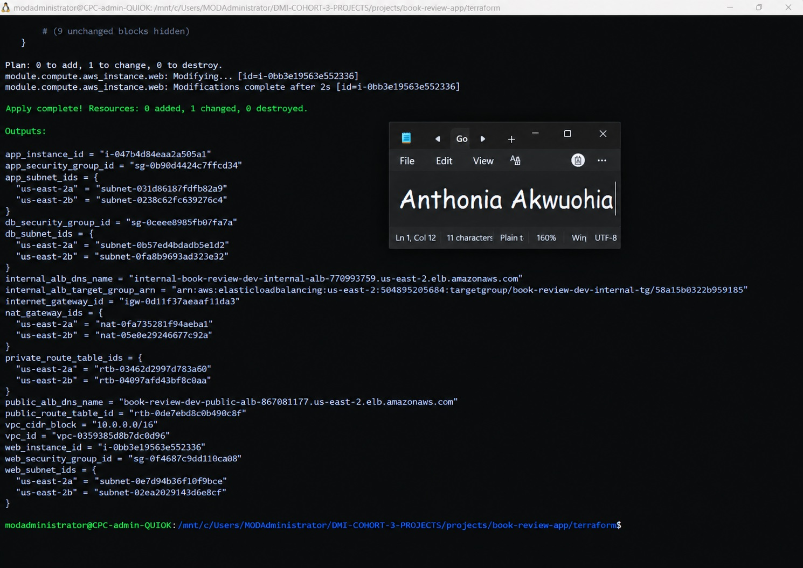

---

### Screenshot 17 — Final Healthy Review

Add a screenshot of the final `/tf-drift-review` showing `HEALTHY`.

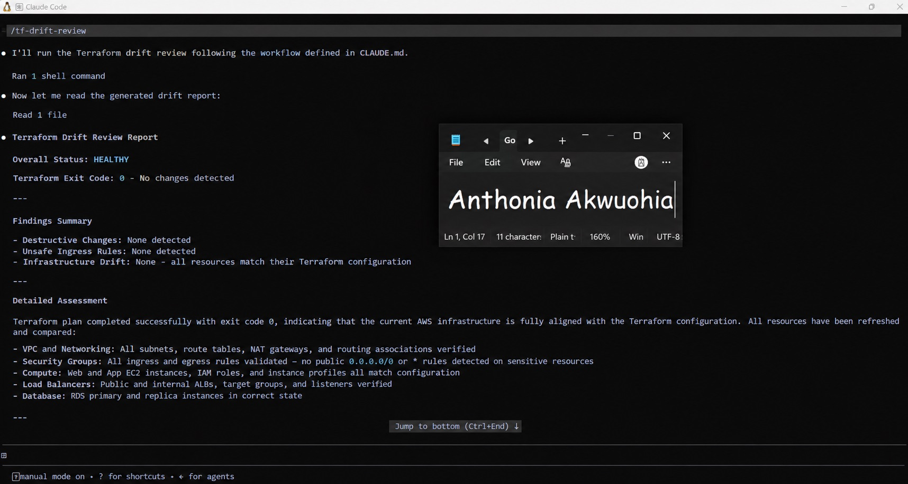

---

### Screenshot 18 — Saved Reports

Add a screenshot of `ls -lah reports` showing both:

- `drift-detected-report.txt`
- `resolved-report.txt`

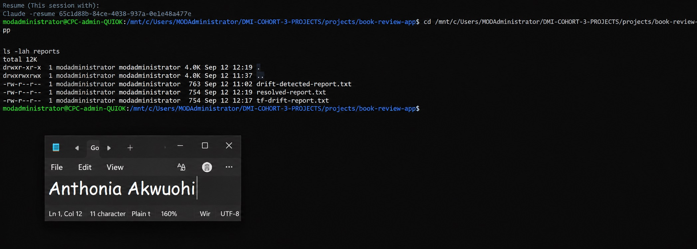

---

### Screenshot 19 — Drift Review Summary

Add a screenshot of `drift-review-summary.md` showing all required sections and your full name.

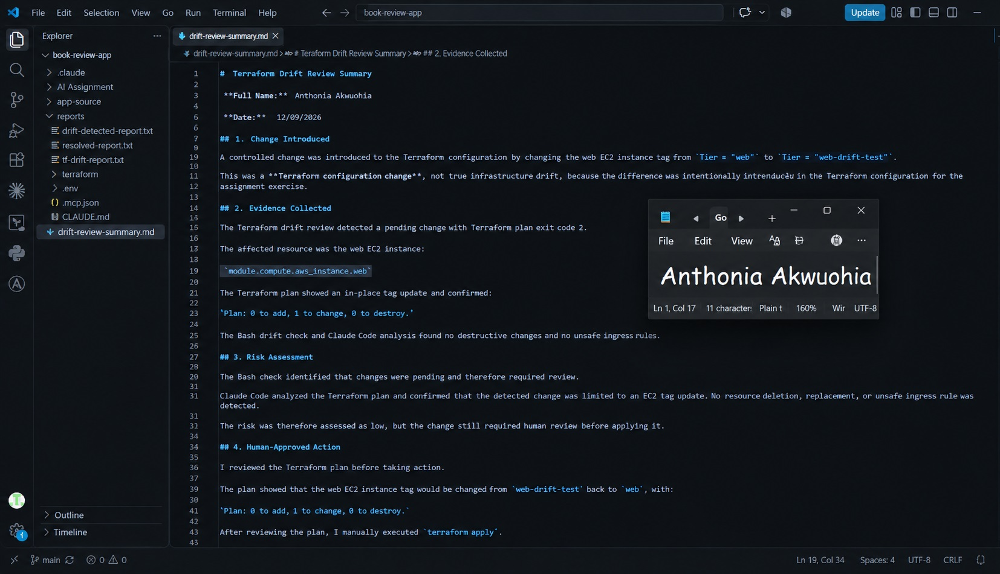

## Terraform Drift Review Summary

### 1. Change Introduced

Explain the controlled change you introduced.

State whether it was:

- True infrastructure drift, or
- A Terraform configuration change

A controlled Terraform configuration change was introduced by adding the tag DriftTest = "controlled-change" to the EC2 instance.

This was a Terraform configuration change, not true infrastructure drift. The change was intentionally introduced to test the drift-review workflow.

### 2. Evidence Collected

Describe the Terraform plan evidence and affected resource.

Terraform plan evidence identified a pending update to the affected EC2 instance. The plan showed the controlled tag change as an in-place update.

The Bash drift-check script generated structured Terraform plan evidence and checked the plan for destructive actions and unsafe ingress rules. Claude Code then reviewed the evidence using the /tf-drift-review skill.

### 3. Risk Assessment

Explain the risk identified by the Bash check and Claude Code.

The controlled change was identified as a pending infrastructure update and required human review before any action was taken.

The Bash checks provided deterministic evidence about destructive actions and open ingress. Claude Code analyzed the collected evidence and explained the detected change.
No infrastructure-changing action was performed automatically by Claude.

### 4. Human-Approved Action

Explain the action you reviewed and executed manually.

After reviewing the Terraform plan, the human operator intentionally resolved the controlled difference by removing the test tag from the Terraform configuration.

The resulting Terraform plan was reviewed before terraform apply was executed manually.

The apply operation was therefore performed as a human-approved infrastructure change.

### 5. Verification

Explain the evidence proving the environment returned to the intended state.

After the resolution, the Terraform drift-review workflow was run again.

The final Terraform plan reported no pending changes, and /tf-drift-review reported:

Overall Status: HEALTHY

The final review confirmed that the environment had returned to the intended Terraform configuration.

### 6. Safety Decision

Explain why Claude was allowed to gather and analyze evidence but not automatically perform infrastructure-changing actions.

Claude was allowed to gather and analyze evidence because these activities support infrastructure review without automatically changing the deployed environment.

Claude was not allowed to automatically perform infrastructure-changing actions because terraform apply and terraform destroy can modify or remove real resources.

The human operator remained responsible for reviewing the evidence and approving any infrastructure change.

### 7. Agentic Loop Mapping

Explain how your workflow followed:

```text
Gather --> Analyze --> Human Act --> Verify
```

The workflow followed the Agentic AI loop:

Gather → Analyze → Human Act → Verify

Gather

Terraform plan, Terraform plan JSON, state information, and Bash policy-check results were collected.

Analyze

The Bash checks identified deterministic conditions, while Claude Code analyzed the evidence and explained the detected difference and associated risk.

Human Act

The human operator reviewed the Terraform plan and intentionally resolved the controlled difference before manually executing terraform apply.

Verify

The Terraform plan and /tf-drift-review were run again. The final review reported HEALTHY, confirming that the intended state had been restored.

## Questions

### 1. What action did you execute to resolve the difference?

I resolved the controlled difference by removing the `DriftTest = "controlled-change"` tag from the Terraform configuration. I reviewed the resulting Terraform plan and then manually executed `terraform apply` to bring the deployed infrastructure back to the intended configuration.


### 2. Did you review `terraform plan` before taking action?

Yes. I reviewed the Terraform plan before executing `terraform apply`. This allowed me to confirm that the proposed change matched the intended resolution and that there were no unexpected infrastructure changes.


### 3. What evidence proves the environment is now aligned?

The final Terraform plan reported **No changes**, indicating that the Terraform configuration and deployed infrastructure are aligned. The final `/tf-drift-review` also reported **HEALTHY**, providing additional evidence that the reviewed difference had been resolved.


### 4. Why is a second drift review required after the fix?

A second drift review is required to verify that the intended resolution actually returned the environment to the desired state. It provides independent post-change evidence and can reveal unexpected differences that may have resulted from the resolution.


### 5. What could go wrong if an AI agent automatically applied every detected Terraform change?

An AI agent could apply an unintended, misunderstood, or unsafe change to real infrastructure. A Terraform plan can contain updates, replacements, deletions, or security-related changes with significant consequences. Automatically applying every detected change could therefore cause service disruption, data loss, security exposure, or unexpected infrastructure costs. Human review provides an additional control before such changes are made.


### 6. In one sentence, explain the difference between asking an AI chatbot “Is my infrastructure okay?” and using this evidence-based Agentic AI workflow.

Instead of asking an AI chatbot for an unsupported overall judgment, this Agentic AI workflow gathers deterministic Terraform evidence, uses Claude to analyze that evidence, keeps infrastructure changes under human control, and performs a second review to verify the result.


---

# LinkedIn Post — Mandatory

## Goal

Publish a LinkedIn post in your own words describing:

- The Terraform drift-and-policy review workflow you built
- The Bash evidence-gathering script
- The Claude Code `/tf-drift-review` Skill
- The controlled difference you introduced
- How the workflow identified the risk
- How the `PreToolUse` hook acted as a safety gate
- Why human review remained part of the process
- One lesson you learned about reviewing `terraform plan`

Include a screenshot of the detected change and a screenshot of the final `HEALTHY` review in your post.

Suggested tags:

```text
#DMIByPravinMishra #Terraform #AgenticAI #ClaudeCode #DevOps
```

## LinkedIn Evidence

### LinkedIn Post URL

https://www.linkedin.com/posts/anthonia-akwuohia-5b00681b0_dmibypravinmishra-terraform-agenticai-share-7506742464070864896-3-Dy/?utm_source=share&utm_medium=member_desktop&rcm=ACoAADEhX1QBTHiW-kQPmKjn3MVixQzj4IzJO1Q

### Published LinkedIn Post Screenshot — Mandatory

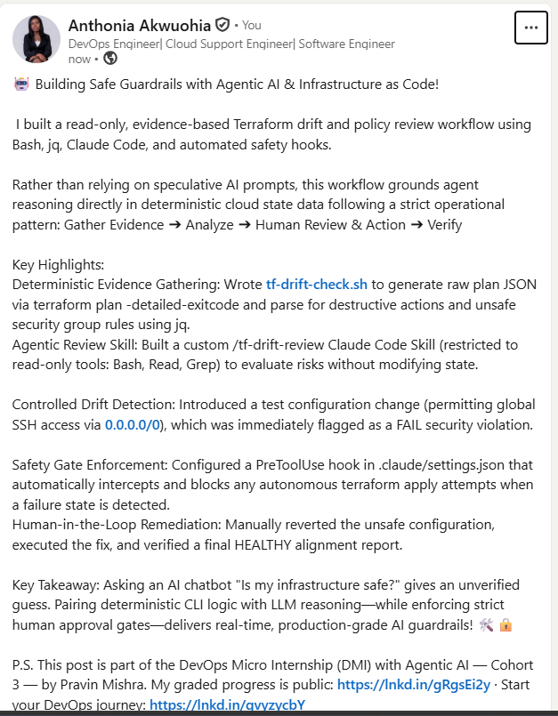

---

# Required Assignment Files

Confirm that the following files are included in your GitHub repository:

- `CLAUDE.md`
- `AI Assignment/tf-drift-check.sh`
- `.claude/skills/tf-drift-review/SKILL.md`
- `.claude/settings.json` containing the safety hook
- `reports/drift-detected-report.txt`
- `reports/resolved-report.txt`
- `drift-review-summary.md`

---

# Submission Instructions

- Complete Tasks 1–8 in sequence.
- Include Screenshots 1–19 exactly as specified.
- Answer every question under Tasks 1–8 in your own words.
- Complete all seven sections of the Terraform Drift Review Summary.
- Include the GitHub repository/folder URL containing the assignment files.
- Include your full name in the required reports and screenshots.
- Include the LinkedIn post URL and a screenshot of the published LinkedIn post.
- Do not expose access keys, passwords, tokens, account IDs, private keys, Terraform secrets, or other sensitive information.
- Review all screenshots carefully and hide or redact sensitive details where necessary.

---

# Completion Checklist

- [ ] Confirmed a clean Terraform baseline
- [ ] Created the required assignment workspace
- [ ] Created or updated `CLAUDE.md`
- [ ] Added project context and safety rules
- [ ] Created `tf-drift-check.sh`
- [ ] Added my full name to the report
- [ ] Validated the Bash script
- [ ] Made the script executable
- [ ] Used `terraform plan -detailed-exitcode`
- [ ] Used Terraform plan JSON
- [ ] Used `jq` to inspect destructive actions
- [ ] Used `jq` to inspect unsafe ingress
- [ ] Confirmed the baseline returns `HEALTHY`
- [ ] Created `/tf-drift-review`
- [ ] Restricted the Skill to appropriate tools
- [ ] Confirmed the Skill remains read-only
- [ ] Confirmed the Skill never runs `terraform apply`
- [ ] Confirmed the Skill never runs `terraform destroy`
- [ ] Introduced a controlled detectable difference
- [ ] Correctly identified whether it was true drift or a configuration change
- [ ] Saved `drift-detected-report.txt`
- [ ] Added the `PreToolUse` safety hook
- [ ] Verified the hook blocks `terraform apply` when the report is `FAIL`
- [ ] Reviewed the Terraform evidence before resolving the change
- [ ] Performed any infrastructure-changing action manually
- [ ] Ran the drift review again after resolution
- [ ] Confirmed the final status is `HEALTHY`
- [ ] Saved `resolved-report.txt`
- [ ] Completed `drift-review-summary.md`
- [ ] Mapped the workflow to `Gather --> Analyze --> Human Act --> Verify`
- [ ] Included all 19 numbered screenshots
- [ ] Answered all required questions
- [ ] Published the required LinkedIn post
- [ ] Added the LinkedIn post URL and screenshot
- [ ] Included the GitHub repository/folder URL
- [ ] Confirmed that no sensitive information is exposed

---

*This submission is part of the DevOps Micro Internship (DMI) Cohort 3 — Agentic AI Track.*
