# Assignment 02 — Provision Linux VMs with Terraform and Run Ansible Ad-Hoc Commands

Part of the DevOps Micro Internship (DMI) Cohort 3 with Agentic AI

---

## Purpose

In this assignment, you will use Terraform to provision three or four Ubuntu Linux Virtual Machines on either Microsoft Azure or Amazon Web Services.

You will configure SSH key-based authentication, organize the servers using a custom Ansible inventory, and run Ansible ad-hoc commands across individual hosts and inventory groups.

---

# Task 1 — Create the Multi-Host Lab Structure

## Goal

Create a separate project directory for the multi-host lab and prepare the Terraform, Ansible, and documentation files.

This project will use the Git repository and Ansible controller prepared in Assignment 01.

### Evidence

#### Screenshot 1 — Terminal showing the complete `ansible-adhoc-lab` project structure

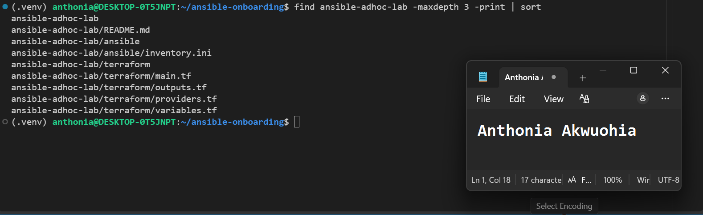

---

#### Screenshot 2 — Terminal showing `git status --short` with the new project files and updated `.gitignore`

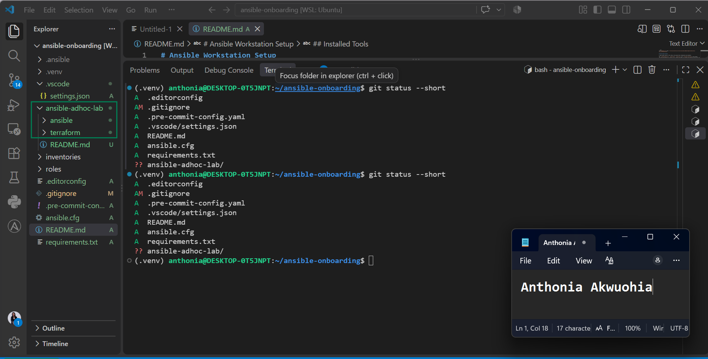

---

### Notes

1. A separate ansible-adhoc-lab project directory was created to keep the multi-host lab organized and independent from the previous Ansible project.
2. The project structure includes dedicated Terraform, Ansible, and documentation areas, providing a clear separation between infrastructure provisioning, configuration management, and project notes.
3. The existing Git repository and Ansible controller from Assignment 01 are reused, so the lab builds on the previously prepared environment rather than creating a new controller.
4. The updated .gitignore helps prevent generated files, Terraform state, local environment files, and other unnecessary or sensitive files from being committed to the repository.
5. git status --short was used to verify the new project files and .gitignore changes before committing them.

---

# Task 2 — Create the Terraform Configuration

## Goal

Create the Terraform configuration required to provision three or four Ubuntu Linux VMs on your selected cloud platform.

Complete only one option:

- Option A — Microsoft Azure
- Option B — Amazon Web Services

Do not configure both providers for this assignment.

### Evidence

#### Screenshot 3 — Terraform configuration showing the three or four server roles and the `for_each` or `count` implementation

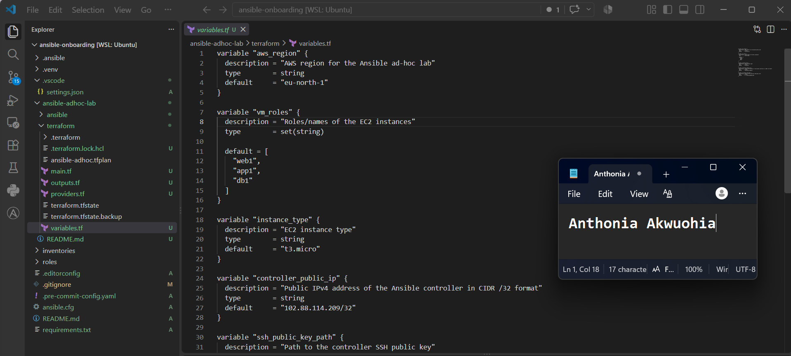

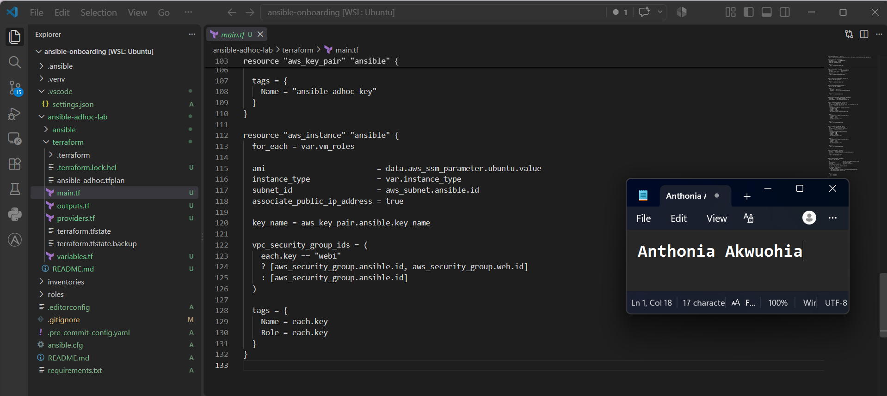

---

#### Screenshot 4 — Terraform configuration showing SSH restricted to the controller IP and HTTP allowed only for web hosts

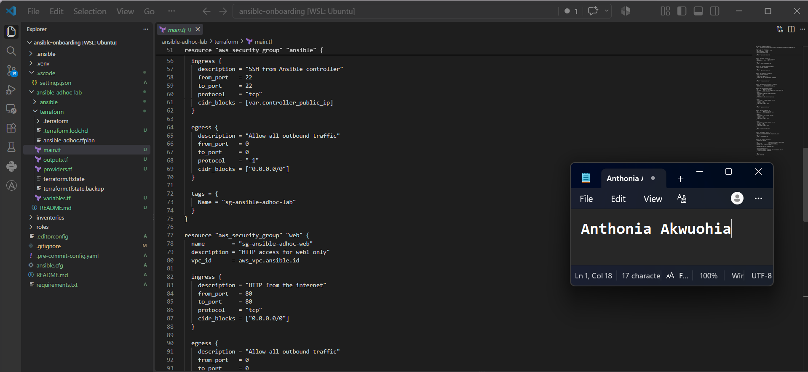

---

#### Screenshot 5 — Terraform output configuration showing how public IP addresses are associated with the server roles

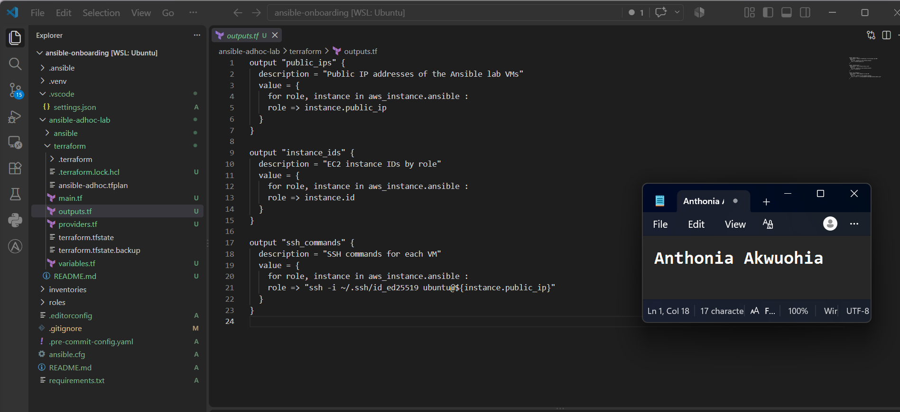

---

### Notes

I selected AWS as the cloud platform and used the three-VM option with the roles web1, app1, and db1. I created the Terraform configuration using for_each so the same configuration could provision multiple EC2 instances. The infrastructure includes a VPC, public subnet, Internet Gateway, route table, security groups, an AWS key pair, and Ubuntu LTS EC2 instances. SSH access was restricted to the Ansible controller public IP using /32, while HTTP access was limited to the web server. The Terraform configuration was formatted and prepared for validation and planning without applying the infrastructure during this task.

---

# Task 3 — Provision the Infrastructure with Terraform

## Goal

Initialize and validate the Terraform configuration, review the execution plan, provision the selected three or four VMs, and retrieve their public IP addresses.

### Evidence

#### Screenshot 6 — Final `terraform apply` output showing `Apply complete`

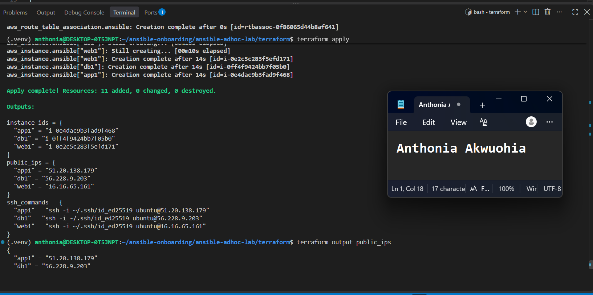
---

#### Screenshot 7 — `terraform output public_ips` showing the role-to-IP mapping for all three or four VMs

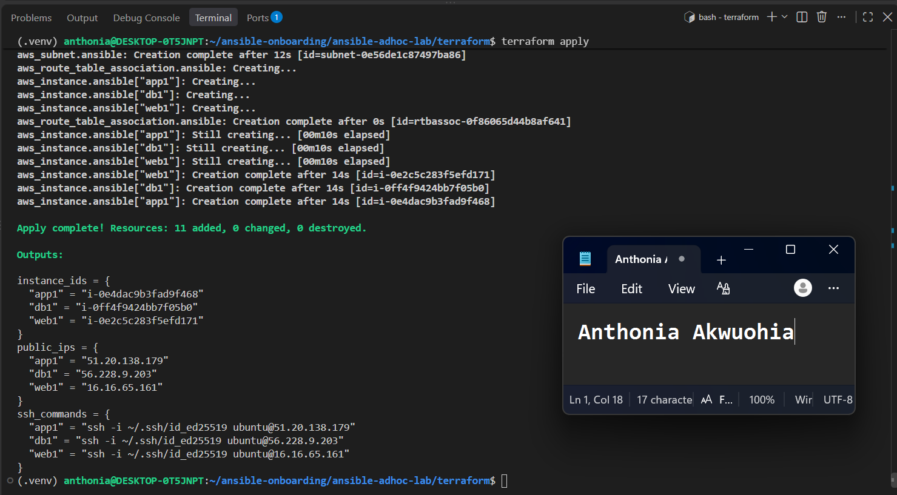

---

#### Screenshot 8 — Azure Portal or AWS Management Console showing all three or four VMs in the `Running` state, with their role-based names visible

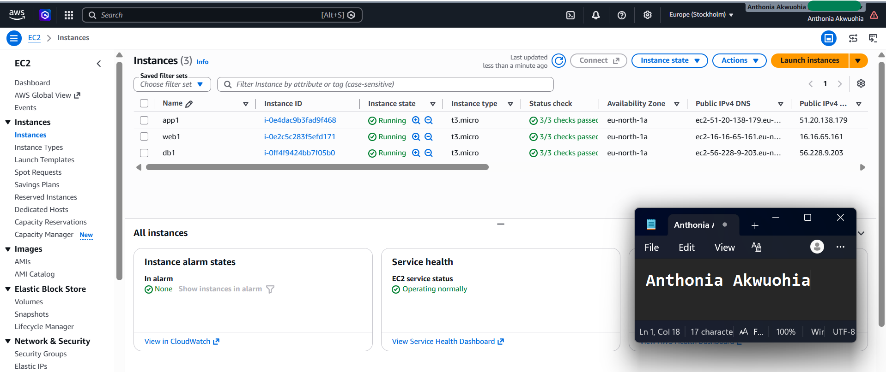

---

### Notes

I initialized and validated the AWS Terraform configuration and reviewed the execution plan before provisioning. The plan showed three EC2 instances for web1, app1, and db1 in the eu-north-1 region using the t3.micro instance type. SSH access was restricted to the controller IP 102.88.114.209/32, and HTTP access was configured for the web server. Terraform planned 11 resources to be created with no resources changed or destroyed. After reviewing the plan and confirming that the configuration was correct, I applied the infrastructure and retrieved the public IP addresses for the three VMs using the Terraform public_ips output.

---

# Task 4 — Verify SSH Key-Based Access

## Goal

Verify that each managed VM can be accessed from the Ansible controller using SSH key-based authentication.

### Evidence

#### Screenshot 9 — Terminal showing successful SSH hostname output from all VMs

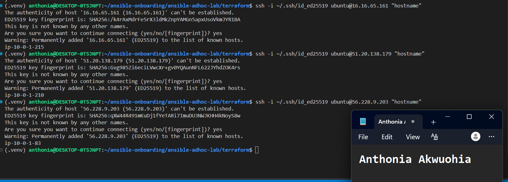

---

### Notes

I verified SSH key-based access from the Ansible controller to all three AWS EC2 managed nodes: web1, app1, and db1. I used the Ubuntu SSH user and the controller's existing `~/.ssh/id_ed25519` private key. Each VM was successfully accessed using its public IP address, and the hostname command confirmed connectivity. No remote password was required.

---

# Task 5 — Create the Custom Ansible Inventory

## Goal

Create an Ansible inventory file that groups the managed VMs by role.

The inventory allows Ansible to run commands against all servers, or only specific groups such as `web`, `app`, or `db`.

### Evidence

#### Screenshot 10 — `inventory.ini` showing the `web`, `app`, and `db` groups

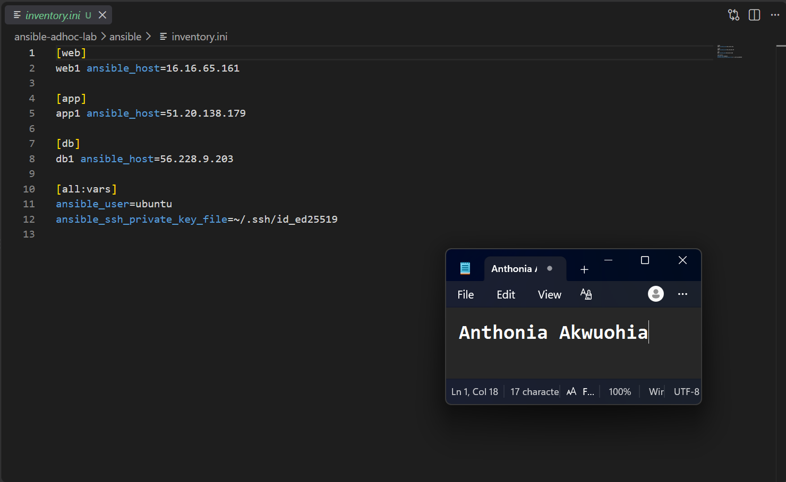

---

#### Screenshot 11 — Output of `ansible-inventory -i inventory.ini --graph`

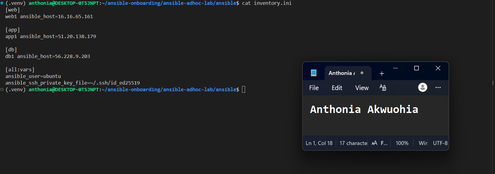

---

I created a custom Ansible inventory for the three AWS EC2 managed VMs: web1, app1, and db1. I grouped the servers by their roles and configured the Ubuntu SSH user and existing controller private key. I also created a local ansible.cfg file with host key checking disabled for this temporary lab. Finally, I validated the inventory using ansible-inventory and confirmed that the hosts were correctly grouped under web, app, and db.

---

# Task 6 — Run Ansible Ad-Hoc Commands

## Goal

Run Ansible ad-hoc commands from the controller to verify connectivity, check server information, and manage packages and services across inventory groups.

This task proves that the inventory is working and that Ansible can control multiple managed VMs without writing a playbook.

### Evidence

#### Screenshot 12 — Output of `ansible all -i inventory.ini -m ping`

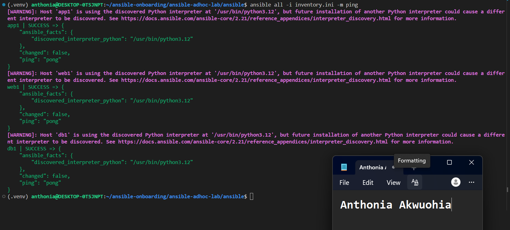

---

#### Screenshot 13 — Output of `ansible all -i inventory.ini -m command -a "uptime"`

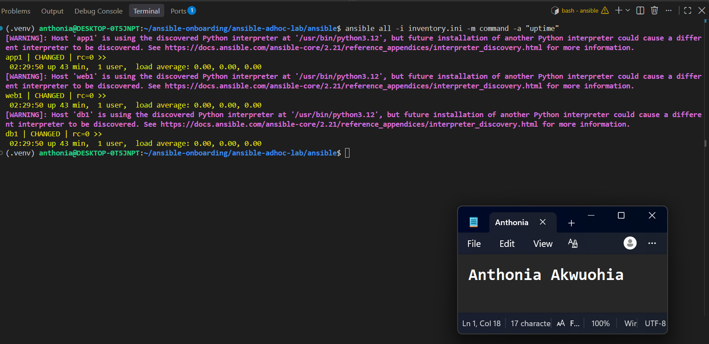

---

#### Screenshot 14 — Output of `ansible web -i inventory.ini -m apt -a "name=nginx state=present update_cache=yes" --become`

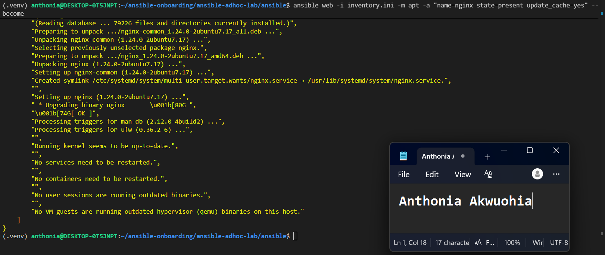

---

#### Screenshot 15 — Output of `ansible web -i inventory.ini -m service -a "name=nginx state=started enabled=yes" --become`

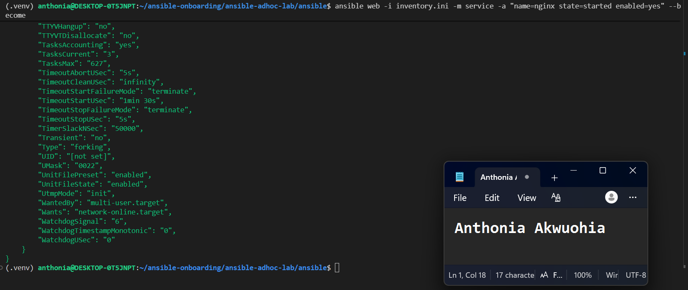

---

#### Screenshot 16 — Output of `ansible all -i inventory.ini -m apt -a "name=htop state=present update_cache=yes" --become`

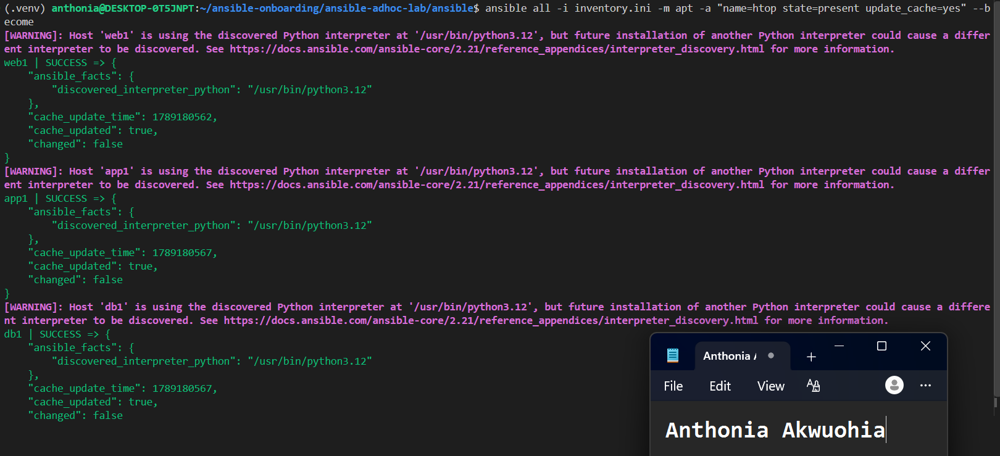

---

#### Screenshot 17 — Output of `ansible web -i inventory.ini -m command -a "systemctl is-active nginx"`

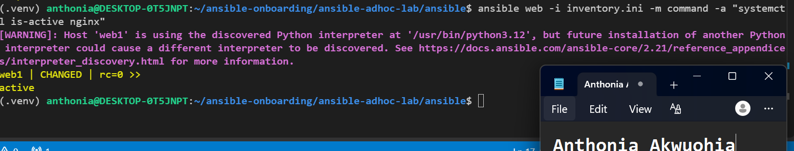

---

### Notes

I used Ansible ad-hoc commands to verify connectivity and manage the three AWS managed VMs: web1, app1, and db1. Ansible successfully connected to all hosts, and I used ad-hoc commands to check the remote user, uptime, disk usage, and memory. I installed and configured Nginx on web1 and installed htop on all three hosts. I also verified that the Nginx service was active on web1.

---

# LinkedIn Post Required

## Evidence

#### LinkedIn Post URL

Paste your LinkedIn post URL here:

https://www.linkedin.com/posts/anthonia-akwuohia-5b00681b0_devops-aws-terraform-share-7504482141926453250-3_q2/?utm_source=share&utm_medium=member_desktop&rcm=ACoAADEhX1QBTHiW-kQPmKjn3MVixQzj4IzJO1Q

---

#### Screenshot — Published LinkedIn post

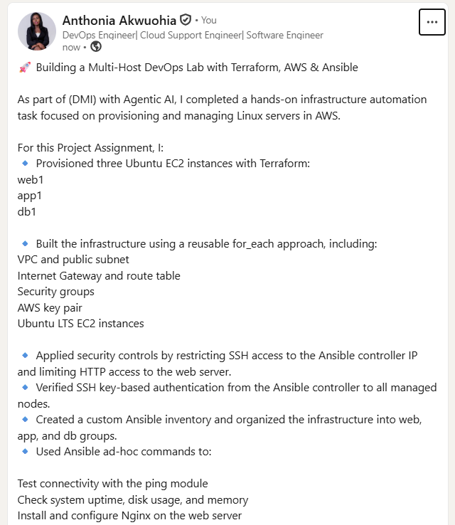

---

# Assignment Questions

Answer the following in your own words:

**1. What is the purpose of an Ansible inventory file?**

An Ansible inventory file tells Ansible which servers it needs to manage. It contains the host names or IP addresses of the managed servers and can organize them into groups based on their roles.

---

**2. What is the difference between the `web`, `app`, and `db` groups in your inventory?**

The groups organize the servers according to their roles. The web group contains the web server, the app group contains the application server, and the db group contains the database server. This makes it possible to run Ansible commands on a specific group instead of all the servers.

---

**3. What does the Ansible `ping` module verify?**

The Ansible ping module verifies that Ansible can connect to a managed server and successfully execute Python on it. A successful response confirms that the SSH connection and basic Ansible communication are working.

---

**4. Why do package installation commands require `--become`?**

Package installation usually requires administrator or root privileges. The --become option allows Ansible to run the command with elevated privileges, similar to using sudo on the managed server.

---

**5. When would you use an ad-hoc command instead of a playbook?**

I would use an ad-hoc command for a quick, one-time task, such as checking server uptime, testing connectivity, installing a package, or checking a service. For repeatable tasks or several related configuration steps, I would use a playbook because it is easier to manage, reuse, and maintain.

---

**6. What is one challenge you faced while setting up SSH or inventory, and how did you fix it?**

One challenge I faced was trying to connect to a VM using an incorrect SSH hostname and a PEM key that did not exist on my controller. I checked the Terraform output to obtain the correct public IP addresses and used the existing ~/.ssh/id_ed25519 private key with the ubuntu user. After correcting the connection details, I successfully connected to the VMs and added them to the Ansible inventory.

---

# Required Files

Confirm that the following files are included in your assignment workspace:

- [ ] `ansible-adhoc-lab/README.md`
- [ ] `ansible-adhoc-lab/terraform/providers.tf`
- [ ] `ansible-adhoc-lab/terraform/main.tf`
- [ ] `ansible-adhoc-lab/terraform/variables.tf`
- [ ] `ansible-adhoc-lab/terraform/outputs.tf`
- [ ] `ansible-adhoc-lab/ansible/inventory.ini`
- [ ] Updated `.gitignore`

---

# Submission Instructions

- Add all required screenshots from the tasks.
- Full Name must be visible in required screenshots.
- Mention whether you used Azure or AWS.
- Mention whether you used the three-VM option or four-VM option.
- Add the public IP addresses of the VMs, redacted if preferred.
- Add your `inventory.ini` proof.
- Add a short explanation of what you learned.
- Answer all assignment questions clearly in your own words.
- Add your LinkedIn post URL.
- Do not expose SSH private keys, Terraform state files, cloud credentials, passwords, access keys, secret keys, account IDs, or subscription IDs.
- Submit only one Google Doc link.

---

# Completion Checklist

- [ ] Task 1: `ansible-adhoc-lab` project structure created
- [ ] Task 1: `.gitignore` updated for Terraform files
- [ ] Task 2: Terraform configuration created
- [ ] Task 2: Server roles defined for either three or four VMs
- [ ] Task 2: `count` or `for_each` used
- [ ] Task 2: SSH restricted to the controller public IP
- [ ] Task 2: HTTP allowed only for web hosts
- [ ] Task 2: Terraform output maps roles to public IPs
- [ ] Task 3: Terraform initialized successfully
- [ ] Task 3: Terraform configuration validated
- [ ] Task 3: Terraform apply completed successfully
- [ ] Task 3: All selected VMs are running
- [ ] Task 4: SSH key-based access works for every VM
- [ ] Task 5: `inventory.ini` contains `web`, `app`, and `db` groups
- [ ] Task 5: `ansible-inventory -i inventory.ini --graph` shows the correct groups
- [ ] Task 6: `ansible all -i inventory.ini -m ping` returns `SUCCESS`
- [ ] Task 6: Ad-hoc commands run successfully
- [ ] Task 6: `--become` was used for package and service tasks
- [ ] Task 6: Nginx is active on the `web` group
- [ ] Screenshots 1–17 are included
- [ ] Assignment questions are answered
- [ ] LinkedIn post published
- [ ] LinkedIn post URL added
- [ ] No sensitive information is exposed
- [ ] Google Doc is accessible

---

## About DMI & CloudAdvisory

DevOps Micro Internship (DMI) is a project-based DevOps program run by Pravin Mishra and The CloudAdvisory, focused on real-world execution, systems thinking, and career readiness.

It helps learners build strong DevOps foundations with hands-on experience.

---

## Resources

- DMI Official Website: [https://dmi.pravinmishra.com?utm_source=github&utm_medium=readme](https://dmi.pravinmishra.com?utm_source=github&utm_medium=readme)
- University: [https://university.pravinmishra.com?utm_source=github&utm_medium=readme](https://university.pravinmishra.com?utm_source=github&utm_medium=readme)
- Discord Community: [https://discord.pravinmishra.com?utm_source=github&utm_medium=readme](https://discord.pravinmishra.com?utm_source=github&utm_medium=readme)
- Blog: [https://dmi.pravinmishra.com/blog?utm_source=github&utm_medium=readme](https://dmi.pravinmishra.com/blog?utm_source=github&utm_medium=readme)
- YouTube Playlist: [https://www.youtube.com/playlist?list=PLFeSNDtI4Cho](https://www.youtube.com/playlist?list=PLFeSNDtI4Cho)
- Pravin Mishra LinkedIn: [https://www.linkedin.com/in/pravin-mishra-aws-trainer/](https://www.linkedin.com/in/pravin-mishra-aws-trainer/)
- CloudAdvisory LinkedIn: [https://www.linkedin.com/company/thecloudadvisory/](https://www.linkedin.com/company/thecloudadvisory/)

---

*This submission is part of DevOps Micro Internship (DMI) Cohort 3 — Agentic AI Track.*