# Assignment 03 — Deploy a Static Website to Multiple Servers Using a Multi-Play Ansible Playbook

Part of the DevOps Micro Internship (DMI) Cohort 3 with Agentic AI

---

## Student Details

**Full Name:** Add your full name here  
**Cloud Platform Used:** AWS / Azure  
**Server 1 URL:** `http://<SERVER_1_PUBLIC_IP>`  
**Server 2 URL:** `http://<SERVER_2_PUBLIC_IP>`

---

## Purpose

In this assignment, you will create a multi-play Ansible playbook to install Nginx, deploy a static website to two Ubuntu servers, and verify that the website is accessible from both servers.

You may use either AWS EC2 instances or Azure Virtual Machines as your managed servers.

---

# Task 1 — Create the Project Structure

## Goal

Create the required folders and files for the Ansible project.

## Evidence

### Screenshot 1 — Terminal or VS Code showing the complete `static-web` project structure

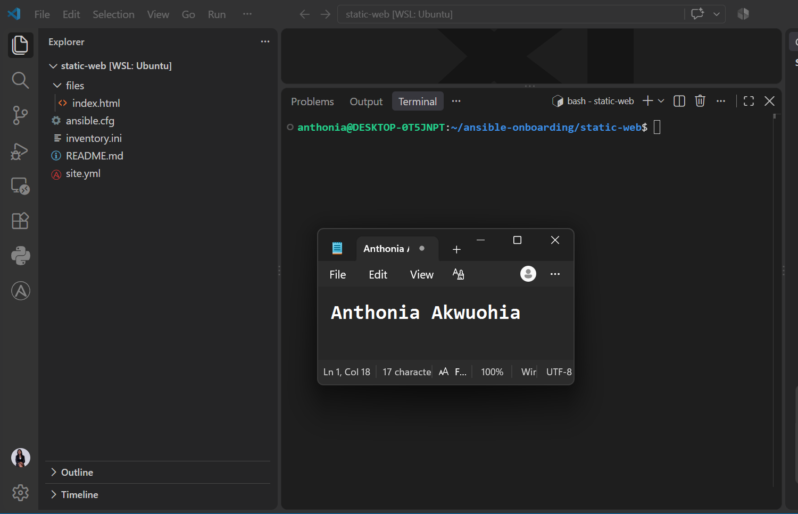

---

# Task 2 — Configure the Ansible Inventory

## Goal

Add both Ubuntu servers to the Ansible inventory.

## Evidence

### Screenshot 2 — Output of `ansible-inventory -i inventory.ini --graph` showing `web1` and `web2`

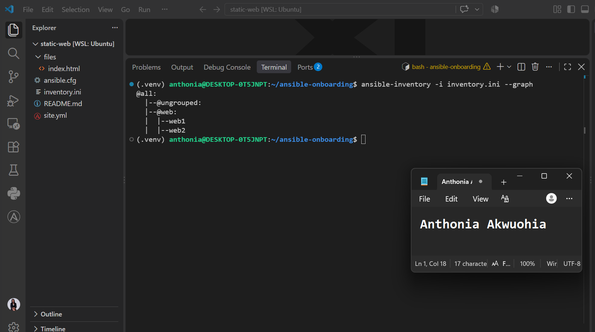

---

## Configuration File

Copy and paste the complete contents of your `inventory.ini` file below:

```ini

[web]
web1 ansible_host=16.170.251.182
web2 ansible_host=16.171.255.20

[web:vars]
ansible_user=ubuntu
ansible_ssh_private_key_file=/home/anthonia/.ssh/static-web-key-2026.pem
(.venv) anthonia@DESKTOP-0T5JNPT:~/ansible-onboarding/static-web$ 

```

---

# Task 3 — Verify Ansible Connectivity

## Goal

Confirm that the Ansible controller can connect to both servers.

## Evidence

### Screenshot 3 — Ansible ping output showing `SUCCESS` and `pong` for both servers

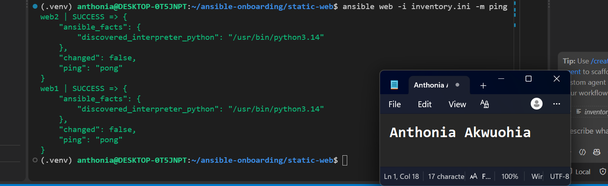
---

# Task 4 — Download and Personalize the Static Website

## Goal

Download `index.html` to the Ansible controller and personalize the website with your full name.

## Evidence

### Screenshot 4 — Edited `files/index.html` showing the footer line with your full name

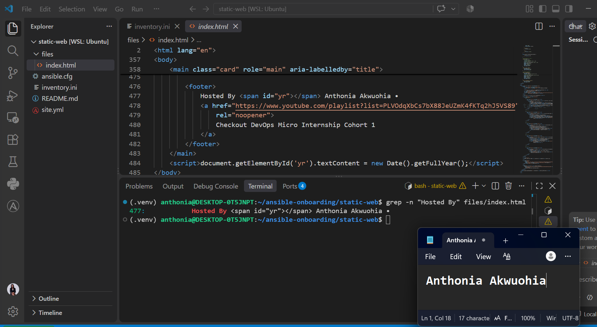

---

# Task 5 — Create the Multi-Play Ansible Playbook

## Goal

Create a single Ansible playbook containing separate plays for installation, deployment, and verification.

## Configuration File

Copy and paste the complete contents of your `site.yml` file below:

```yaml
---

* name: Install and configure Nginx
  hosts: web
  become: true

  tasks:

  * name: Update APT package cache
    ansible.builtin.apt:
    update_cache: true

  * name: Install Nginx
    ansible.builtin.apt:
    name: nginx
    state: present

  * name: Start and enable Nginx
    ansible.builtin.service:
    name: nginx
    state: started
    enabled: true

* name: Deploy static website
  hosts: web
  become: true

  tasks:

  * name: Copy static website
    ansible.builtin.copy:
    src: files/index.html
    dest: /var/www/html/index.html
    owner: www-data
    group: www-data
    mode: "0644"
    notify: Reload Nginx

  handlers:

  * name: Reload Nginx
    ansible.builtin.service:
    name: nginx
    state: reloaded

* name: Verify both websites from the controller
  hosts: localhost
  connection: local
  gather_facts: false

  tasks:

  * name: Check websites
    ansible.builtin.uri:
    url: "http://{{ hostvars[item].ansible_host }}"
    method: GET
    status_code: 200
    loop: "{{ groups['web'] }}"
    register: website_checks

  * name: Verify HTTP status
    ansible.builtin.assert:
    that:
    - item.status == 200
    success_msg: "{{ item.item }} is reachable with HTTP status {{ item.status }}"
    fail_msg: "{{ item.item }} verification failed with HTTP status {{ item.status }}"
    loop: "{{ website_checks.results }}"

```

---

# Task 6 — Validate the Playbook Syntax

## Goal

Check the playbook for YAML or Ansible syntax errors before running it.

## Evidence

### Screenshot 5 — Successful syntax-check output showing `playbook: site.yml`

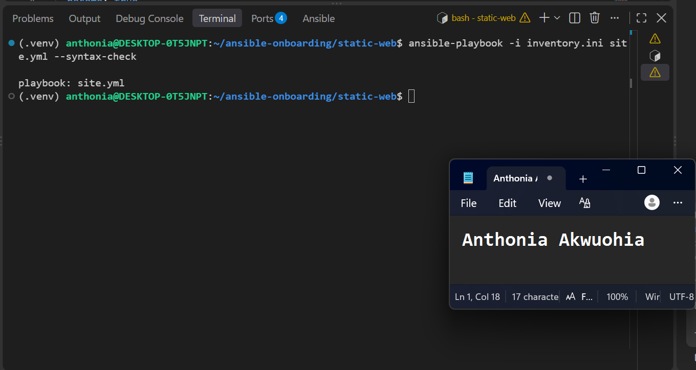

---

# Task 7 — Run the Multi-Play Playbook

## Goal

Install Nginx, deploy the website, and verify both servers in one playbook run.

## Evidence

### Screenshot 6 — Play 3 verification showing HTTP `200` for both servers

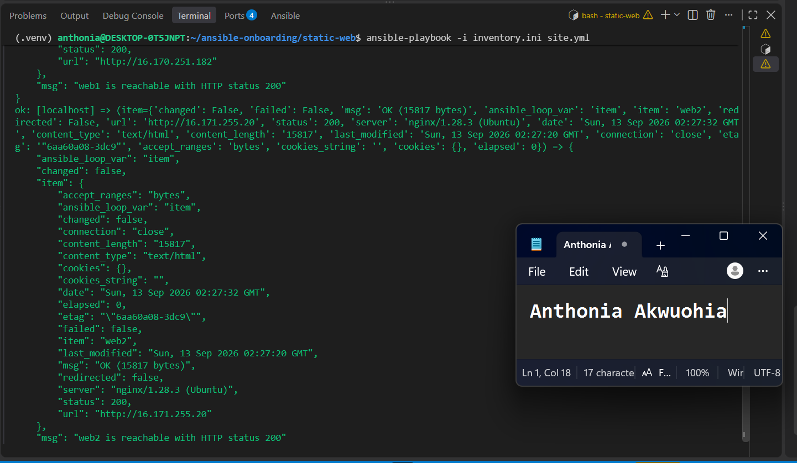

---

### Screenshot 7 — Final play recap showing `unreachable=0` and `failed=0` for `web1`, `web2`, and `localhost`

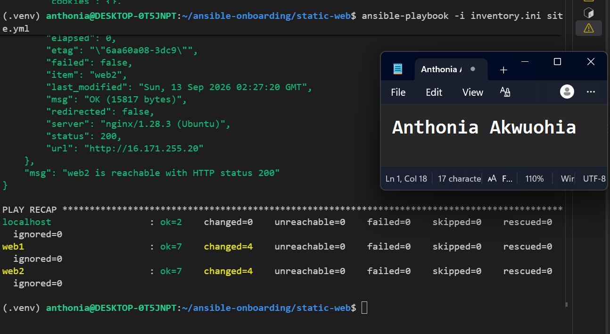

---

# Task 8 — Verify Idempotency

## Goal

Run the playbook again and confirm that it does not make unnecessary changes.

## Evidence

### Screenshot 8 — Second playbook run showing the play recap with `changed=0`, `unreachable=0`, and `failed=0` for both web servers

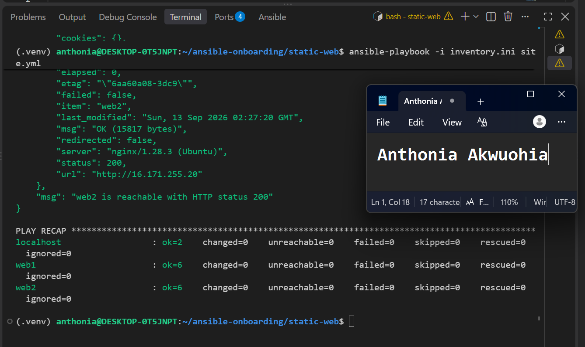

---

# Task 9 — Test Both Websites Manually

## Goal

Confirm that the static website is accessible from both public IP addresses.

## Evidence

### Screenshot 9 — `curl -I` output showing HTTP `200 OK` from both servers

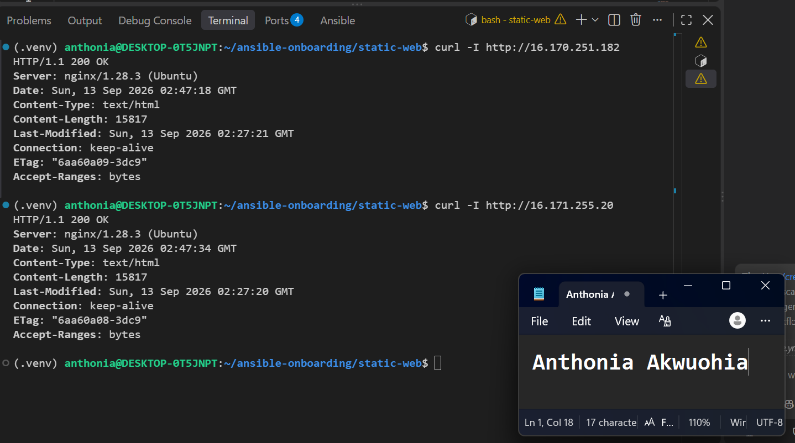

---

### Screenshot 10 — Browser showing the website from Server 1 with the public IP and your full name visible

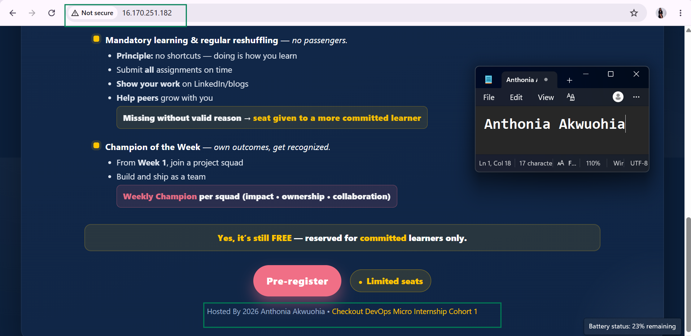

---

### Screenshot 11 — Browser showing the website from Server 2 with the public IP and your full name visible

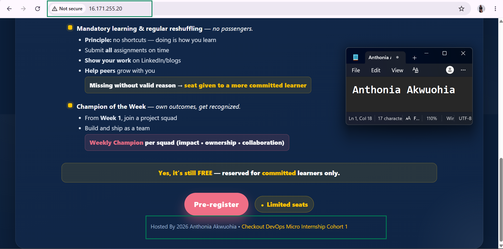

---

## Website URLs

Add both deployed website URLs below:

```text
Server 1: http://16.170.251.182/
Server 2: http://16.171.255.20/
```

---

# Task 10 — Complete the Project README

## Goal

Document how the project works and record what you learned.

## README Content

Copy and paste the complete contents of your `README.md` file below:

```markdown
# Multi-Play Ansible Static Website Deployment

## Project Overview

This project demonstrates how to use Ansible to deploy a static website to multiple web servers. I used Ansible from my controller machine to install and configure Nginx on two AWS EC2 instances, deploy the same `index.html` file to both servers, and verify that both websites were accessible over HTTP.

The playbook uses three plays: the first installs and configures Nginx, the second deploys the website content, and the third verifies both websites from the Ansible controller.

## Environment

- Cloud platform: AWS
- Operating system: Ubuntu
- Number of managed servers: 2
- Web server: Nginx


## Issue Faced and Solution

One issue I encountered was that Ansible could not initially connect to the EC2 servers over SSH. The inventory and SSH key configuration were correct, but the connection attempts timed out.

I investigated the AWS networking configuration and found that the VPC route table had a default route to an Internet Gateway in a blackhole state. I fixed the issue by creating and attaching a working Internet Gateway and recreating the default route. After the network configuration was corrected, SSH connectivity and Ansible connectivity checks worked successfully.

## What I Learned

I learned how to use Ansible inventory files to manage multiple servers, test connectivity with the ping module, and automate server configuration with a playbook. I also learned how to use Ansible's apt, service, copy, uri, and assert modules.

I learned the importance of idempotency in Ansible. When the playbook is run again without changing the desired configuration, Ansible should avoid making unnecessary changes. The website deployment also uses a handler so Nginx is reloaded only when the website file changes.

I also gained practical experience troubleshooting AWS networking when SSH connectivity was unavailable.

## Why Installation and Deployment Are Separate

Installation and deployment are handled in separate plays because they perform different responsibilities. The first play prepares the servers by installing and configuring Nginx. The second play manages the website content.

Separating these tasks makes the playbook easier to understand, maintain, and troubleshoot. It also allows the website deployment to be changed without mixing application content management with server software installation.

## Benefit of the Ansible Copy Module

One benefit of using the Ansible copy module is that it allows the controller to manage and deploy a known version of the website file consistently across all managed servers.

Unlike cloning the website repository directly on every server, the copy module can detect whether the destination file already matches the desired content. If there is no change, Ansible does not copy the file again. This supports idempotency and avoids unnecessary changes to the managed servers.

## How to Run the Playbook

The playbook can be executed from the `static-web` project directory with:

```bash
ansible-playbook -i inventory.ini site.yml

```

---

# LinkedIn Post Required

## Evidence

### LinkedIn Post URL

Paste your LinkedIn post URL here:

https://www.linkedin.com/posts/anthonia-akwuohia-5b00681b0_dmibypravinmishra-devops-ansible-share-7504746833223733248-rnQ3/?utm_source=share&utm_medium=member_desktop&rcm=ACoAADEhX1QBTHiW-kQPmKjn3MVixQzj4IzJO1Q
---

### Screenshot — Published LinkedIn post

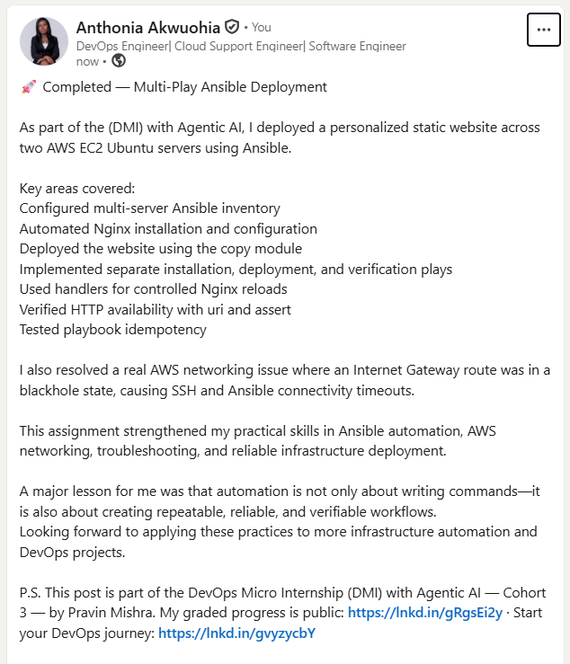

---

# Assignment Questions

Answer the following in your own words:

**1. What issue did you face while completing this assignment, and how did you fix it?**

I initially had a problem connecting Ansible to the EC2 servers because the SSH connection was timing out. After checking the AWS networking configuration, I found that the VPC route table had a default route pointing to an Internet Gateway in a blackhole state. I fixed this by creating and attaching a working Internet Gateway and recreating the default route. After that, SSH and Ansible connectivity worked successfully.

---

**2. What did you learn from this assignment?**

I learned how to use Ansible to manage multiple servers from one controller. I learned how to create an inventory, test connectivity, install Nginx, deploy a static website, use handlers, and verify websites with the uri module. I also learned the importance of writing idempotent playbooks and troubleshooting cloud networking problems.
---

**3. Why is it useful to split installation, deployment, and verification into separate plays?**

Splitting these tasks into separate plays makes the playbook easier to understand, maintain, and troubleshoot. Each play has a clear purpose: the first prepares the servers, the second deploys the website, and the third verifies that the deployment works correctly.

---

**4. What is one benefit of using the Ansible `copy` module instead of cloning the website directly from Git on every managed server?**

The copy module allows me to control the exact website file that is deployed from the Ansible controller. It also checks whether the file has changed, so it does not copy the file again when the content is already correct. This helps maintain consistency and supports idempotency.

---

**5. What does idempotency mean in this assignment?**

AIdempotency means that I can run the same Ansible playbook multiple times and, once the servers are already in the desired state, Ansible does not make unnecessary changes. For example, Nginx remains installed and running, and the website file is not copied again if it has not changed.
---

**6. What does the Ansible `uri` module verify in Play 3?**

The uri module verifies that the websites are accessible over HTTP from the Ansible controller. In this assignment, it sends a request to each server's public IP address and checks that the server returns HTTP status 200, confirming that the website is reachable and responding successfully.

---

# Required Files

Confirm that the following files are included in your assignment folder:

- [ ] `inventory.ini`
- [ ] `site.yml`
- [ ] `files/index.html`
- [ ] `README.md`

---

# Submission Instructions

- Add all required screenshots in the correct order.
- Full Name must be visible in required screenshots.
- Include both deployed website URLs.
- Paste `inventory.ini`, `site.yml`, and `README.md` as editable text.
- Answer all assignment questions clearly in your own words.
- Add your LinkedIn post URL.
- Do not expose SSH private keys, passwords, cloud account IDs, or other sensitive information.

---

# Completion Checklist

- [ ] Task 1: `static-web` folder structure is complete
- [ ] Task 2: Both servers are listed under the `[web]` group in `inventory.ini`
- [ ] Task 2: Inventory graph shows `web1` and `web2`
- [ ] Task 3: Ansible ping returns `SUCCESS` and `pong` for both servers
- [ ] Task 4: `files/index.html` contains your full name
- [ ] Task 5: `site.yml` contains three separate plays
- [ ] Task 5: Play 1 installs, starts, and enables Nginx
- [ ] Task 5: Play 2 deploys `index.html` using the `copy` module
- [ ] Task 5: Nginx reload handler is included
- [ ] Task 5: Play 3 verifies both web servers from the controller
- [ ] Task 6: Playbook syntax check passes
- [ ] Task 7: First playbook run completes with `unreachable=0` and `failed=0`
- [ ] Task 7: URI verification returns HTTP `200` for both servers
- [ ] Task 8: Second playbook run demonstrates idempotency
- [ ] Task 8: Second run shows `changed=0` for both web servers
- [ ] Task 9: Both `curl -I` commands return HTTP `200 OK`
- [ ] Task 9: Website loads from Server 1
- [ ] Task 9: Website loads from Server 2
- [ ] Task 9: Full name is visible on both deployed websites
- [ ] Task 10: `README.md` contains all required explanations
- [ ] Screenshots 1–11 are included
- [ ] `inventory.ini`, `site.yml`, and `README.md` are pasted as editable text
- [ ] Both website URLs are included
- [ ] Assignment questions are answered
- [ ] LinkedIn post published
- [ ] LinkedIn post URL added
- [ ] No sensitive information is exposed

---

## About DMI & CloudAdvisory

DevOps Micro Internship (DMI) is a project-based DevOps program run by Pravin Mishra and The CloudAdvisory, focused on real-world execution, systems thinking, and career readiness.

It helps learners build strong DevOps foundations with hands-on experience.

---

## Resources

- DMI Official Website: [https://dmi.pravinmishra.com?utm_source=github&utm_medium=readme](https://dmi.pravinmishra.com?utm_source=github&utm_medium=readme)
- University: [https://university.pravinmishra.com?utm_source=github&utm_medium=readme](https://university.pravinmishra.com?utm_source=github&utm_medium=readme)
- Discord Community: [https://discord.pravinmishra.com?utm_source=github&utm_medium=readme](https://discord.pravinmishra.com?utm_source=github&utm_medium=readme)
- Blog: [https://dmi.pravinmishra.com/blog?utm_source=github&utm_medium=readme](https://dmi.pravinmishra.com/blog?utm_source=github&utm_medium=readme)
- YouTube Playlist: [https://www.youtube.com/playlist?list=PLFeSNDtI4Cho](https://www.youtube.com/playlist?list=PLFeSNDtI4Cho)
- Pravin Mishra LinkedIn: [https://www.linkedin.com/in/pravin-mishra-aws-trainer/](https://www.linkedin.com/in/pravin-mishra-aws-trainer/)
- CloudAdvisory LinkedIn: [https://www.linkedin.com/company/thecloudadvisory/](https://www.linkedin.com/company/thecloudadvisory/)

---

*This submission is part of DevOps Micro Internship (DMI) Cohort 3 — Agentic AI Track.*