# Assignment — Deploy EpicBook with Terraform and Ansible Roles

Part of the DevOps Micro Internship (DMI) with Agentic AI

---

## Purpose

In this assignment, you will deploy the EpicBook web application using Terraform and Ansible roles.

Terraform provisions the cloud infrastructure, including one Ubuntu VM and one managed MySQL database. Ansible roles configure the VM, install required software, deploy the EpicBook application, configure Nginx, connect the app to the managed MySQL database, and verify the deployment.

---

# Task 1 — Set Up the Project Folder Layout

## Goal

Create the project folder structure for Terraform and Ansible roles.

Terraform will be used to provision the cloud infrastructure. Ansible roles will be used to configure the VM and deploy the EpicBook application.

### Evidence

#### Screenshot 1 — Terminal showing the completed `epicbook-prod` project structure

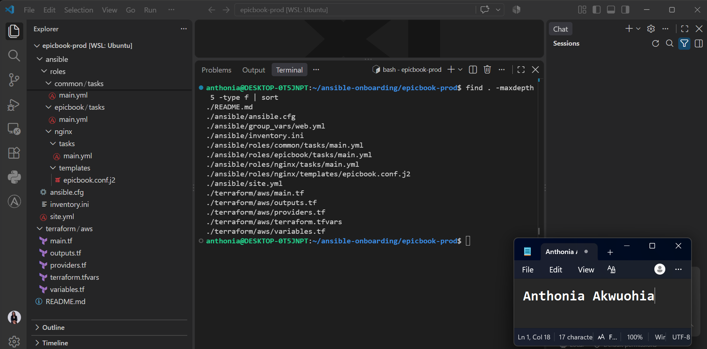

---

### Notes

Answer the following in your own words:

**1. Which cloud provider did you choose for this assignment?**

I chose AWS (Amazon Web Services) as the cloud provider for this assignment.

---

**2. Why is it useful to keep Terraform files and Ansible files in separate folders?**

Keeping Terraform and Ansible files in separate folders makes the project organized and easier to manage. Terraform is responsible for provisioning the AWS infrastructure, while Ansible is responsible for configuring the server and deploying the application. Separating them makes it easier to understand, maintain, troubleshoot, and reuse each part of the deployment.

---

**3. What is the purpose of the `roles` directory in Ansible?**

The roles directory organizes Ansible tasks into reusable components. Each role focuses on a specific responsibility, such as common server configuration, Nginx installation, or EpicBook deployment. This makes the playbook cleaner, easier to maintain, and reusable across different servers or projects.

---

# Task 2 — Provision the Infrastructure with Terraform

## Goal

Run Terraform to provision the cloud infrastructure for the EpicBook deployment.

Terraform will create the VM, managed MySQL database, networking, security rules, and required outputs.

### Evidence

#### Screenshot 2 — `terraform apply` completed successfully

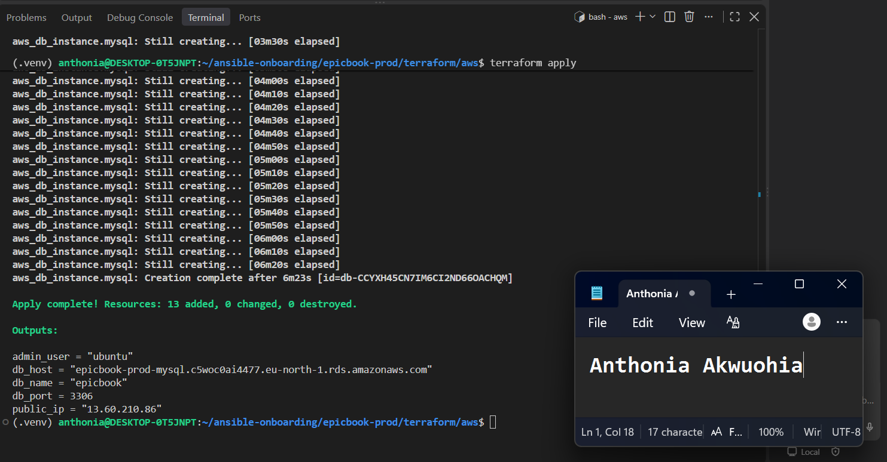

---

#### Screenshot 3 — Output of `terraform output`

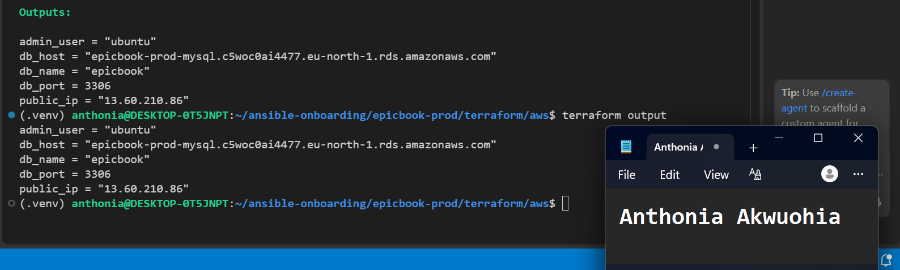

---

#### Screenshot 4 — Azure Portal or AWS Console showing the VM running

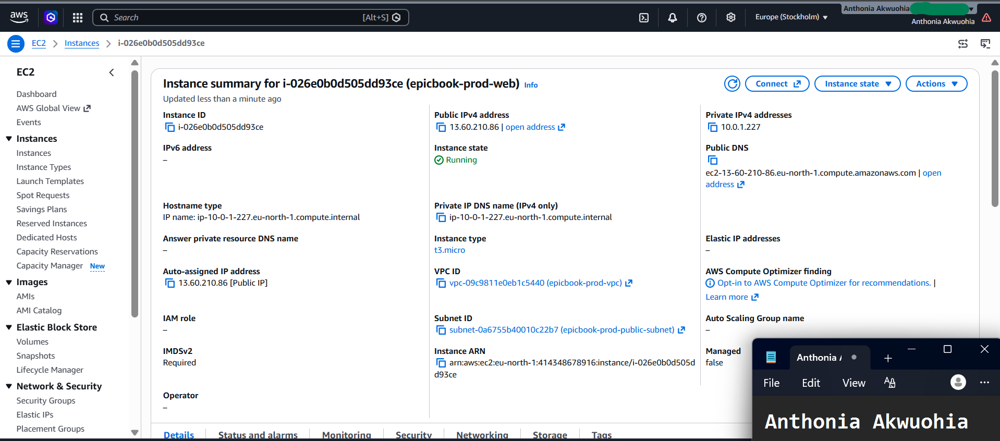

---

#### Screenshot 5 — Azure Portal or AWS Console showing the managed MySQL database created

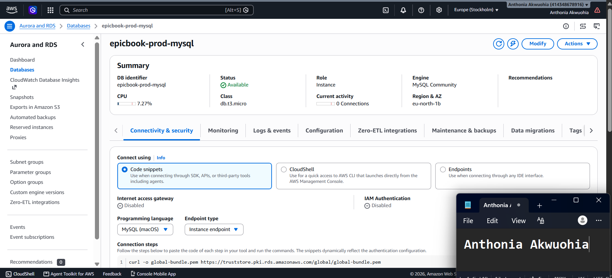

---

### Notes

Answer the following in your own words:

**1. What resources did Terraform create for this assignment?**

Terraform created the AWS infrastructure needed to run the EpicBook application. This included a VPC, public and private subnets, an Internet Gateway, a route table, security groups, an EC2 web server, an SSH key pair, and an RDS MySQL database. The database was placed in private subnets, while the EC2 instance was placed in a public subnet so it could be accessed and managed remotely.

---

**2. Why should you review `terraform plan` before running `terraform apply`?**

Reviewing terraform plan helps me understand exactly what Terraform intends to create, change, or delete before making any changes to AWS. It gives me an opportunity to identify configuration mistakes, unexpected resources, security issues, or unnecessary costs. This makes the deployment safer and reduces the chance of accidentally modifying or deleting the wrong infrastructure.

---

**3. Why should database passwords not be shown in Terraform output?**

Database passwords are sensitive credentials and should be protected from unauthorized access. Showing them in Terraform output, logs, screenshots, or source code could expose the database to security risks. Terraform should mark sensitive values appropriately, and passwords should be stored securely rather than displayed publicly or committed to Git.

---

# Task 3 — Verify SSH Key-Based Access

## Goal

Verify that the cloud VM can be accessed from the Ansible controller using SSH key-based authentication.

### Evidence

#### Screenshot 6 — Successful SSH hostname check from the Ansible controller

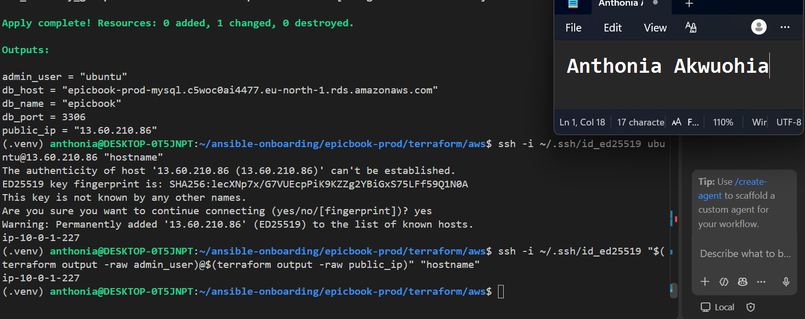

---

### Notes

Answer the following in your own words:

**1. What command did you use to verify SSH access?**

I used the SSH command below to connect to the AWS EC2 instance using my private SSH key:

ssh -i ~/.ssh/id_ed25519 ubuntu@13.60.210.86 "hostname"

The command connects to the server and runs hostname to confirm that the remote machine is accessible.

---

**2. What proves that SSH key-based access worked successfully?**

The successful connection and the hostname returned by the EC2 instance prove that SSH key-based authentication worked. I was able to access the server without entering a password, using the private key stored on my Ansible controller.

---

**3. What would you check if SSH returned `Permission denied (publickey)`?**

I would first check that I am using the correct private key and that the corresponding public key is installed for the ubuntu user on the EC2 instance. I would also verify that the SSH username is correct, the key permissions are secure, and the EC2 instance was created with the expected key pair.

I would then use verbose SSH output with:

ssh -v -i ~/.ssh/id_ed25519 ubuntu@<public-ip>

This would help identify whether the problem is with the key, username, or SSH authentication configuration.

---

# Task 4 — Create the Ansible Inventory and Configuration

## Goal

Create the Ansible inventory file and local Ansible configuration for the EpicBook VM.

The inventory tells Ansible which VM to manage and which SSH user to use.

### Evidence

#### Screenshot 7 — `inventory.ini` showing the VM under the `web` group

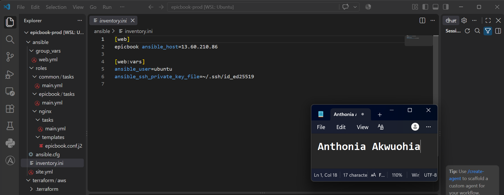

---

#### Screenshot 8 — Output of `ansible-inventory -i inventory.ini --graph`

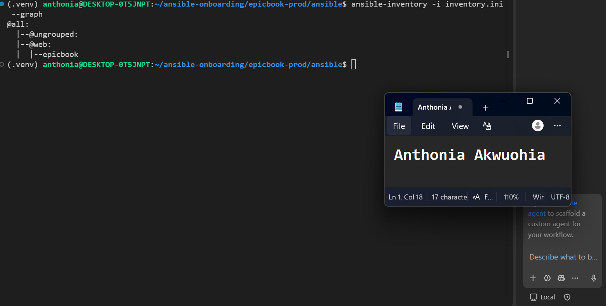

---

#### Screenshot 9 — Output of `ansible web -i inventory.ini -m ping`

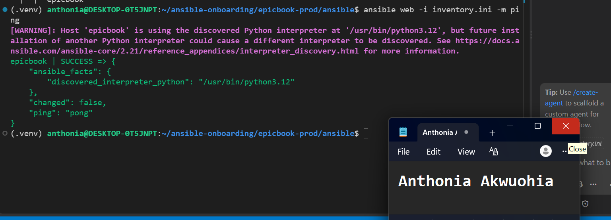

---

### Notes

Answer the following in your own words:

**1. What is the purpose of `inventory.ini`?**

The inventory.ini file tells Ansible which servers it needs to manage. It also organizes the servers into groups and can define connection details such as the SSH username and private key to use.

---

**2. What does `ansible_host` store?**

ansible_host stores the actual IP address or hostname that Ansible uses to connect to the managed server. In this lab, it contains the public IP address of the AWS EC2 instance.

---

**3. What does `ansible_ssh_private_key_file` tell Ansible?**

ansible_ssh_private_key_file tells Ansible which private SSH key to use when connecting to the managed server. In this lab, it points to the existing ~/.ssh/id_ed25519 private key.

---

**4. Why is `host_key_checking = False` used only for this temporary lab?**

It is used in this temporary lab to prevent Ansible from stopping for SSH host fingerprint confirmation when connecting to the EC2 instance for the first time. In a production environment, host key checking should normally remain enabled to help verify that Ansible is connecting to the correct server and reduce the risk of man-in-the-middle attacks.

---

# Task 5 — Create the Main Ansible Playbook

## Goal

Create the main Ansible playbook that runs the required roles in the correct order.

The `site.yml` file will call the `common`, `nginx`, and `epicbook` roles.

### Evidence

#### Screenshot 10 — `site.yml` showing the roles in the correct order

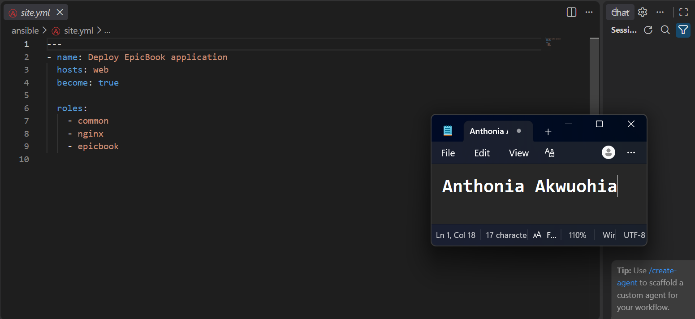

---

#### Screenshot 11 — Output of `ansible-playbook -i inventory.ini site.yml --syntax-check`

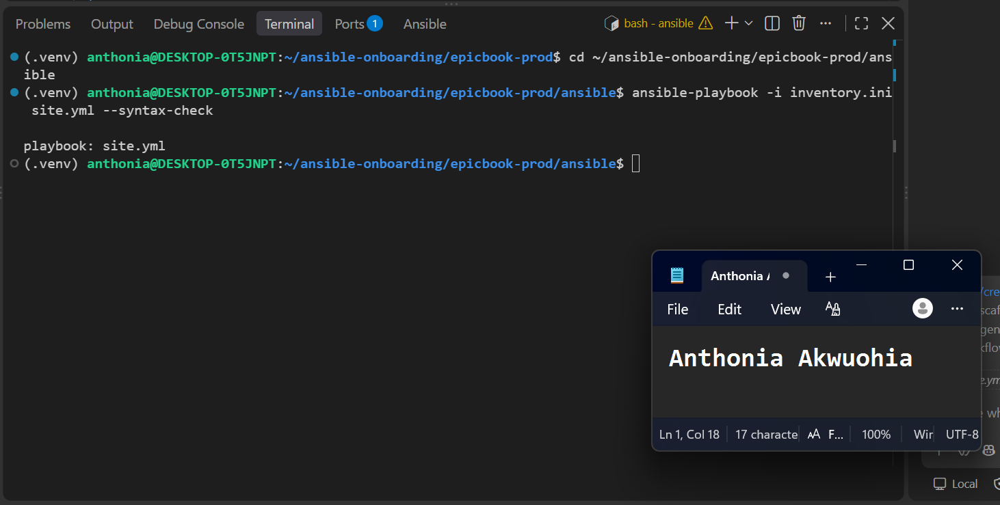

---

### Notes

Answer the following in your own words:

**1. What is the purpose of `site.yml`?**

The site.yml file is the main Ansible playbook for the project. It defines which hosts Ansible should manage and calls the required roles to deploy and configure the EpicBook application.

---

**2. Why should the roles run in the order `common`, `nginx`, and `epicbook`?**

The roles run in this order because each stage prepares the system for the next one. The common role performs the basic system setup, nginx installs and configures the web server, and epicbook deploys the application. This order helps ensure that the server is properly prepared before the application is configured.

---

**3. What does `become: true` allow Ansible to do?**

become: true allows Ansible to use elevated privileges, usually through sudo, when running tasks on the managed server. This is necessary for tasks such as installing packages, modifying system configuration files, and managing services.
---

# Task 6 — Create the `common` Role

## Goal

Create the `common` role to prepare the Ubuntu VM with the basic packages required for the EpicBook deployment.

This role handles the common server setup before Nginx and the application are configured.

### Evidence

#### Screenshot 12 — `roles/common/tasks/main.yml` showing the common setup tasks

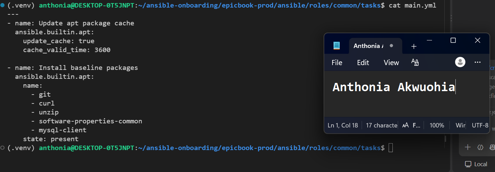

---

### Notes

Answer the following in your own words:

**1. What is the responsibility of the `common` role?**

The common role is responsible for preparing the Ubuntu server with the basic tools and packages needed for the deployment. It updates the APT package cache and installs packages such as Git, curl, unzip, software-properties-common, and mysql-client.

---

**2. Why should Nginx installation not be placed inside the `common` role?**

Nginx installation should not be placed in the common role because each Ansible role should have a specific responsibility. The common role handles general server preparation, while the nginx role is responsible for installing and configuring Nginx. Keeping them separate makes the playbook easier to maintain, troubleshoot, and reuse.

---

**3. Why is `mysql-client` useful in this deployment?**

mysql-client is useful because it provides command-line tools for connecting to and testing the MySQL database. It can be used to verify that the EpicBook server can communicate with the MySQL database and perform basic database connection tests.

---

# Task 7 — Create the `nginx` Role

## Goal

Create the `nginx` role to install Nginx and configure it as a reverse proxy for the EpicBook application.

Nginx will receive browser traffic on port `80` and forward it to the EpicBook Node.js application running on the VM.

### Evidence

#### Screenshot 13 — `roles/nginx/tasks/main.yml` showing Nginx installation and site configuration tasks

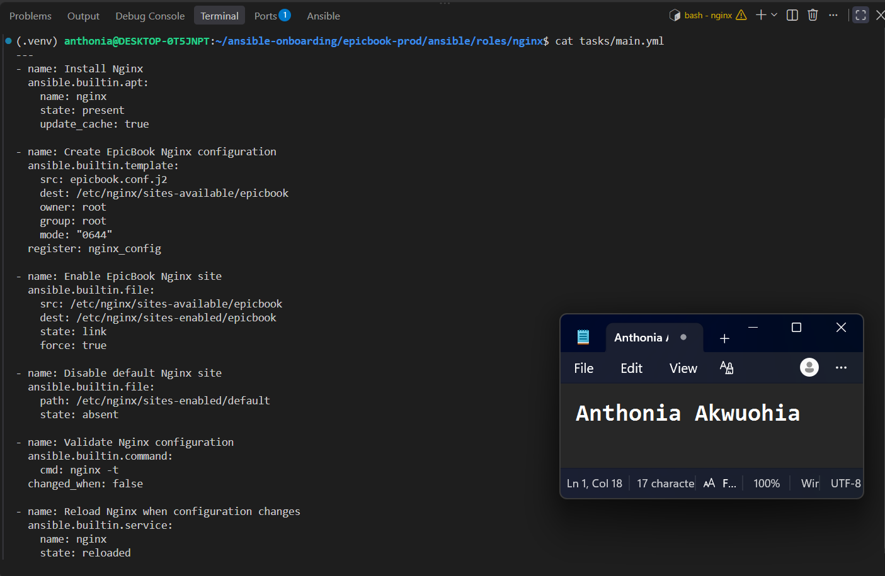

---

#### Screenshot 14 — `roles/nginx/templates/epicbook.conf.j2` showing the reverse proxy configuration

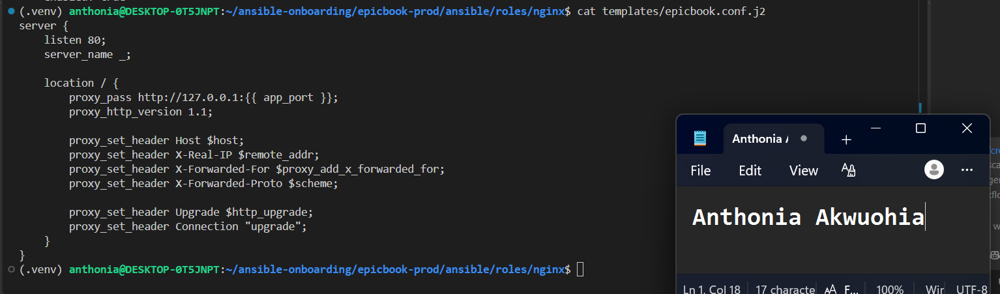

---

### Notes

Answer the following in your own words:

**1. What is the responsibility of the `nginx` role?**

The nginx role is responsible for installing and configuring Nginx on the server. It creates the EpicBook site configuration, enables the site, disables the default site, validates the Nginx configuration, and ensures the Nginx service is running and enabled.

---

**2. Why is Nginx configured as a reverse proxy in this deployment?**

Nginx is configured as a reverse proxy so it can receive HTTP requests from users on port 80 and forward those requests to the EpicBook Node.js application running on the server's internal application port. This keeps the application port separate from the public-facing web port and allows Nginx to handle incoming web traffic.
---

**3. Why should the application port come from `group_vars/web.yml` instead of being hard-coded?**

The application port should come from group_vars/web.yml because it makes the configuration easier to manage and reuse. If the application's port changes, I only need to update the variable instead of modifying the Nginx template. This also keeps environment-specific settings separate from the role's configuration logic.

---

# Task 8 — Create the `epicbook` Role

## Goal

Create the `epicbook` role to deploy the EpicBook application, connect it to the managed MySQL database, and run the application on port `8080` using PM2.

### Evidence

#### Screenshot 15 — `roles/epicbook/tasks/main.yml` showing application deployment tasks

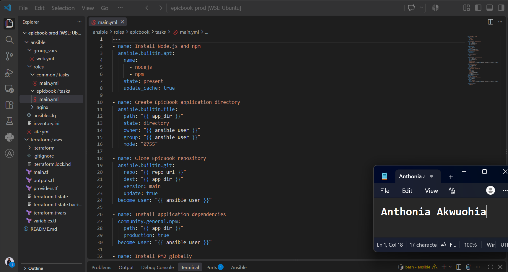

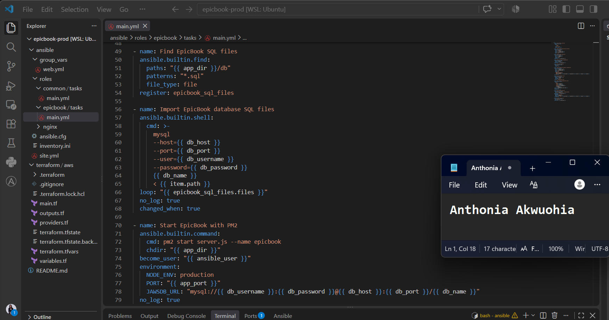

---

#### Screenshot 16 — Task or file showing how the database connection is configured, with secrets hidden

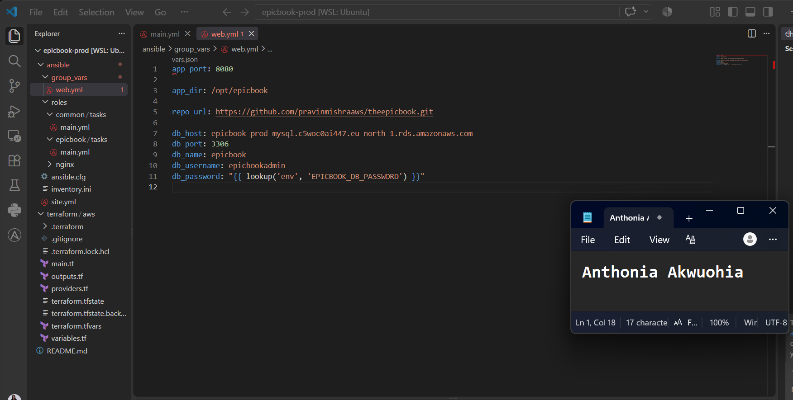

---

#### Screenshot 17 — Task or output showing the EpicBook application managed by PM2

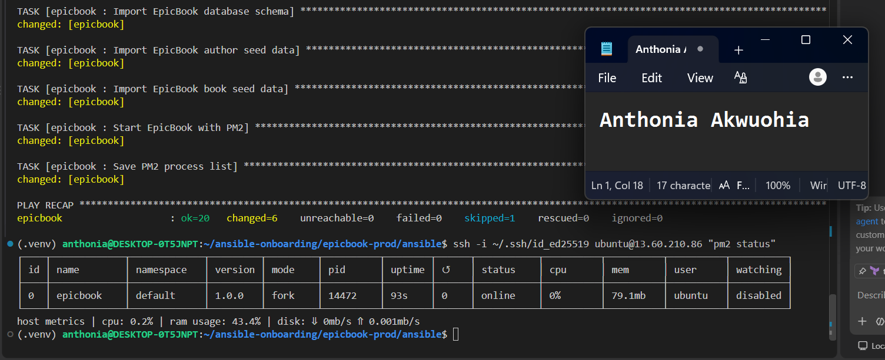

---

### Notes

Answer the following in your own words:

**1. What is the responsibility of the `epicbook` role?**

The epicbook role is responsible for deploying and managing the EpicBook application on the web server. It clones the application from GitHub, installs the required Node.js dependencies, creates the database configuration, imports the database schema and seed data, installs PM2, and starts the application. Keeping these application-specific tasks inside the role makes the Ansible playbook more organized, reusable, and easier to maintain.

---

**2. Why is PM2 used for the EpicBook Node.js application?**

PM2 is used to manage the EpicBook Node.js application as a background process. It keeps the application running after the terminal session ends and can restart the application if it crashes. It also provides useful process information such as the application status, process ID, uptime, CPU usage, and memory usage. In this deployment, PM2 manages the application using the process name epicbook.

---

**3. Why should database passwords not be hard-coded in public files?**

Database passwords should not be hard-coded in public files because anyone who can access the repository could potentially obtain the credentials and use them to connect to the database. This creates a serious security risk and could lead to unauthorized access or data loss. Instead, sensitive information should be stored securely and passed to the application through environment variables, secret managers, or other protected configuration methods. In this deployment, the database password is supplied through the EPICBOOK_DB_PASSWORD environment variable rather than being written directly into the Git repository.

---

**4. What does it mean for the application to run on port `8080` while Nginx listens on port `80`?**

It means that the EpicBook Node.js application is running internally on port 8080, while Nginx receives requests from users on the standard HTTP port 80. Nginx acts as a reverse proxy and forwards incoming requests from port 80 to the EpicBook application on port 8080. This separates the public web-facing service from the application process and allows Nginx to handle incoming HTTP requests before passing them to the Node.js application.

---

# Task 9 — Create Group Variables

## Goal

Create reusable variables for the EpicBook deployment.

The `group_vars/web.yml` file stores values that can be reused across the Ansible roles.

### Evidence

#### Screenshot 18 — `group_vars/web.yml` showing the application, PM2, and database variables, with passwords hidden or masked

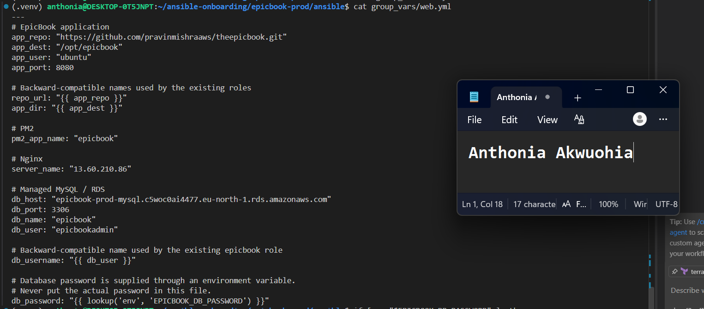

---

### Notes

Answer the following in your own words:

**1. What is the purpose of `group_vars/web.yml`?**

The purpose of group_vars/web.yml is to store reusable variables for the web servers in the Ansible inventory. It keeps configuration values separate from the role tasks, making the playbook cleaner, easier to maintain, and easier to reuse across different environments.

---

**2. Which values did you store in `group_vars/web.yml`?**

I stored the EpicBook repository URL, application destination path, application user, application port, PM2 process name, Nginx server name, and managed MySQL connection details. The database variables include the MySQL host, port, database name, username, and the method used to retrieve the database password.

---

**3. How did you handle the database password securely?**

I did not hard-code the database password in group_vars/web.yml or commit it to GitHub. Instead, I used an environment variable called EPICBOOK_DB_PASSWORD and retrieved it with Ansible's lookup('env', ...) method. This keeps the actual password outside the project files while still allowing Ansible to use it during deployment.

---

# Task 10 — Run the Ansible Playbook

## Goal

Run the Ansible playbook to configure the VM and deploy the EpicBook application.

The playbook should run the roles in this order:

1. `common`
2. `nginx`
3. `epicbook`

### Evidence

#### Screenshot 19 — Ansible playbook output showing the roles running

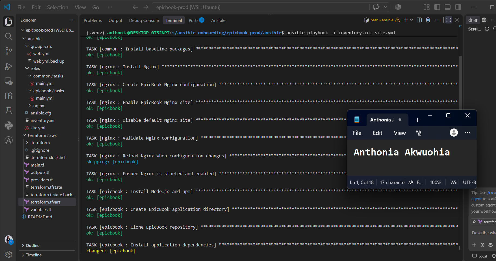

---

#### Screenshot 20 — Final Ansible recap showing `failed=0`

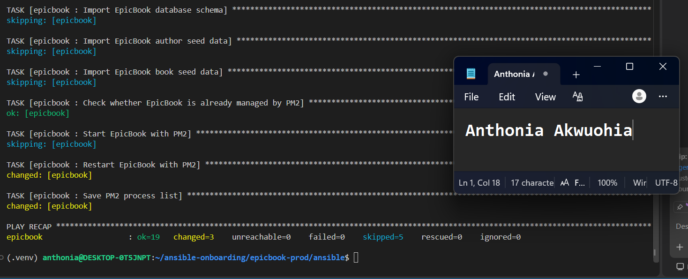

---

#### Screenshot 21 — Output of `ansible web -i inventory.ini -m command -a "systemctl is-active nginx" --become`

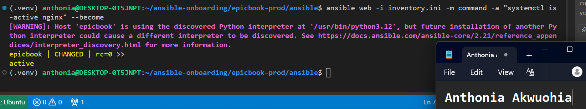

---

#### Screenshot 22 — Output of `ansible web -i inventory.ini -m command -a "pm2 status"`

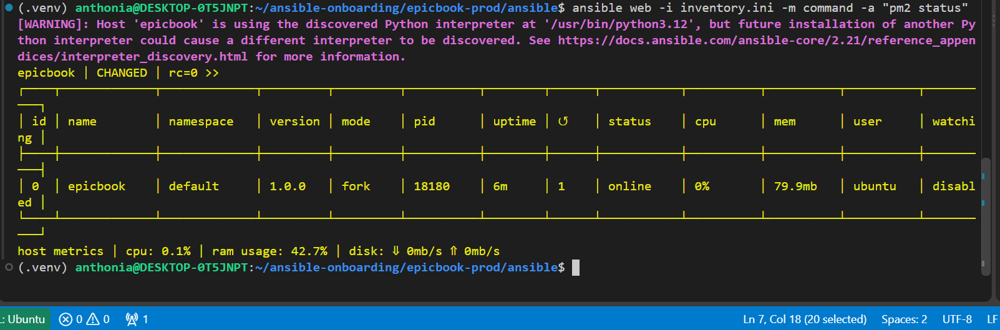

---

#### Screenshot 23 — Output of `ansible web -i inventory.ini -m command -a "curl -I http://localhost:8080"`

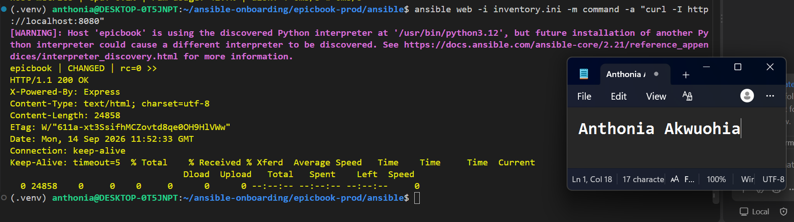

---

### Notes

Answer the following in your own words:

**1. What command did you run to execute the Ansible playbook?**

I ran the following command from the Ansible directory:

ansible-playbook -i inventory.ini site.yml

This uses the inventory file to identify the target server and runs the site.yml playbook to deploy and configure EpicBook.

---

**2. How do you know all roles completed successfully?**

I ran:

I checked the final Ansible play recap. The deployment was successful when the recap showed unreachable=0 and failed=0. The playbook also completed the common, nginx, and epicbook roles without a fatal error.

---

**3. What proves that Nginx is active?**

I ran:

ansible web -i inventory.ini -m command -a "systemctl is-active nginx" --become

The command returned active, which confirms that the Nginx service is running on the web server.

---

**4. What proves that PM2 is managing the EpicBook application?**

I ran:

ansible web -i inventory.ini -m command -a "pm2 status"

The output showed the epicbook process with a status of online. This confirms that PM2 is managing the Node.js application.

---

**5. What proves that the EpicBook application responds on port `8080`?**

I ran:

ansible web -i inventory.ini -m command -a "curl -I http://localhost:8080"

The command returned an HTTP response from the application. This confirms that EpicBook is running and responding on port 8080.

---

# Task 11 — Verify the EpicBook Deployment

## Goal

Verify that the EpicBook application is running, accessible in the browser, and connected to the managed MySQL database.

### Evidence

#### Screenshot 24 — Output of `curl -I http://<public_ip>`

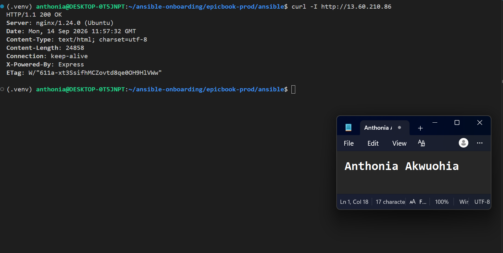

---

#### Screenshot 25 — Output of the cart API test command

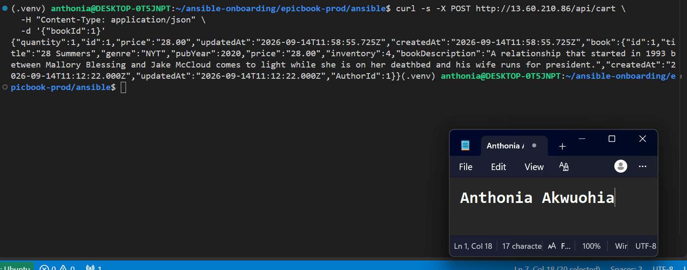

---

#### Screenshot 26 — Output of the `/cart` HTTP status check

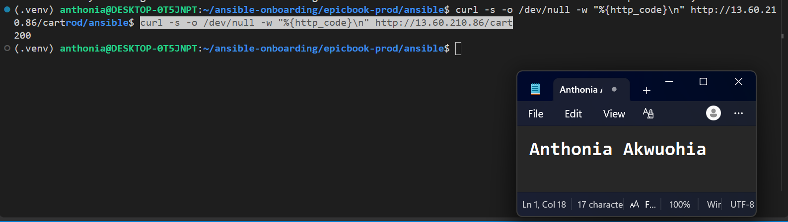

---

#### Screenshot 27 — Browser showing the EpicBook application loaded from `http://<public_ip>`

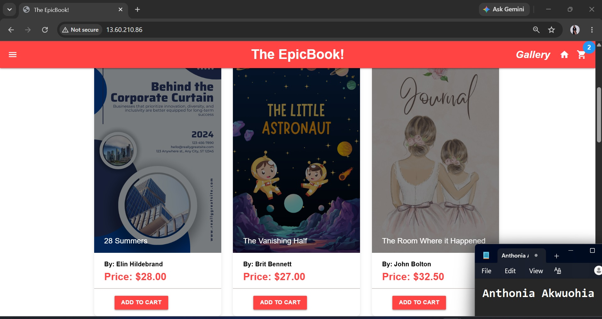

---

### Notes

Answer the following in your own words:

**1. What HTTP response did you receive from the public application URL?**

I received a successful HTTP response from the public EpicBook application URL. This confirmed that the request was reaching the EC2 instance, being handled by Nginx, and forwarded to the EpicBook Node.js application.

---

**2. What did the cart API test prove?**

The cart API test confirmed that the application could process a cart request through the API. It also helped verify that the Node.js application was communicating with the managed MySQL database, since the cart functionality depends on the application's database connection and seeded book data.

---

**3. What did the `/cart` status check return?**

The /cart status check returned HTTP status 200, confirming that the cart page was successfully available through the public application.

---

**4. What issue did you face during verification, and how did you fix it?**

During verification, the Ansible playbook initially failed when it tried to import the database schema again. The database had already been initialized during the first successful deployment, so the schema import was being repeated. I fixed this by updating the epicbook Ansible role to check whether the database was already initialized before importing the schema and seed data.

The playbook then encountered another issue because PM2 was already managing the epicbook process. I updated the role to check whether the PM2 process already existed and restart it when necessary instead of always trying to create a new process. This made the deployment more repeatable and idempotent.

---

# LinkedIn Post Required

## Evidence

#### LinkedIn Post URL

Paste your LinkedIn post URL here:

https://www.linkedin.com/posts/anthonia-akwuohia-5b00681b0_devops-aws-terraform-share-7505241018733076480-x2Wv/?utm_source=share&utm_medium=member_desktop&rcm=ACoAADEhX1QBTHiW-kQPmKjn3MVixQzj4IzJO1Q

---

#### Screenshot — Published LinkedIn post

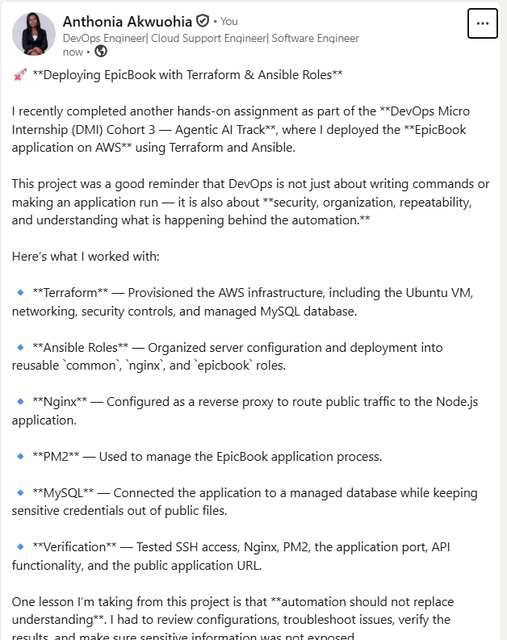

---

# Assignment Questions

Answer the following in your own words:

**1. Why is Terraform used for infrastructure provisioning?**

Terraform is used to create and manage the cloud infrastructure in a consistent and automated way. In this deployment, Terraform provisioned the AWS networking, EC2 web server, security groups, SSH key pair, and managed MySQL database. It also makes the infrastructure easier to reproduce, update, and destroy when it is no longer needed.

---

**2. Why are Ansible roles useful for production-style deployments?**

Ansible roles help organize deployment tasks into separate, reusable components. In this project, the common, nginx, and epicbook roles each have a specific responsibility. This makes the deployment easier to understand, maintain, troubleshoot, and reuse across different servers or environments.

---

**3. What is the purpose of `group_vars/web.yml`?**

The purpose of group_vars/web.yml is to store reusable configuration variables for the web server group. It contains values such as the EpicBook repository, application path, application port, PM2 process name, Nginx configuration, and managed MySQL connection details. This keeps configuration separate from the Ansible role tasks and avoids unnecessary hard-coding.

---

**4. Why should database passwords not be committed to GitHub?**

Database passwords should not be committed to GitHub because repositories can be accessed by other people or accidentally made public. Exposing a database password could allow unauthorized users to access or modify the database. I used an environment variable for the database password so that the actual secret was kept outside the project files.

---

**5. What is the purpose of Nginx in this deployment?**

Nginx acts as a reverse proxy in the deployment. It listens for HTTP requests on port 80 and forwards them to the EpicBook Node.js application running on port 8080. This allows the application to remain on its internal application port while Nginx handles incoming web traffic.

---

**6. Why should the managed MySQL database not be publicly accessible?**

The managed MySQL database should not be publicly accessible because exposing the database directly to the internet increases the risk of unauthorized access and attacks. In this deployment, the database is placed in private subnets and its security group only allows MySQL traffic from the web server security group. This limits database access to the application infrastructure that needs it.

---

**7. Why is PM2 used for the EpicBook Node.js application?**

PM2 is used to manage the EpicBook Node.js application as a background process. It keeps the application running, provides process monitoring, and can restart the application if it stops unexpectedly. In this deployment, PM2 manages the application using the process name epicbook.

---

**8. What does idempotency mean in Ansible?**

Idempotency means that an Ansible playbook can be run multiple times and still produce the desired final state without unnecessarily recreating or breaking resources. During this deployment, I applied this concept to the database imports and PM2 process. The playbook checks whether the database is already initialized and whether the EpicBook PM2 process already exists before deciding what action to take.

---

**9. What issue did you face during the deployment, and how did you fix it?**

I encountered two main issues during the deployment. First, the database SQL files used the database name bookstore, while the managed MySQL database created by Terraform was named epicbook. I fixed this by transforming the database name during the SQL import without modifying the original repository files.

The second issue occurred when I ran the Ansible playbook again and PM2 tried to start an epicbook process that was already running. I fixed this by updating the Ansible role to check whether the PM2 process already existed and restart it when necessary. This made the deployment more repeatable.

---

**10. What security improvement would you make before using this setup in production?**

Before using this setup in production, I would improve secret management by using a dedicated secrets manager such as AWS Secrets Manager or Ansible Vault instead of relying only on an environment variable. I would also restrict SSH access further, keep host key checking enabled, use HTTPS with TLS certificates, apply least-privilege IAM permissions, and strengthen monitoring, logging, backups, and security-group rules.

---

# Required Files

Confirm that the following files are included in your GitHub repository or assignment folder:

- [ ] `README.md`
- [ ] Terraform files under either `terraform/azure/` or `terraform/aws/`
- [ ] `ansible/ansible.cfg`
- [ ] `ansible/inventory.ini`
- [ ] `ansible/site.yml`
- [ ] `ansible/group_vars/web.yml`
- [ ] `ansible/roles/common/tasks/main.yml`
- [ ] `ansible/roles/nginx/tasks/main.yml`
- [ ] `ansible/roles/nginx/templates/epicbook.conf.j2`
- [ ] `ansible/roles/epicbook/tasks/main.yml`

---

# Submission Instructions

- Add all required screenshots in your submission.
- Full Name must be visible in required screenshots.
- Mention the cloud provider used: Azure or AWS.
- Add the VM public IP address.
- Add the final application URL.
- Add Terraform output proof.
- Add Ansible role tree proof.
- Add all required notes and assignment question answers.
- Add your LinkedIn post URL.
- Do not expose SSH private keys, passwords, cloud credentials, database credentials, Terraform state files, subscription IDs, or account IDs.

---

# Completion Checklist

- [ ] Task 1: Project folder layout created
- [ ] Task 2: Terraform infrastructure provisioned
- [ ] Task 3: SSH key-based access verified
- [ ] Task 4: Ansible inventory and configuration created
- [ ] Task 5: Main Ansible playbook created
- [ ] Task 6: `common` role created
- [ ] Task 7: `nginx` role created
- [ ] Task 8: `epicbook` role created
- [ ] Task 9: Group variables created
- [ ] Task 10: Ansible playbook run completed
- [ ] Task 11: EpicBook deployment verified
- [ ] Terraform files created under only one cloud provider folder
- [ ] One Ubuntu VM was created
- [ ] One managed MySQL database was created
- [ ] SSH port `22` is restricted to the controller public IP
- [ ] HTTP port `80` is accessible
- [ ] MySQL port `3306` is not publicly open
- [ ] `ansible web -i inventory.ini -m ping` returns `SUCCESS`
- [ ] `site.yml` calls the roles in the correct order
- [ ] Database secrets are hidden or handled securely
- [ ] Nginx is active
- [ ] PM2 shows the EpicBook application running
- [ ] EpicBook responds on port `8080`
- [ ] Public URL loads in the browser
- [ ] Cart API verification works
- [ ] Playbook completes with `failed=0`
- [ ] Screenshots 1–27 are included
- [ ] Assignment questions are answered
- [ ] LinkedIn post published
- [ ] LinkedIn post URL added
- [ ] No sensitive information is exposed

---

## About DMI & CloudAdvisory

DevOps Micro Internship (DMI) is a project-based DevOps program run by Pravin Mishra and The CloudAdvisory, focused on real-world execution, systems thinking, and career readiness.

It helps learners build strong DevOps foundations with hands-on experience.

---

## Resources

- DMI Official Website: [https://dmi.pravinmishra.com?utm_source=github&utm_medium=readme](https://dmi.pravinmishra.com?utm_source=github&utm_medium=readme)
- University: [https://university.pravinmishra.com?utm_source=github&utm_medium=readme](https://university.pravinmishra.com?utm_source=github&utm_medium=readme)
- Discord Community: [https://discord.pravinmishra.com?utm_source=github&utm_medium=readme](https://discord.pravinmishra.com?utm_source=github&utm_medium=readme)
- Blog: [https://dmi.pravinmishra.com/blog?utm_source=github&utm_medium=readme](https://dmi.pravinmishra.com/blog?utm_source=github&utm_medium=readme)
- YouTube Playlist: [https://www.youtube.com/playlist?list=PLFeSNDtI4Cho](https://www.youtube.com/playlist?list=PLFeSNDtI4Cho)
- Pravin Mishra LinkedIn: [https://www.linkedin.com/in/pravin-mishra-aws-trainer/](https://www.linkedin.com/in/pravin-mishra-aws-trainer/)
- CloudAdvisory LinkedIn: [https://www.linkedin.com/company/thecloudadvisory/](https://www.linkedin.com/company/thecloudadvisory/)

---

*This submission is part of DevOps Micro Internship (DMI) — Agentic AI Track.*