# Assignment 6 — AI-Assisted Ansible Change Risk Review

Part of the DevOps Micro Internship (DMI) with Agentic AI

---

## Purpose

In this assignment, you will build an AI-assisted Ansible risk-review workflow using `ansible-playbook --check --diff`, Bash scripting, and Claude Code.

You will review possible server changes before applying them, classify risky tasks, and keep the final apply decision under human control.

---

# Task 1 — Confirm EpicBook Connectivity and Create the Workspace

## Goal

Confirm that your previous EpicBook Ansible project is working before creating the risk-review automation.

### Evidence

#### Screenshot 1 — Output of `ansible web -i inventory.ini -m ping`

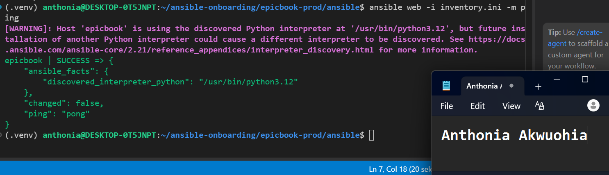

---

#### Screenshot 2 — Output of `ansible-playbook -i inventory.ini site.yml --syntax-check`

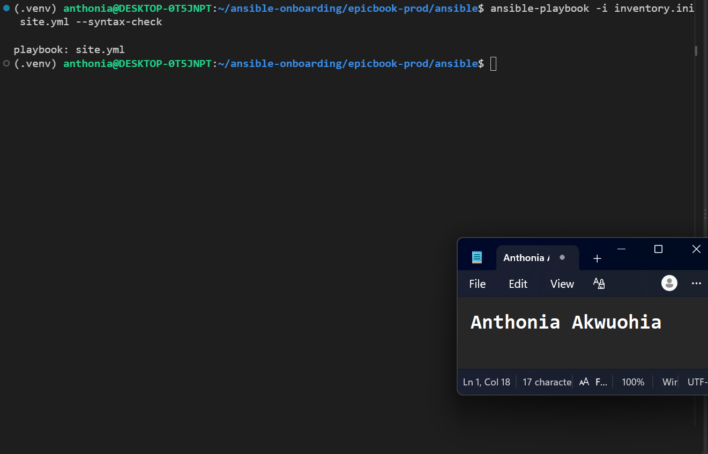

---

#### Screenshot 3 — Output of `pwd` and `find . -maxdepth 4 -type d | sort`

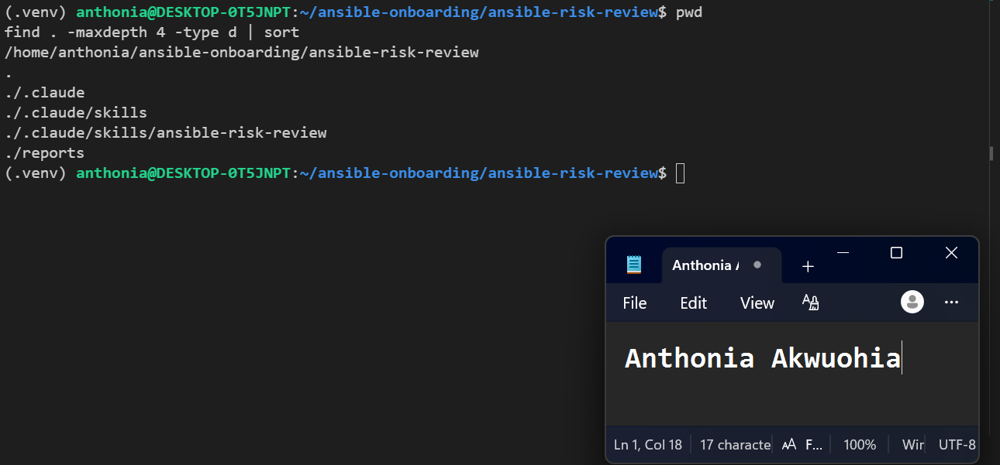

---

### Notes

Answer the following in your own words:

**1. What proves that Ansible can reach your EpicBook VM?**

The successful Ansible ping test proves that Ansible can reach the EpicBook VM. When the command returns SUCCESS with "ping": "pong", it confirms that Ansible can connect to the server through SSH and communicate with the managed host.

---

**2. Why should you confirm playbook syntax before building a risk-review script?**

Confirming the playbook syntax first helps ensure that the existing Ansible project is valid and working before starting the new automation. It prevents us from building the risk-review script on top of an existing configuration problem and makes troubleshooting easier if something goes wrong later.

---

# Task 2 — Create Project Context and Safety Rules in CLAUDE.md

## Goal

Create a `CLAUDE.md` file that tells Claude Code how this project must behave.

### Evidence

#### Screenshot 4 — `CLAUDE.md` open in VS Code or terminal showing the safety rules

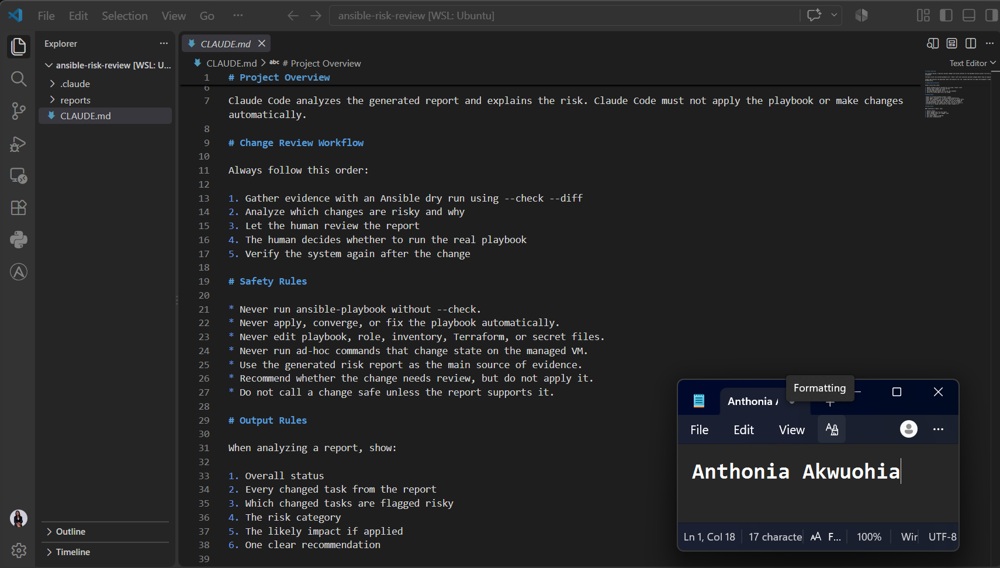

---

### Notes

Answer the following in your own words:

**1. Why should Claude Code have project-specific safety rules?**

Claude Code should have project-specific safety rules because they define what it is allowed and not allowed to do within the project. In this risk-review workflow, the goal is to inspect and analyze possible Ansible changes without accidentally applying them. Clear rules help keep the automation controlled and reduce the risk of unintended infrastructure changes.

---

**2. Why should the human run the real Ansible playbook manually?**

The human should run the real Ansible playbook manually because the risk review is intended to support a human decision, not replace it. The human can review the proposed changes, consider their impact, and decide whether it is appropriate to apply them.

---

**3. Which rule prevents Claude Code from applying changes automatically?**

The rule that prevents Claude Code from applying changes automatically is:

"Never apply, converge, or fix the playbook automatically."

This explicitly requires Claude Code to remain in a read-only review role and leaves the decision to apply changes with the human.

---

# Task 3 — Ask Claude Code to Plan the Risk Review

## Goal

Use Claude Code to produce a read-only plan before writing the Bash script.

### Evidence

#### Screenshot 5 — Claude Code showing the four-category risk-classification plan

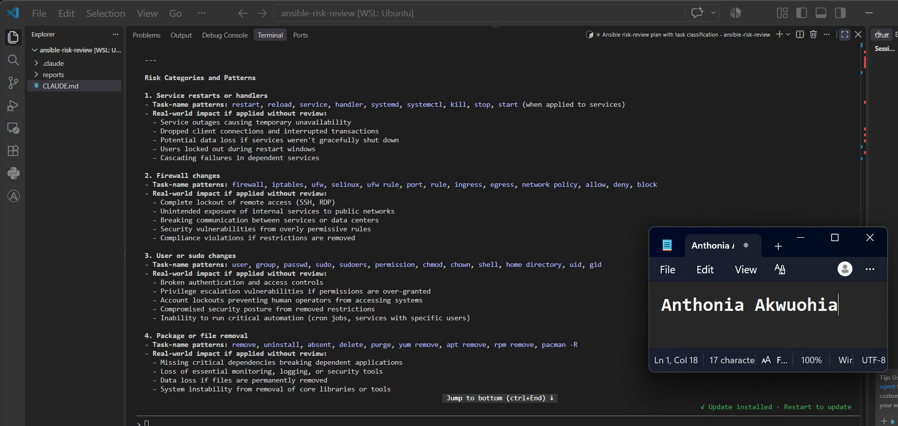

---

### Notes

Answer the following in your own words:

**1. Which part of this task represents the Gather phase?**

The Gather phase is running the Ansible playbook with --check --diff. This performs a dry run and collects information about the tasks that would change without actually applying those changes.

---

**2. Which part represents the Analyze phase?**

The Analyze phase is reviewing the dry-run results and classifying the potential changes into the four risk categories: service restarts or handlers, firewall changes, user or sudo changes, and package or file removal. It also involves explaining the possible impact of each risk.

---

**3. How did you verify Claude Code did not create or edit files?**

I gave Claude Code an explicit instruction not to create or edit any files. After it completed the analysis, I checked the project workspace and confirmed that no new files were created and no existing project files were modified.

---

# Task 4 — Build the Ansible Risk Review Script

## Goal

Create a Bash script that runs an Ansible dry run and classifies risky changes.

### Evidence

#### Screenshot 6 — Top section of `ansible-check-review.sh` showing `full_name`, `playbook_path`, `inventory_path`, and the `checks` array

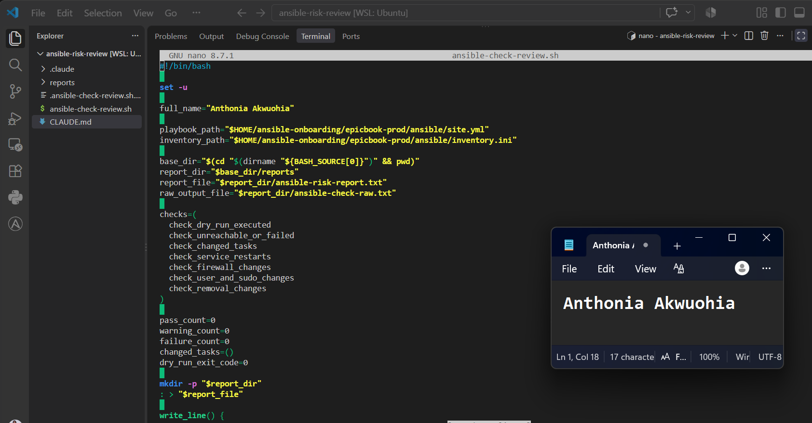

---

#### Screenshot 7 — Middle section showing `extract_changed_tasks` and `check_tasks_matching_pattern`

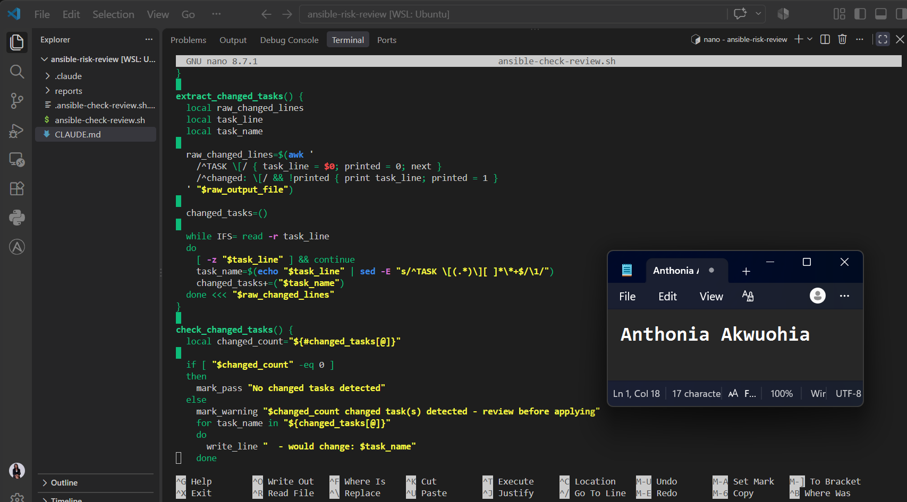

---

#### Screenshot 8 — Bottom section showing the loop, summary, and exit behavior

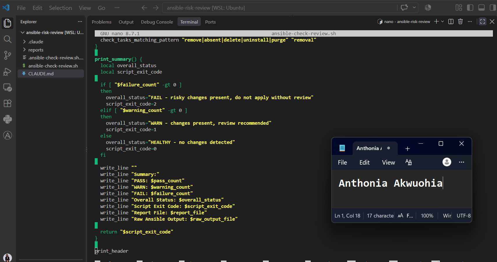

---

#### Screenshot 9 — Output of `bash -n ansible-check-review.sh` and `ls -l ansible-check-review.sh`

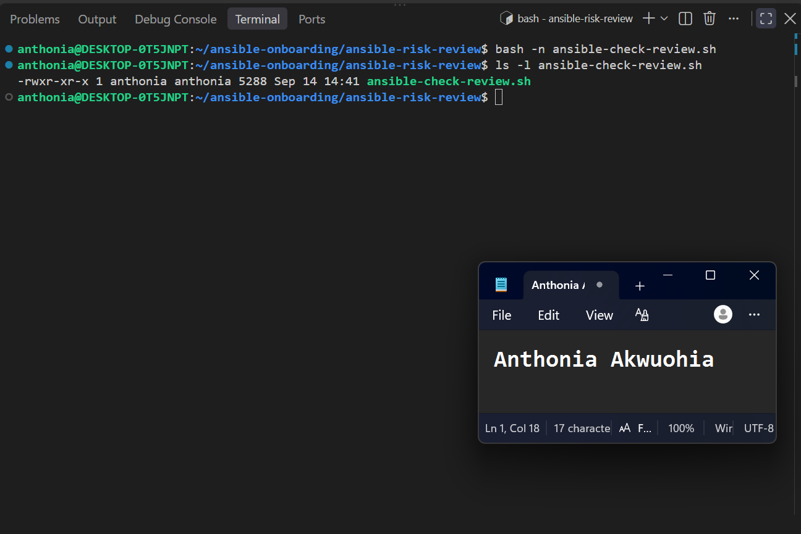

---

### Notes

Answer the following in your own words:

**1. What is stored in the `changed_tasks` array?**

The changed_tasks array stores the names of Ansible tasks that the dry run identifies as tasks that would make changes if the playbook were applied.
---

**2. Which function finds changed tasks from the Ansible output?**

The extract_changed_tasks function finds the changed tasks. It uses awk to identify task lines associated with Ansible changed results and then uses sed to extract the task names.

---

**3. Why does the script use `--check --diff`?**

The script uses --check --diff to perform a dry run before making any changes. --check shows what Ansible would change without applying the changes, while --diff provides additional details about file or configuration differences. This allows the changes to be reviewed safely before the real playbook is executed.

---

**4. Why does the script use different exit codes for healthy, warning, and failed results?**

Different exit codes allow the result to be understood by both humans and automation. Exit code 0 represents a healthy review with no detected changes, 1 indicates that changes were detected and should be reviewed, and 2 indicates that risky changes were found and should not be applied without further review.

---

# Task 5 — Run the Baseline Dry-Run Review

## Goal

Run the script against your current EpicBook playbook and confirm the baseline risk status.

### Evidence

#### Screenshot 10 — Output of `./ansible-check-review.sh`

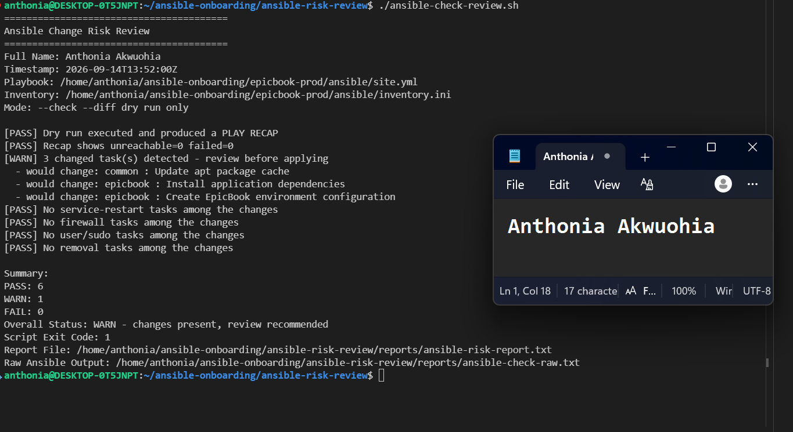

---

#### Screenshot 11 — Output of `echo "Captured Exit Code: $script_exit_code"` and `cat reports/ansible-risk-report.txt`

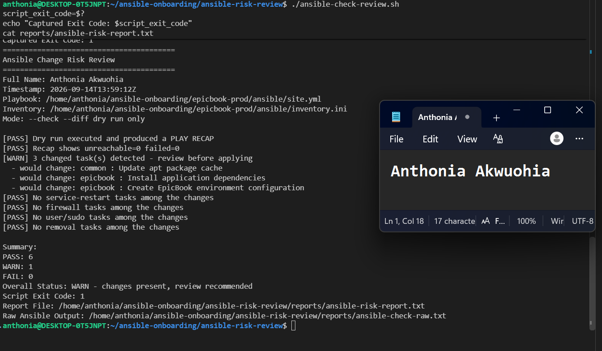

---

### Notes

Answer the following in your own words:

**1. What was the overall status of your baseline run?**

The overall status of my baseline run was WARN - changes present, review recommended. The Ansible dry run completed successfully, with zero unreachable hosts and zero failed tasks. However, three tasks were identified as changes that would occur if the playbook were applied.

---

**2. Did any tasks report `changed`?**

Yes. Three tasks were identified as changed:

common : Update apt package cache
epicbook : Install application dependencies
epicbook : Create EpicBook environment configuration

These changes were detected during the dry run and were not applied to the server.

---

**3. Were any changed tasks flagged as risky?**

No. None of the three changed tasks matched the defined risky categories for service restarts or handlers, firewall changes, user or sudo changes, or package or file removal. The report therefore recorded 0 risky tasks.

---

**4. What does the script exit code mean?**

The script returned exit code 1, which means changes were detected and a review is recommended before applying the playbook. It does not indicate that the playbook failed; the report confirmed unreachable=0 and failed=0.

---

# Task 6 — Create and Run the Claude Code Skill

## Goal

Turn the Bash script into a reusable Claude Code skill called `/ansible-risk-review`.

### Evidence

#### Screenshot 12 — `SKILL.md` showing the frontmatter, allowed tools, and safety rules

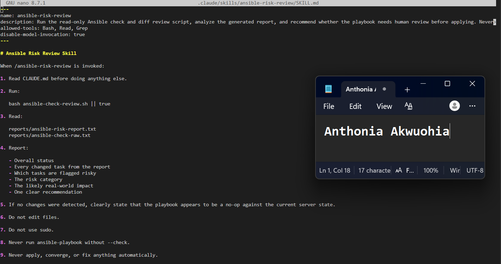

---

#### Screenshot 13 — Claude Code output after running `/ansible-risk-review`

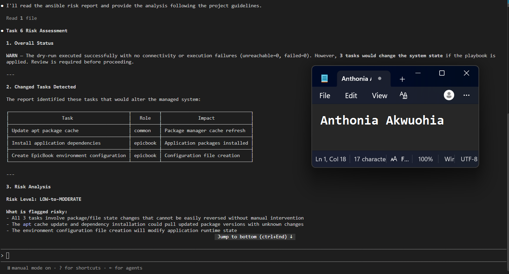

---

### Notes

Answer the following in your own words:

**1. Why does this skill allow `Bash`, `Read`, and `Grep`?**

The skill allows Bash so it can run the read-only risk-review script. Read allows Claude Code to inspect the generated reports and project instructions, while Grep allows it to search the report for relevant information. Together, these tools provide the evidence needed for the risk analysis without requiring permission to modify files.

---

**2. Why does this skill not allow file editing?**

The skill is designed as a read-only safety review. Preventing file editing reduces the risk of Claude Code accidentally changing the playbook, inventory, roles, configuration, or other project files while performing the review.

---

**3. What part is handled by Bash?**

Bash handles the execution of the Ansible dry run through the risk-review script. It runs ansible-playbook --check --diff, captures the output, identifies changed tasks, checks for risky task patterns, and produces the structured risk report.

---

**4. What part is handled by Claude Code?**

Claude Code handles the analysis and explanation of the evidence produced by the Bash script. It reads the report, identifies the overall status and risky changes, explains their possible impact, and provides a recommendation for human review.

---

**5. Why is this better than asking Claude Code if the playbook is safe without giving it evidence?**

This approach is more reliable because Claude Code bases its assessment on an actual Ansible dry-run and the generated evidence. Instead of making a general assumption about whether the playbook is safe, it can analyze the specific changes that Ansible reports would occur on the current server. This creates a clearer separation between evidence gathering, risk analysis, and the final human decision to apply changes.

---

# Task 7 — Introduce a Controlled Risky Change and Let the Skill Catch It

## Goal

Add a small controlled risky change in your lab playbook and confirm the script and Claude Code catch it before applying.

### Evidence

#### Screenshot 14 — The added risky task inside the role file

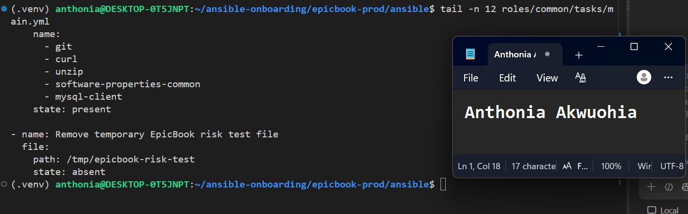

---

#### Screenshot 15 — Output of `./ansible-check-review.sh`

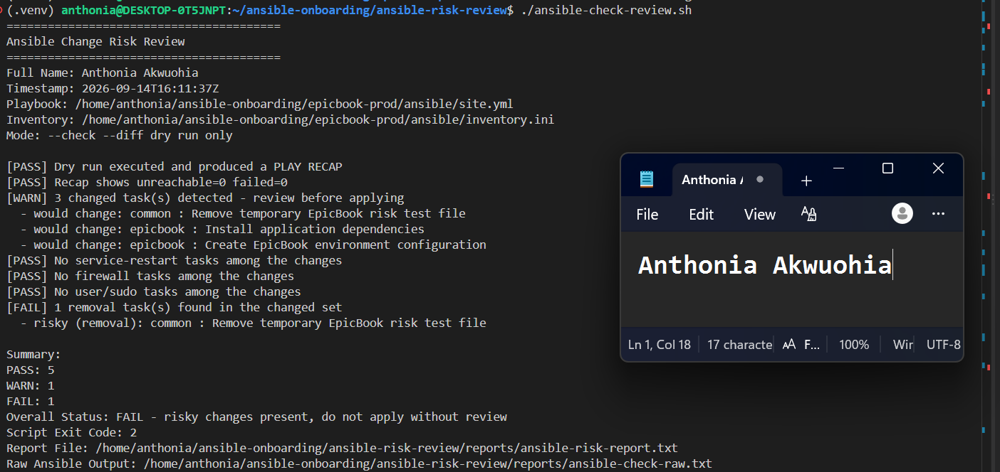

---

#### Screenshot 16 — Claude Code `/ansible-risk-review` output showing the risky finding

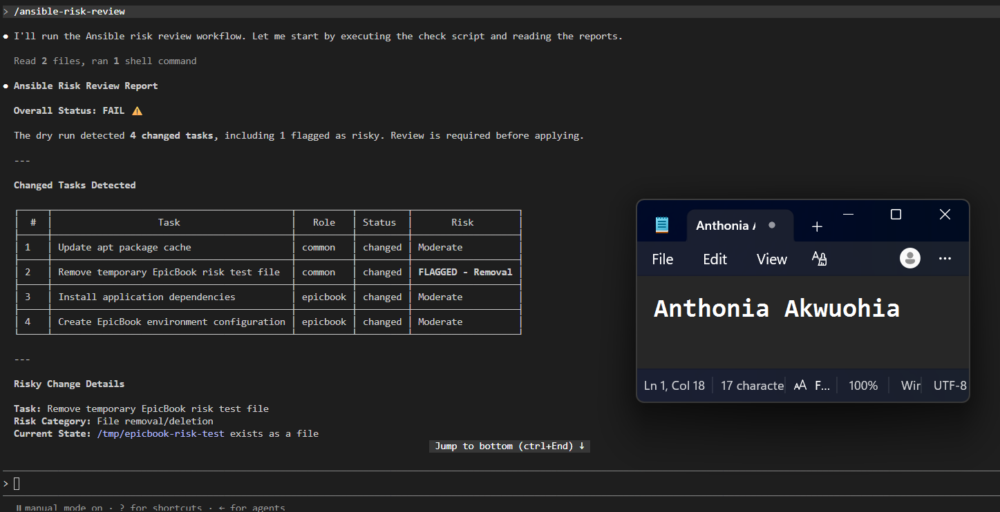

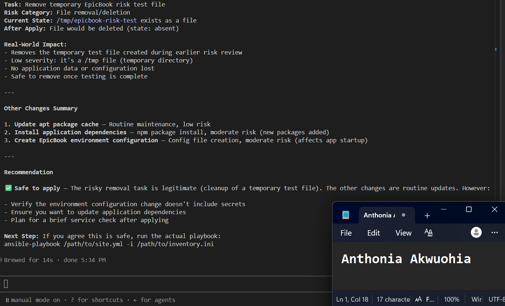

---

#### Screenshot 17 — Output of `cat reports/risky-change-report.txt`

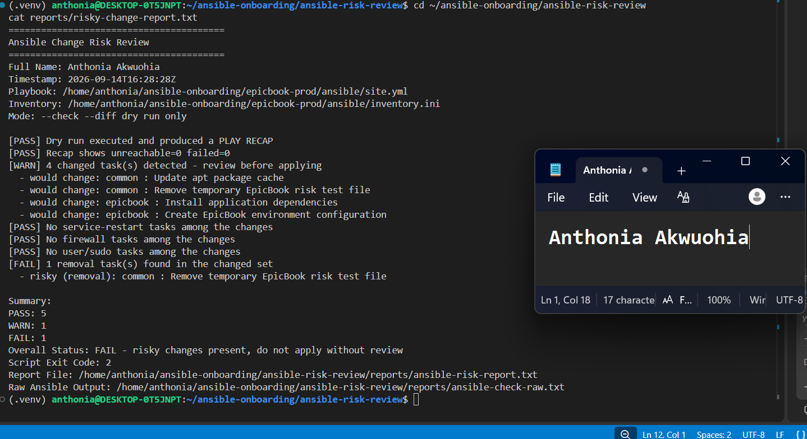

---

### Notes

Answer the following in your own words:

**1. Which risk category did the added task fall into?**

The added task fell into the removal risk category because it uses Ansible to remove a file from the managed VM by setting its state to absent.

---

**2. What evidence proves the task would change something?**

The dry-run output showed that the task would change the managed VM. The temporary file existed before the review, and Ansible identified the state: absent task as a change that would remove the file.

---

**3. Did Claude Code apply the playbook?**

No. Claude Code only analyzed the playbook and identified the risky removal task. The playbook was not applied.

---

**4. Why is it important that Claude Code only analyzed the risk?**

It is important because the purpose of the exercise is to use Agentic AI as a safety and review mechanism rather than allowing it to automatically make potentially destructive changes. A human should review and approve a risky change before it is applied.

---

**5. Which phase of the Agentic Loop is represented by the Bash report?**

The Bash report represents the Observe/Analyze and Validate phase of the Agentic Loop. It collects evidence from the playbook dry run, identifies potential risks, and provides information for human review before any change is applied.
---

# Task 8 — Apply as the Human, Verify, and Write the Change Summary

## Goal

Review the risky-change report, apply the playbook manually as the human operator, and verify the result.

### Evidence

#### Screenshot 18 — Output of the real playbook run showing the final recap with `failed=0`

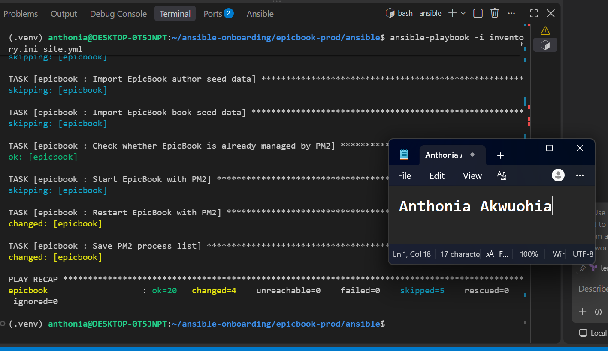

---

#### Screenshot 19 — Output of `ansible web -i inventory.ini -m ping`

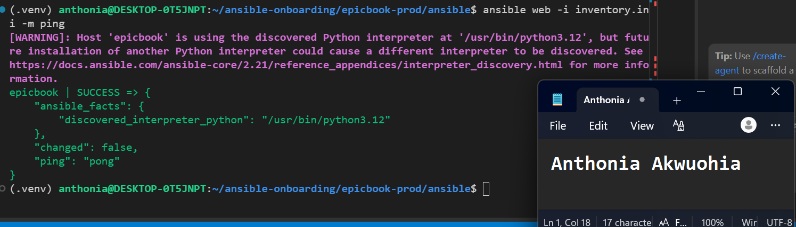

---

#### Screenshot 20 — Second `/ansible-risk-review` output after applying the change

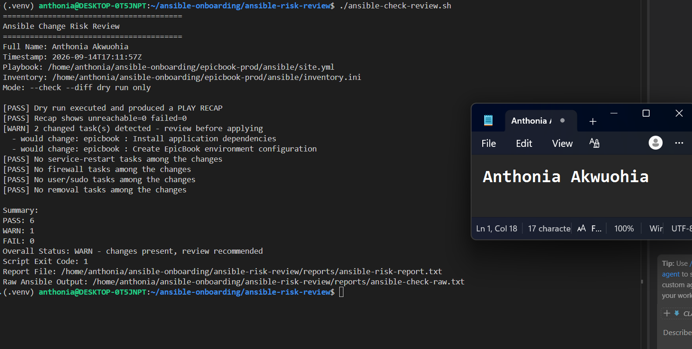

---

#### Screenshot 21 — Output of `ls -lah reports`

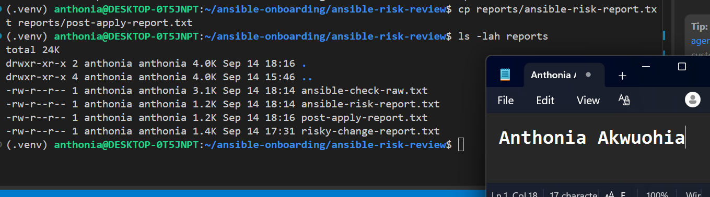

---

#### Screenshot 22 — `change-summary.md` showing all required sections and your Full Name

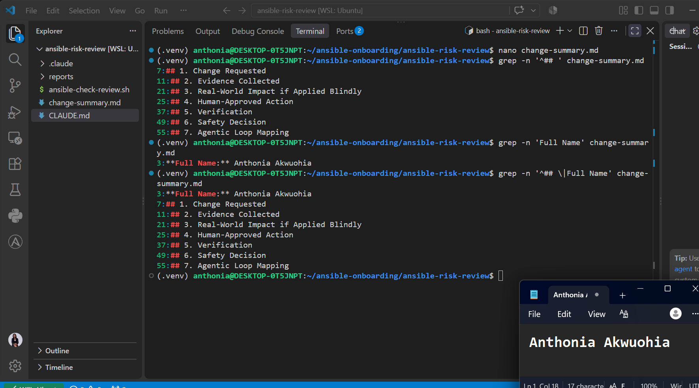

---

### Notes

Answer the following in your own words:

**1. What command did you run to apply the change for real?**

I ran ansible-playbook -i inventory.ini site.yml to apply the reviewed change to the managed VM.

---

**2. Who made the final decision to apply the playbook?**

I made the final decision as the human operator after reviewing the risky-change report and confirming that the change was intentional and safe for the lab environment.

---

**3. What evidence proves the VM is still reachable?**

The successful output from ansible web -i inventory.ini -m ping, showing SUCCESS and pong, proves that the VM remained reachable after the change.

---

**4. Why should the risk review be run again after applying?**

The risk review should be run again to confirm the actual state after the change and ensure there are no remaining unexpected or newly introduced risks.

---

**5. What could go wrong if an AI agent applied Ansible changes automatically?**

An AI agent could misunderstand the intended change and apply a destructive or incorrect configuration. This could cause service outages, data loss, security problems, or unexpected infrastructure changes. Human review provides an important safety checkpoint before applying changes.

---

# LinkedIn Post Required

## Evidence

#### LinkedIn Post URL

Paste your LinkedIn post URL here:

https://www.linkedin.com/posts/anthonia-akwuohia-5b00681b0_devops-ansible-agenticai-share-7505287123671998464-NI9x/?utm_source=share&utm_medium=member_desktop&rcm=ACoAADEhX1QBTHiW-kQPmKjn3MVixQzj4IzJO1Q

---

#### Screenshot — Published LinkedIn post

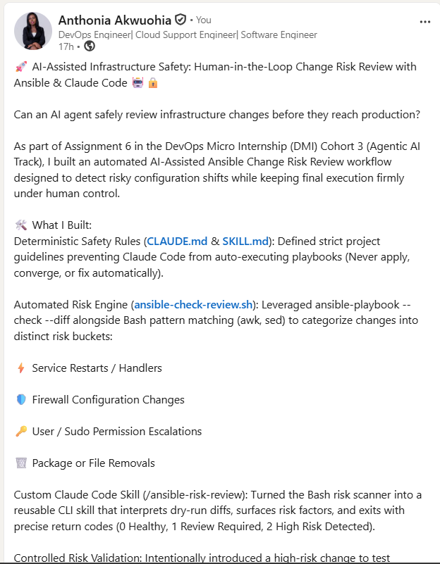

---

# Required Files

Confirm that the following files are included in your GitHub repository or assignment folder:

- [ ] `CLAUDE.md`
- [ ] `ansible-check-review.sh`
- [ ] `.claude/skills/ansible-risk-review/SKILL.md`
- [ ] `reports/risky-change-report.txt`
- [ ] `reports/post-apply-report.txt`
- [ ] `change-summary.md`

---

# Submission Instructions

- Add all required screenshots in your submission.
- Full Name must be visible in required screenshots and reports.
- All required notes must be answered clearly.
- Do not expose SSH private keys, passwords, cloud credentials, database credentials, or secret environment variables.
- Add your GitHub repository or folder URL inside this document.

---

# Completion Checklist

- [ ] Task 1: EpicBook connectivity confirmed and workspace created
- [ ] Task 2: `CLAUDE.md` created with safety rules
- [ ] Task 3: Claude Code produced a read-only risk-review plan
- [ ] Task 4: `ansible-check-review.sh` created and syntax checked
- [ ] Task 5: Baseline dry-run review completed
- [ ] Task 6: Claude Code `/ansible-risk-review` skill created and tested
- [ ] Task 7: Controlled risky change introduced and detected
- [ ] Task 8: Human applied the change and verified the result
- [ ] Risky-change report saved
- [ ] Post-apply report saved
- [ ] Change summary completed
- [ ] All screenshots added
- [ ] All notes answered
- [ ] LinkedIn post published
- [ ] LinkedIn post URL added
- [ ] No sensitive information exposed

---

## About DMI & CloudAdvisory

DevOps Micro Internship (DMI) is a project-based DevOps program run by Pravin Mishra and The CloudAdvisory, focused on real-world execution, systems thinking, and career readiness.

It helps learners build strong DevOps foundations with hands-on experience.

---

## Resources

- DMI Official Website: [https://dmi.pravinmishra.com?utm_source=github&utm_medium=readme](https://dmi.pravinmishra.com?utm_source=github&utm_medium=readme)
- University: [https://university.pravinmishra.com?utm_source=github&utm_medium=readme](https://university.pravinmishra.com?utm_source=github&utm_medium=readme)
- Discord Community: [https://discord.pravinmishra.com?utm_source=github&utm_medium=readme](https://discord.pravinmishra.com?utm_source=github&utm_medium=readme)
- Blog: [https://dmi.pravinmishra.com/blog?utm_source=github&utm_medium=readme](https://dmi.pravinmishra.com/blog?utm_source=github&utm_medium=readme)
- YouTube Playlist: [https://www.youtube.com/playlist?list=PLFeSNDtI4Cho](https://www.youtube.com/playlist?list=PLFeSNDtI4Cho)
- Pravin Mishra LinkedIn: [https://www.linkedin.com/in/pravin-mishra-aws-trainer/](https://www.linkedin.com/in/pravin-mishra-aws-trainer/)
- CloudAdvisory LinkedIn: [https://www.linkedin.com/company/thecloudadvisory/](https://www.linkedin.com/company/thecloudadvisory/)

---

*This submission is part of DevOps Micro Internship (DMI) — Agentic AI Track.*