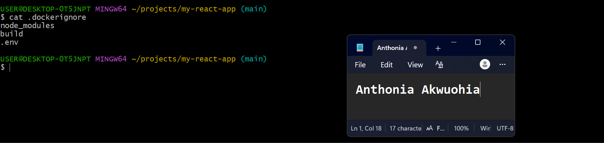
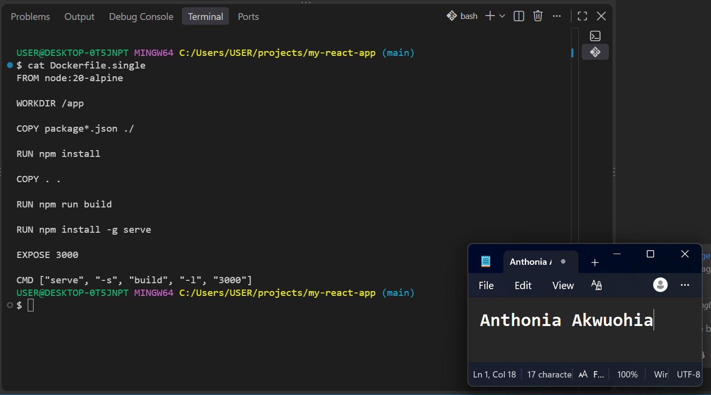
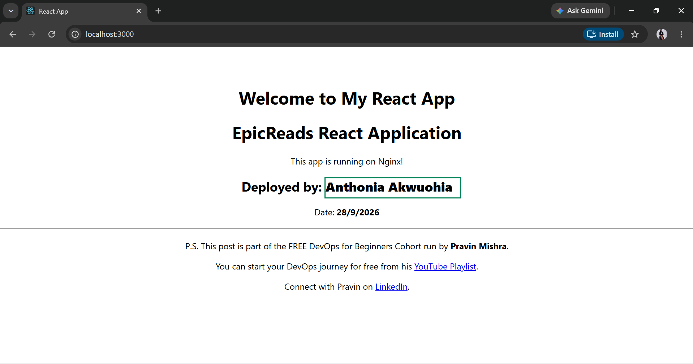
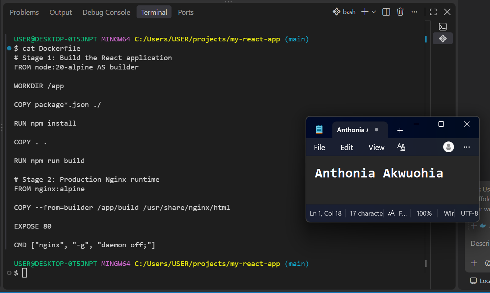
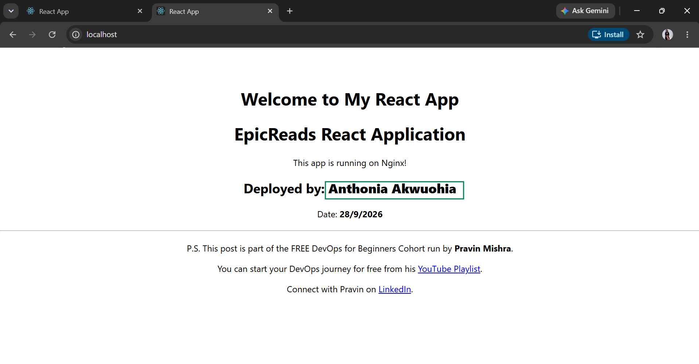
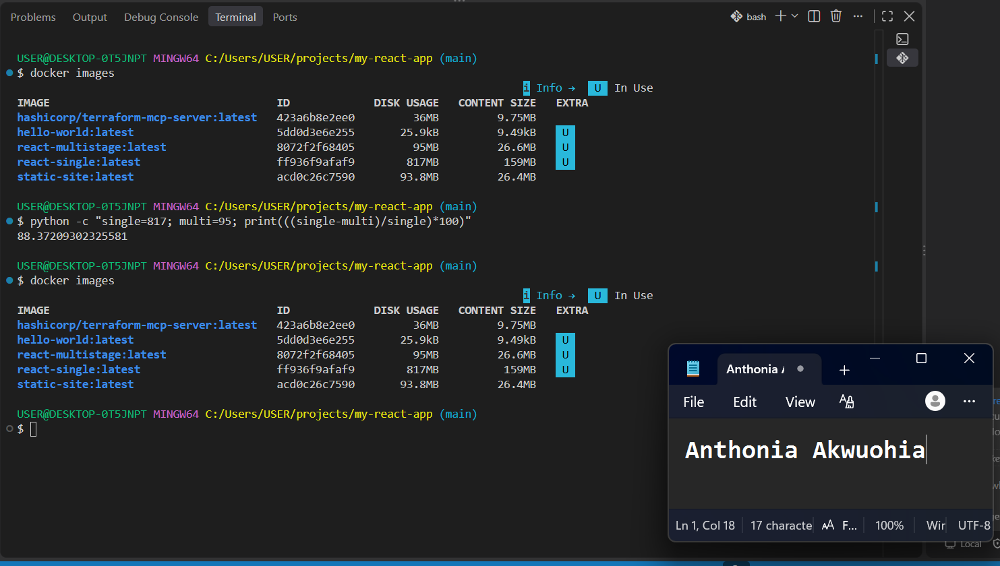
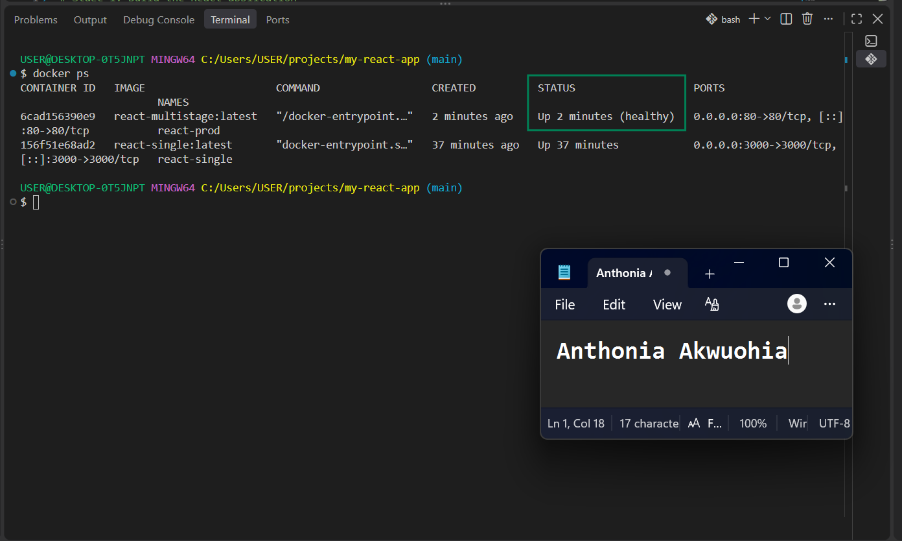
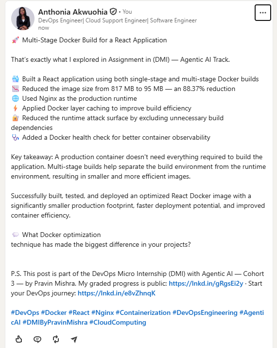

# Assignment 2 — Multi-Stage Docker Build for a React Application

Part of the DevOps Micro Internship (DMI) with Agentic AI

---

## Purpose

In this assignment, you will build both a single-stage and an optimized multi-stage Docker image for a React application, compare the resulting image sizes, and deploy the optimized version using a production-ready Nginx runtime container.

Complete this assignment locally on your own computer where Docker is installed and running.

---

# Task 1 — Prepare the Project

## Goal

Prepare the React application for Docker image creation.

### Evidence

#### Screenshot 1 — Contents of the `.dockerignore` File

Add a screenshot of the terminal showing:

```bash
cat .dockerignore
```

The file must exclude `node_modules`, `build`, and `.env`.



---

# Task 2 — Create a Single-Stage Docker Image

## Goal

Create a baseline single-stage Docker image and run the application on port 3000.

### Evidence

#### Screenshot 2 — Contents of `Dockerfile.single`

Add a screenshot showing the completed `Dockerfile.single`.



---

#### Screenshot 3 — Single-Stage Application in Browser

Add a screenshot of the browser showing the application at:

```text
http://localhost:3000
```

Ensure that your full name is visible in the application.



---

# Task 3 — Create a Multi-Stage Docker Build

## Goal

Create an optimized multi-stage Docker image with separate builder and Nginx runtime stages, then run the application on port 80.

### Evidence

#### Screenshot 4 — Contents of the Multi-Stage Dockerfile

Add a screenshot showing the completed multi-stage `Dockerfile`.



---

#### Screenshot 5 — Multi-Stage Application in Browser

Add a screenshot of the browser showing the application at:

```text
http://localhost
```

Ensure that your full name is visible in the application.



---

# Task 4 — Compare Docker Image Sizes

## Goal

Compare the single-stage and multi-stage image sizes and calculate the percentage reduction.

### Evidence

#### Screenshot 6 — Docker Image Size Comparison

Add a screenshot of the terminal showing:

```bash
docker images
```

The output must include both:

```text
react-single:latest
react-multistage:latest
```



---

### Percentage Reduction Calculation

Record the image sizes and calculate the reduction using the same unit for both images.

```text
Single-stage image size: Add size here

Multi-stage image size: Add size here

Percentage reduction =
((Single-stage image size − Multi-stage image size)
÷ Single-stage image size) × 100

Percentage reduction: The single-stage image is 817 MB, while the multi-stage image is 95 MB. The multi-stage build achieves an approximately 88.37% reduction in image size. This is because the final image contains only the Nginx runtime and compiled React application, without Node.js, source code, or build dependencies.
```

---

# Task 5 — Analyze the Optimization Results

## Goal

Evaluate the advantages of using multi-stage Docker builds.

### Notes

Write a short analysis of 5–8 lines covering:

- The single-stage and multi-stage image sizes
- The percentage reduction in image size
- Security benefits of the smaller runtime image
- How a smaller runtime image reduces the attack surface
- How smaller images improve image pull and deployment speed
- One Docker build-caching optimization you used

The single-stage React image is **817 MB**, while the multi-stage image is only **95 MB**.
This represents an **88.37% reduction** in image size.
The smaller production image improves security by excluding Node.js, source code, and unnecessary build dependencies.
Fewer components in the runtime image help reduce the potential **attack surface**.
The smaller image also improves image pull, startup, and deployment speed.
I optimized Docker build caching by copying `package*.json` before the application source and running `npm install` before `COPY . .`.
This allows Docker to reuse the dependency layer when only application source files change.


---

# Task 6 — Explore Additional Production Optimizations (Optional)

## Goal

Explore one or more additional production optimization techniques.

### Optional Work

You may choose to:

- Configure an Nginx health check
- Configure cache headers for static assets
- Experiment with a lighter runtime image
- Compare the resulting image size with your original multi-stage image


I added a Docker health check to the production Nginx runtime image. The health check periodically verifies that Nginx is responding successfully on the container's port 80. This allows Docker to identify whether the production container is healthy and serving the application correctly. The optimization improves container observability and provides an additional reliability check without adding unnecessary application dependencies to the runtime image.




---

# LinkedIn Requirement

## Goal

Create a LinkedIn post describing what you built, what a multi-stage Docker build is, the image-size reduction achieved, and key learnings from the assignment.

### Evidence

#### LinkedIn Post URL

Paste your LinkedIn post URL here:

https://www.linkedin.com/posts/anthonia-akwuohia-5b00681b0_devops-docker-react-share-7510728056018190337-4N-Q/?utm_source=share&utm_medium=member_desktop&rcm=ACoAADEhX1QBTHiW-kQPmKjn3MVixQzj4IzJO1Q

---

#### LinkedIn Post Screenshot



---

# Submission Instructions

- Complete all required tasks in sequence.
- Include Screenshots 1–6 exactly as specified.
- Include the percentage-reduction calculation and Task 5 analysis.
- Include the LinkedIn post URL and screenshot.
- Ensure that your full name is visible in all required screenshots.
- Do not expose passwords, keys, tokens, account IDs, or other sensitive information.

---

# Completion Checklist

- [ ] Assignment completed locally
- [ ] `.dockerignore` created and verified (Screenshot 1)
- [ ] `Dockerfile.single` created (Screenshot 2)
- [ ] Single-stage container verified in the browser (Screenshot 3)
- [ ] Multi-stage `Dockerfile` created (Screenshot 4)
- [ ] Multi-stage container verified in the browser (Screenshot 5)
- [ ] Both Docker image sizes captured (Screenshot 6)
- [ ] Percentage reduction calculated
- [ ] Optimization analysis completed
- [ ] LinkedIn post URL and screenshot included
- [ ] Full name visible in all required screenshots
- [ ] No sensitive information exposed

---

## About DMI & CloudAdvisory

DevOps Micro Internship (DMI) is a project-based DevOps program run by Pravin Mishra (The CloudAdvisory), focused on real-world execution, systems thinking, and career readiness.

It helps learners build strong DevOps foundations through hands-on experience.

---

## 📌 About DMI & CloudAdvisory

DevOps Micro Internship (DMI) is a project-based DevOps program run by Pravin Mishra (The CloudAdvisory) focused on real-world execution, systems thinking, and career readiness.

It helps learners build strong DevOps foundations with hands-on experience.

---

## 📌 Resources

- 🌐 DMI Official Website: https://dmi.pravinmishra.com?utm_source=github&utm_medium=readme  
- 🎓 University: https://university.pravinmishra.com?utm_source=github&utm_medium=readme  
- 💬 Discord Community: https://discord.pravinmishra.com?utm_source=github&utm_medium=readme  
- 📝 Blog: https://dmi.pravinmishra.com/blog?utm_source=github&utm_medium=readme  
- ▶️ YouTube Playlist: https://www.youtube.com/playlist?list=PLFeSNDtI4Cho  
- 🔗 Pravin Mishra (LinkedIn): https://www.linkedin.com/in/pravin-mishra-aws-trainer/  
- 🏢 CloudAdvisory (LinkedIn): https://www.linkedin.com/company/thecloudadvisory/

---

*This submission is part of DevOps Micro Internship (DMI) — Agentic AI Track.*
