# Assignment 8 — AI-Assisted Docker Container Hardening Audit

Part of the DevOps Micro Internship (DMI) with Agentic AI

---

## Purpose

In this assignment, you will build a read-only Bash script that audits a running Docker container for common hardening gaps — running as root, missing health checks, unpinned image tags, privileged mode, and unnecessary exposed ports — then connect that script to Claude Code as a reusable `/docker-audit` skill. You will run the audit against your production-grade EpicBook stack, fix what it finds by editing the Dockerfile yourself, rebuild the image, and re-run the audit to prove the fix worked. Claude analyzes evidence and recommends a fix; it never edits your Dockerfile or rebuilds the image itself.

---

# Target Container

**Target Container Name:** `Add the exact container name here`

---

# Task 1 — Prepare the Audit Workspace

## Goal

Create an audit workspace and confirm that the supplied files are available.

### Evidence

#### Screenshot 1 — Audit Workspace Files

Add a terminal screenshot showing your full name and both supplied files:

```text
docker-audit.sh
SKILL.md
```

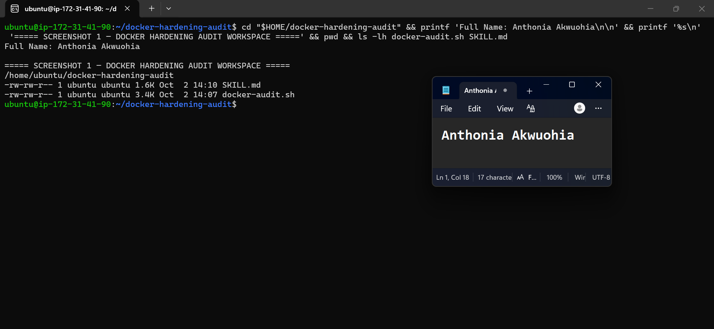

---

# Task 2 — Add the Docker Audit Skill to Claude Code

## Goal

Add the supplied `docker-audit` skill to Claude Code and confirm that it is available.

### Evidence

#### Screenshot 2 — Docker Audit Skill Available in Claude Code

Add a screenshot of Claude Code showing `docker-audit` in the available skill list.

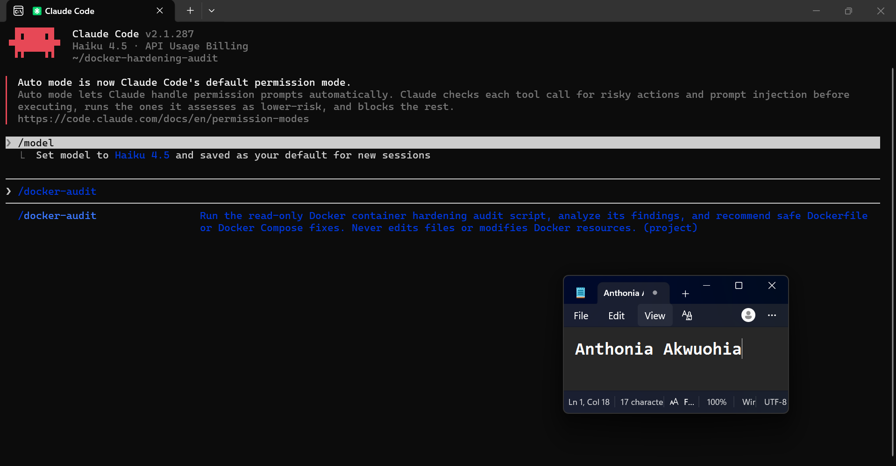

---

# Task 3 — Validate the Audit Script

## Goal

Verify the audit script line endings, Bash syntax, and usage message.

### Evidence

#### Screenshot 3 — Script Validation

Add a terminal screenshot showing:

- LF line-ending check
- Successful `bash -n docker-audit.sh` validation
- Your full name
- The usage message displayed when the script runs without a container name

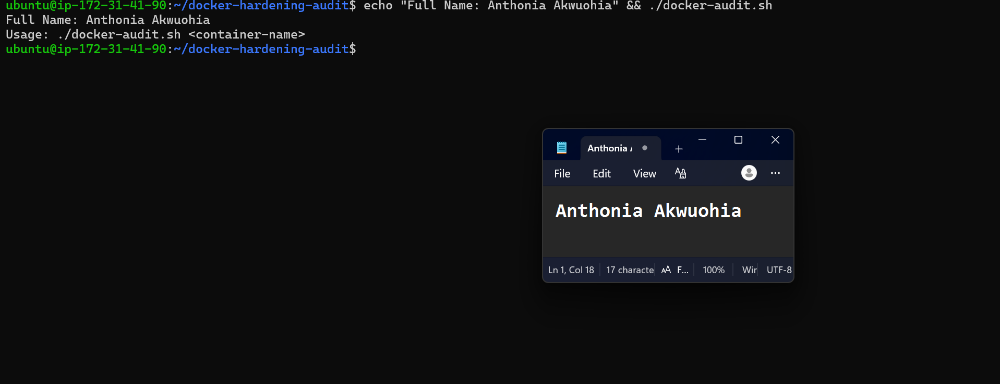

---

# Task 4 — Run the Initial Docker Security Audit

## Goal

Audit a running container and record the initial findings.

### Evidence

#### Screenshot 4 — Selected Target Container

Add a terminal screenshot showing:

- Your full name
- `docker ps`
- The audit command using the selected target container name

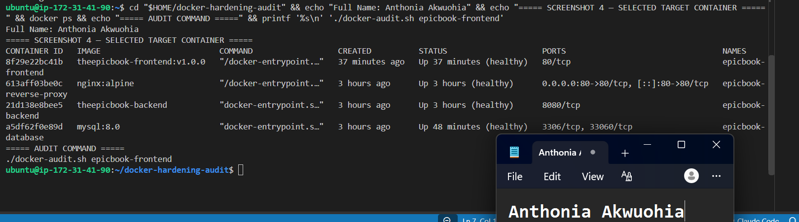

---

#### Screenshot 5 — Initial Audit Results

Add a terminal screenshot showing the initial Docker audit results.

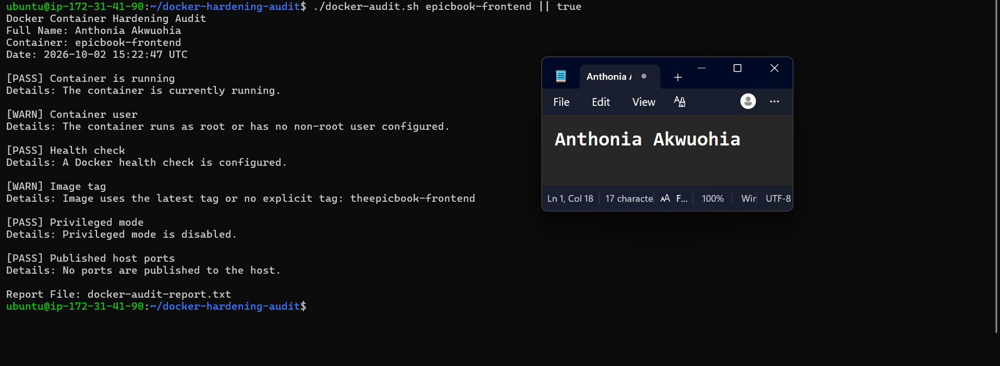

---

# Task 5 — Use AI Assistance to Understand the Findings

## Goal

Use the supplied `docker-audit` skill to understand the initial audit results safely.

### Evidence

#### Screenshot 6 — Audit Explanation and Recommended Fix

Add a Claude Code screenshot showing:

- Audit finding
- Security risk
- Recommended manual fix
- Verification method

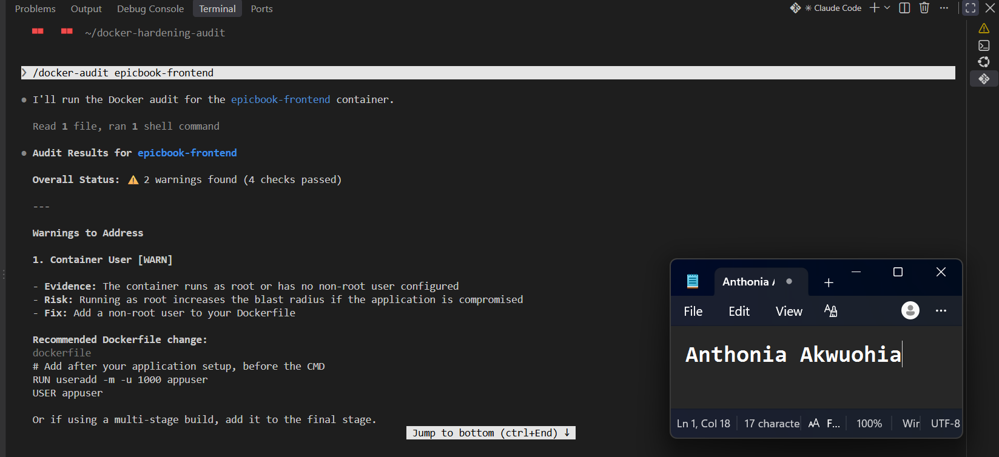

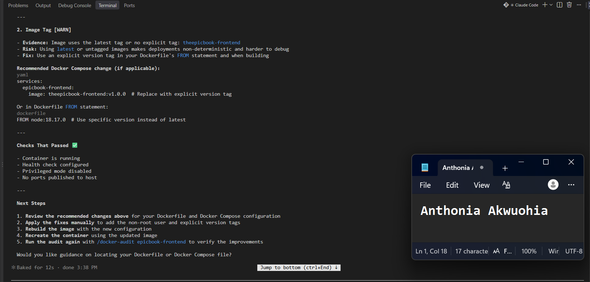

---

# Task 6 — Apply One Container-Hardening Fix

## Goal

Manually fix one WARN or FAIL finding from the initial audit.

### Evidence

#### Screenshot 7 — Hardening Configuration Change

Add a screenshot of the updated Dockerfile or `docker-compose.yml` showing the selected hardening fix.

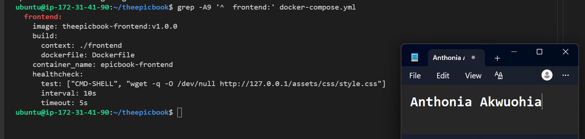

---

#### Screenshot 8 — Updated Service Running

Add a terminal screenshot showing your full name and the rebuilt or recreated service/container running successfully.

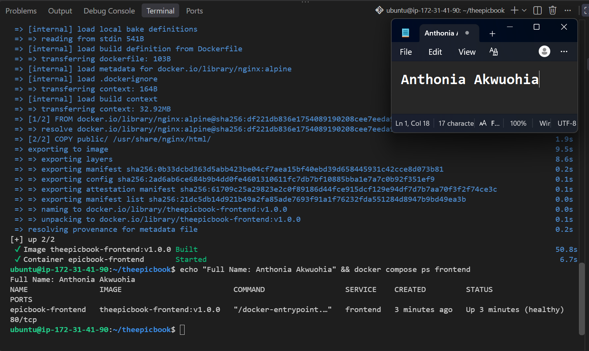

---

# Task 7 — Re-Run the Audit and Compare Results

## Goal

Verify that the selected hardening fix improved the container configuration.

### Evidence

#### Screenshot 9 — Final Audit Results

Add a terminal screenshot showing:

- Your full name
- The updated running container
- The final audit report

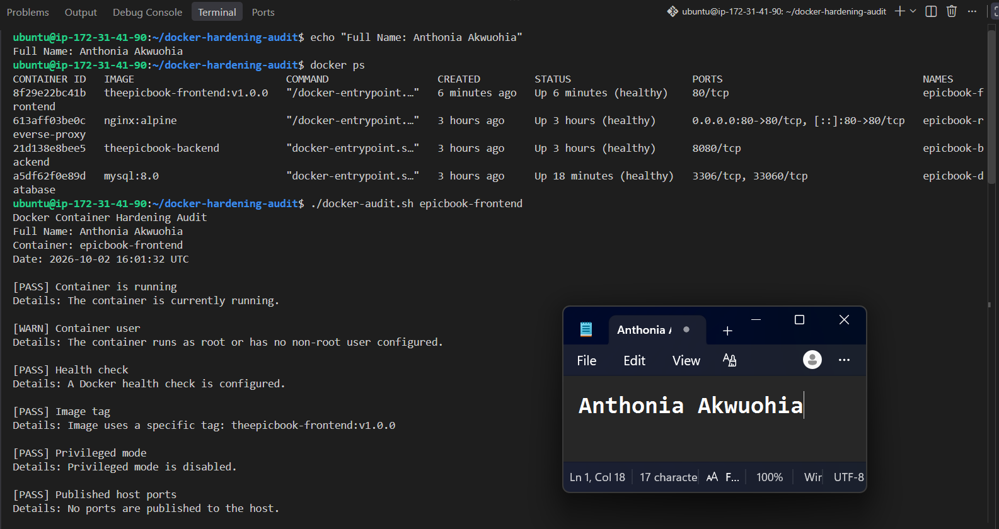

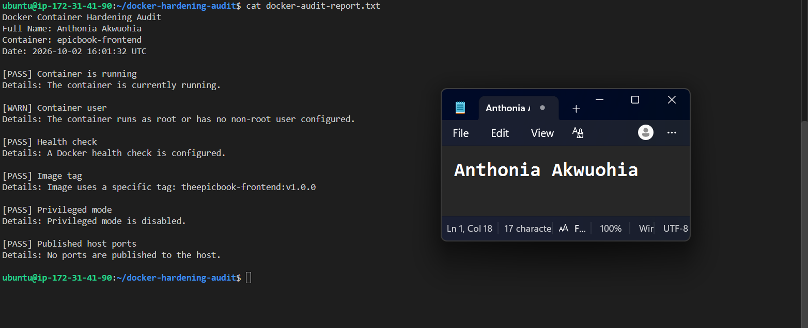

---

### Before-and-After Comparison

Write a short comparison covering:

- Initial audit finding
- Dockerfile or Docker Compose change applied
- Final audit result
- Security benefit of the improvement

### Before-and-After Security Audit Comparison

**Initial Finding:**  
The initial audit reported an **Image Tag — WARN** because the frontend container used the untagged image reference `theepicbook-frontend`, which the audit treated as `latest`.

**Change Applied:**  
The Docker Compose configuration was manually updated to use the explicit image tag:

`theepicbook-frontend:v1.0.0`

The frontend service was then rebuilt and recreated using `docker compose up -d --build --no-deps frontend`.

**Final Result:**  
The final audit reported:

`[PASS] Image tag — Image uses a specific tag: theepicbook-frontend:v1.0.0`

The other checks remained unchanged, with the container running, health check configured, privileged mode disabled, and no host ports published. The container-user check remains a WARN because no non-root user was configured.

**Security Benefit:**  
Using an explicit image tag makes the deployment more deterministic and easier to identify and reproduce. It reduces ambiguity associated with an untagged or `latest` image reference and improves traceability during deployments and troubleshooting.
---

# LinkedIn Requirement

## Goal

Create a LinkedIn post about the container security checks you performed, one hardening improvement you applied, and why the improvement matters.

### Evidence

**LinkedIn Post URL:** https://www.linkedin.com/posts/anthonia-akwuohia-5b00681b0_devops-docker-containersecurity-share-7511820593403412480-HsPp/?utm_source=share&utm_medium=member_desktop&rcm=ACoAADEhX1QBTHiW-kQPmKjn3MVixQzj4IzJO1Q

#### LinkedIn Post Screenshot

Add a screenshot of the published LinkedIn post, including the final audit result.

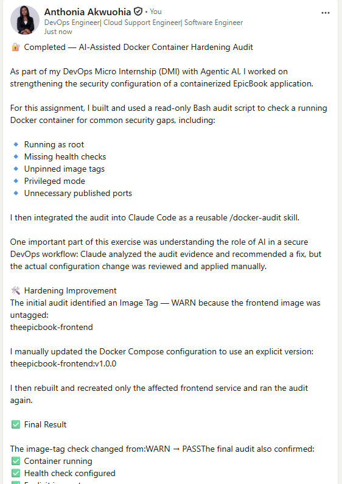
---

# Submission Instructions

- Include Screenshots 1–9 exactly as specified.
- Include the target container name and before-and-after comparison.
- Include the LinkedIn post URL and screenshot.
- Ensure that your full name is visible in all required terminal screenshots.
- Do not expose passwords, API keys, tokens, account IDs, or `.env` file contents.

---

# Completion Checklist

- [ ] Audit workspace created and supplied files verified
- [ ] `docker-audit` skill added to Claude Code
- [ ] Audit script validated successfully
- [ ] Running target container identified
- [ ] Initial Docker audit completed
- [ ] Claude Code explanation of findings captured
- [ ] One hardening fix applied manually
- [ ] Affected service or container rebuilt and recreated
- [ ] Final Docker audit completed
- [ ] Before-and-after comparison completed
- [ ] Screenshots 1–9 included
- [ ] LinkedIn post URL and screenshot included
- [ ] No sensitive information exposed

---

## 📌 About DMI & CloudAdvisory

DevOps Micro Internship (DMI) is a project-based DevOps program run by Pravin Mishra (The CloudAdvisory) focused on real-world execution, systems thinking, and career readiness.

It helps learners build strong DevOps foundations with hands-on experience.

---

## 📌 Resources

- 🌐 DMI Official Website: https://dmi.pravinmishra.com?utm_source=github&utm_medium=readme  
- 🎓 University: https://university.pravinmishra.com?utm_source=github&utm_medium=readme  
- 💬 Discord Community: https://discord.pravinmishra.com?utm_source=github&utm_medium=readme  
- 📝 Blog: https://dmi.pravinmishra.com/blog?utm_source=github&utm_medium=readme  
- ▶️ YouTube Playlist: https://www.youtube.com/playlist?list=PLFeSNDtI4Cho  
- 🔗 Pravin Mishra (LinkedIn): https://www.linkedin.com/in/pravin-mishra-aws-trainer/  
- 🏢 CloudAdvisory (LinkedIn): https://www.linkedin.com/company/thecloudadvisory/

---

*This submission is part of DevOps Micro Internship (DMI) — Agentic AI Track.*
